# Community Building

[← Back to main gallery](../)

### Architecture Participation Complexity Cartoon

_A political cartoon shows a complex spiral staircase labeled "Architecture of Participation" with people navigating it while a simpler "Try it out!" sign stands nearby, illustrating the contrast between complicated participation systems and accessible alternatives._

---

### Be Part Of Community Im In Shirt

_A simple illustration shows a person wearing a blue t-shirt with "I'M IN" written on it, with the text "BE PART OF A" above and "COMMUNITY" below in red letters._

---

### Big Tech Discovers Old News Community Groans

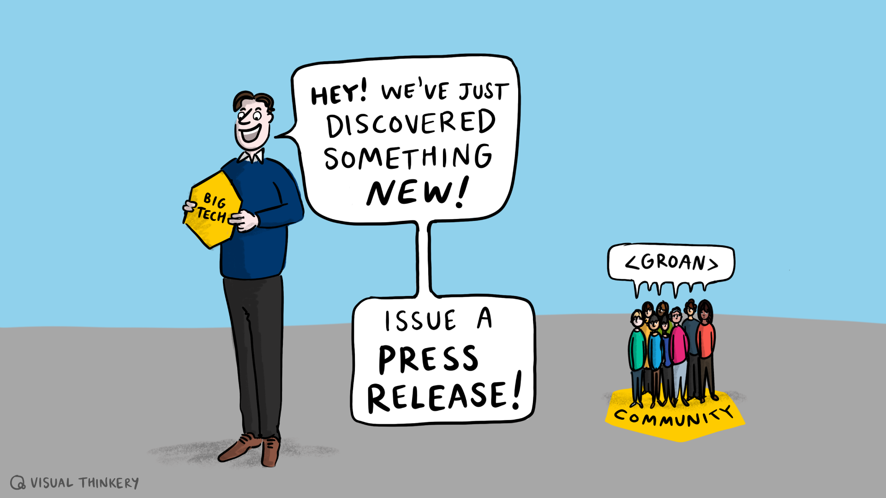

_A cartoon shows a "Big Tech" executive excitedly announcing they've discovered something new and should issue a press release, while a group labeled "Community" responds with a collective groan._

---

### Blue We Are Open Sign Concern For Community

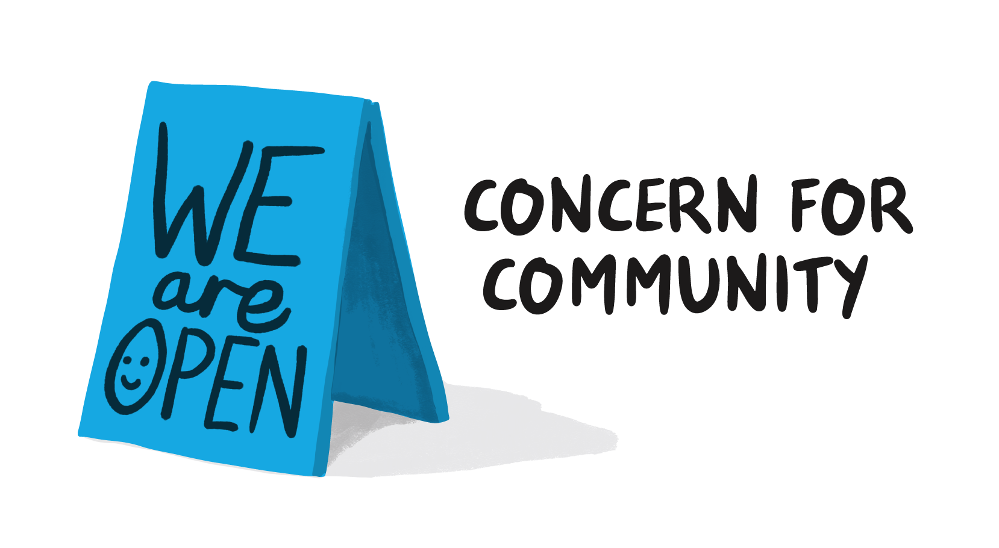

_A blue A-frame sandwich board sign displays "WE are OPEN" with a smiley face, next to text reading "CONCERN FOR COMMUNITY" against a white background._

---

### Borderless Community Blue Geometric Text

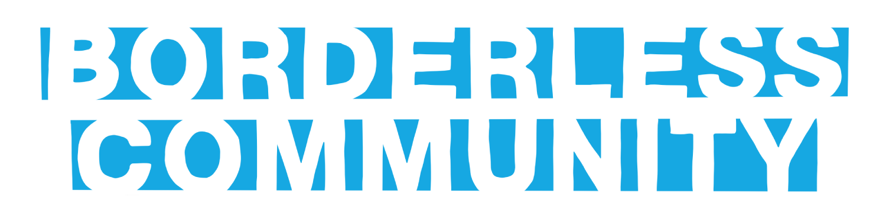

_The text "BORDERLESS COMMUNITY" is displayed in large blue letters with a stylized, geometric font where parts of letters appear to be cut out or missing._

---

### Borderless Community Blue Stencil Text

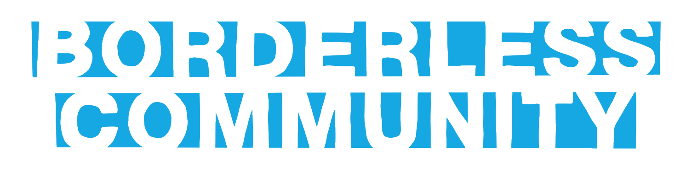

_The text "BORDERLESS COMMUNITY" is displayed in large blue letters with a distinctive stencil-like typeface against a white background._

---

### Build On Near Vibrant Community Concept

_A conceptual illustration showing small human figures positioned on and around large black text reading "BUILD ON NEAR" with blue construction grid lines, and red text below stating "VIBRANT COMMUNITY."_

---

### Come For Money Stay For People

_A simple illustration contrasting "COME FOR" with three gold coins on the left and "STAY FOR" with three diverse, smiling people on the right._

---

### Community Of Practice Blue Circles Concept

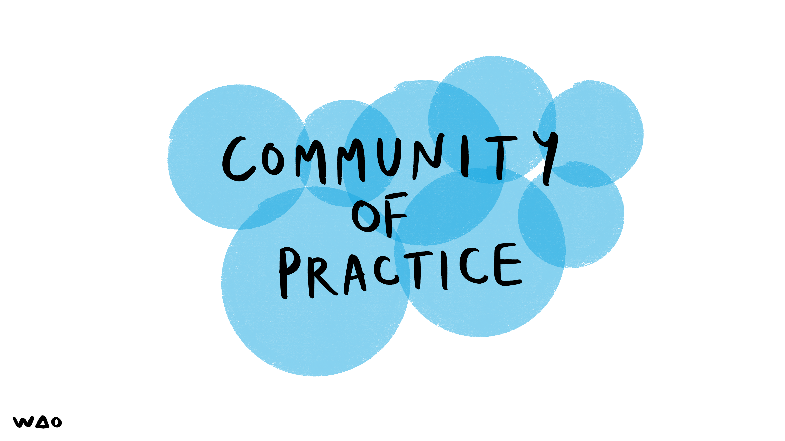

_The text "COMMUNITY OF PRACTICE" appears in black handwritten letters overlaid on a cluster of overlapping translucent blue circles against a white background._

---

### Community Value Extraction Misunderstanding

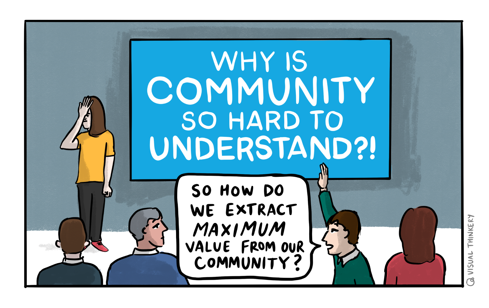

_A presenter with head in hand stands before a slide asking "Why is community so hard to understand?!" while an audience member raises their hand asking "So how do we extract maximum value from our community?"_

---

### Community Works For Us Global Connection

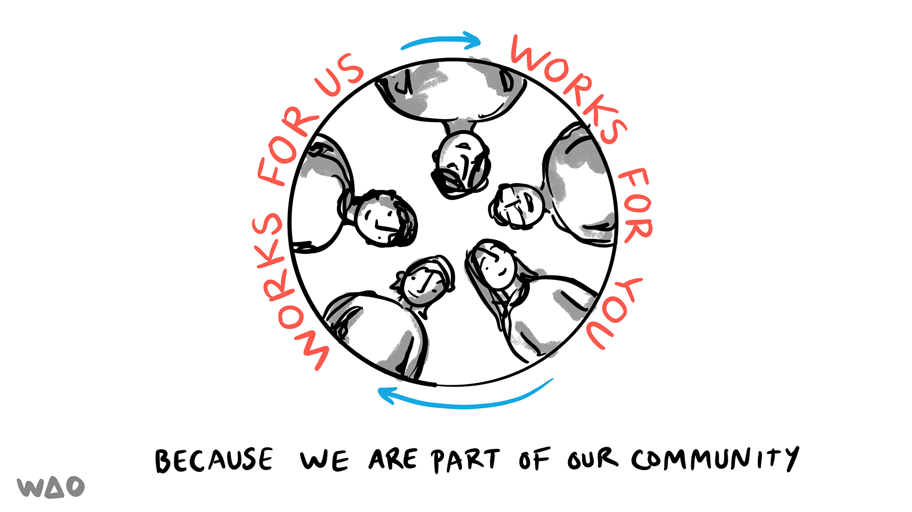

_A circular illustration showing diverse people's faces around a globe with "WORKS FOR US" text and arrows, emphasizing community connection through the message "Because we are part of our community."_

---

### Customer Journey Stepping Stones Process

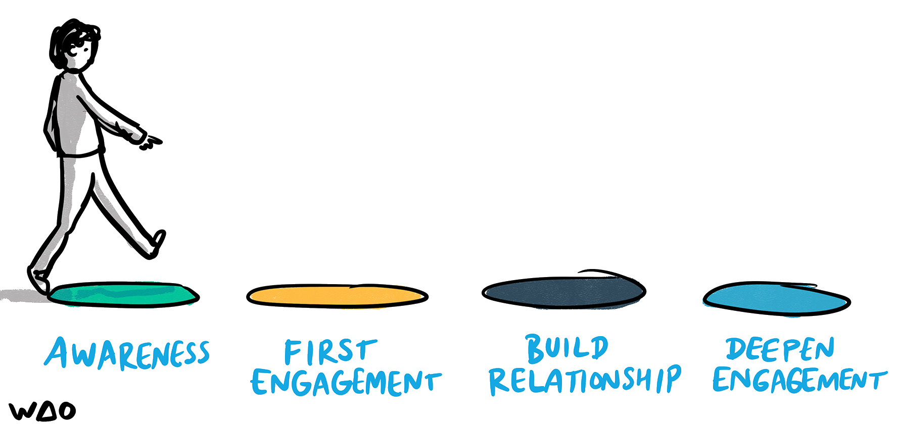

_A stick figure person walks across four colored stepping stones labeled "Awareness," "First Engagement," "Build Relationship," and "Deepen Engagement," illustrating a progressive customer journey or engagement process._

---

### Four Stages Of Engagement Stepping Stones

_A stick figure person steps across four colored circles representing the progressive stages of engagement: Awareness, First Engagement, Build Relationship, and Deepen Engagement._

---

### Greenpeace Reputation Protect Vs Use Dilemma

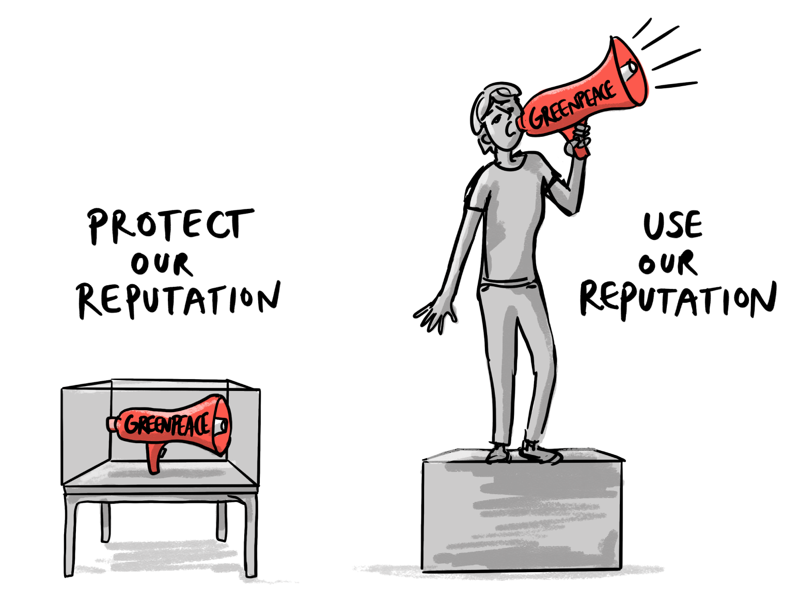

_A person holds a Greenpeace megaphone while standing on a platform, with another Greenpeace megaphone stored under a protective glass case, illustrating the choice between protecting or using organizational reputation._

---

### London Clc Organizational Ecosystem Sketch

_This hand-drawn illustration shows the London CLC (City Learning Centre) at the center surrounded by various elements including company values, full-stack employees, manifestos, connecting initiatives, and references to government reinvention and entrepreneurial learning._

---

### Open Hub Network Spokes Hexagons

_A radial diagram showing "Open Hub" in a blue center circle with gray spoke-like ribbons extending outward, each ending in an orange hexagon, representing a hub-and-spoke network model._

---

### Participation Depth Vs Skill Acquisition Graph

_Two hand-drawn graphs illustrate the concept that as depth of participation increases, fewer people engage (left graph shows declining participation with vertical lines), while individual skill level increases (right graph shows rising curve), with a note about "skim-swim-dive" levels of engagement._

---

### People Community Group Illustration

_Three diverse people standing together representing community, teamwork, or social connection._

---

### People Connected By Flowing Blue Network Ribbons

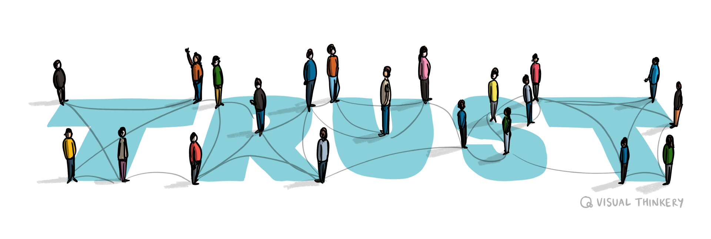

_A diverse group of people in colorful clothing stand connected by flowing blue ribbons or fabric that weave between them, illustrating interconnectedness and community bonds._

---

### People Connected By Flowing Network Pathways

_The illustration shows diverse people standing on and connected by flowing turquoise ribbons or pathways, representing interconnected networks and human connections._

---

### Planet 4 Stakeholder Ecosystem Diagram

_A cartoon illustration showing Planet 4 at the center surrounded by various stakeholders including P4 Council, Data & Web Analytics Community, Developer Community, Programme Stakeholders, and Designers Community, all connected by a dotted orbital path._

---

### Planet A Communities Orbiting Earth Diagram

_A cartoon illustration shows Planet A (Earth) at the center surrounded by various communities including Senior Admin, Designers, Data & Web Analytics, Developer, and Programme Stakeholders, each represented by small space-themed icons orbiting around the planet._

---

### Planet4 Ecosystem Communities Orbit Diagram

_A diagram showing Planet4 at the center surrounded by orbiting elements representing different communities: P4 Council (rocket), Designers Community (astronauts), Programme Stakeholders (moon), Developer Community (rover), and Data & Web Analytics Community (satellite)._

---

### Portus People Digital Catapult Mindmap Nov2016

_A hand-drawn mind map from a November 2016 "Portus People Digital Catapult" meeting showing various concepts around data, storytelling, digital engagement, and cultural heritage research with stick figures representing participants and their ideas branching out from the central topic._

---

### Portus People Digital Catchup Mindmap Nov2016

_This is a hand-drawn mind map from a "Portus People Digital Catchup" meeting on November 18, 2016, showing various interconnected concepts around digital heritage, open data, storytelling, and research with participant names and key themes branched out from the central topic._

---

### Quick Call Clc Cake Emergency Sketch

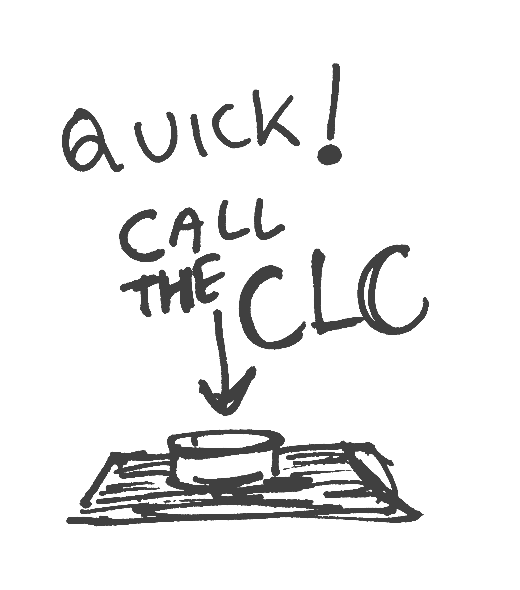

_A hand-drawn sketch shows the text "Quick! Call the CLC" with an arrow pointing down to a simple drawing of what appears to be a cake or round object on a tray or plate._

---

### Scatter Plot Organizations Among People

_A scatter plot showing dots representing people, with larger star-shaped dots labeled as "Large Universities," "Professional Bodies," and "Major Employers" distributed among the smaller dots._

---

### Three Types Relationship With Your Stuff Cartoon

_A cartoon illustrates three types of people's relationship with "your stuff": a detractor standing on it dismissively, a passive person sitting casually beside it, and a promoter enthusiastically holding it up high._

---

### Trapeze Artists Discussing Trust Timing

_A trapeze artist asks their catcher mid-flight "Is now a good time to talk about trust and reliability?" as they reach toward each other's outstretched hands._

---

### Trust Word Geometric Connections Turquoise

_The word "TRUST" is displayed in large turquoise letters with geometric line patterns connecting and overlaying each letter._

---

### Visual Thinking Metaphors Community Sketch

_A hand-drawn sketch exploring various metaphors and concepts including birds, plants, trees, street scenes, and human interactions, with handwritten notes about community, digital spaces, fear, and social connections._

---

### Wao Core Values Creativity Sustainability Solidari

_Three watercolor shapes in orange, blue, and green contain the words "CREATIVITY," "SUSTAINABILITY," and "SOLIDARITY" respectively, representing core values with the WAO logo in the bottom left corner._

---

**32 images** in this collection

All images © Bryan Mathers, available under [CC BY-ND 4.0](https://creativecommons.org/licenses/by-nd/4.0/)
