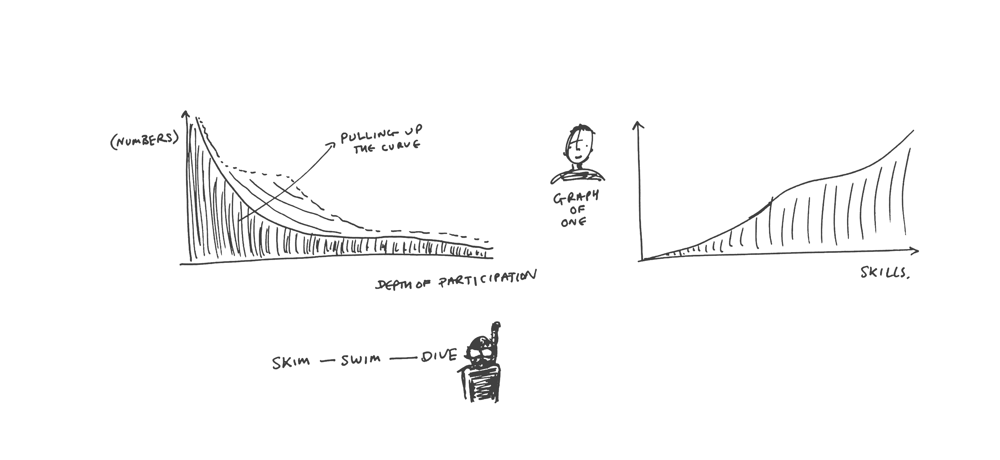
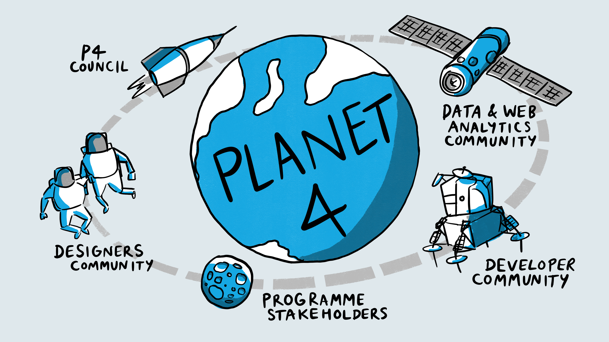
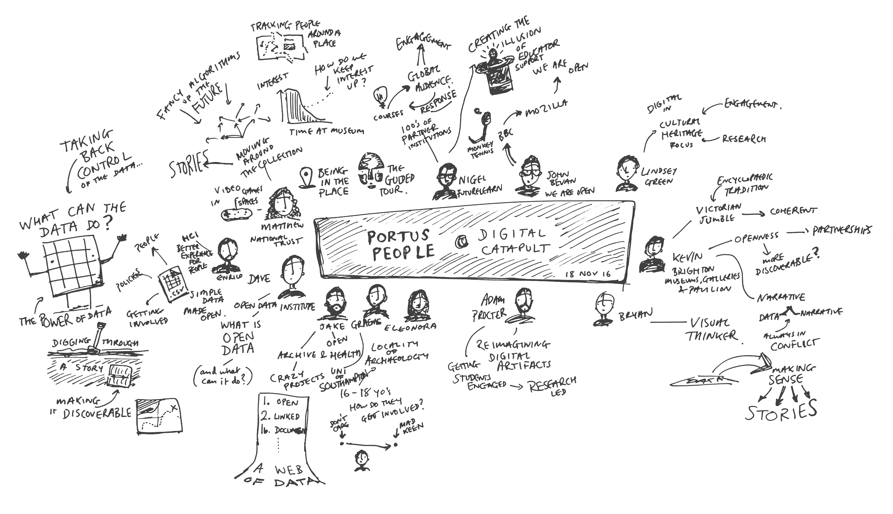

# Community Building

[← Back to main gallery](../)

| | | |
|:--:|:--:|:--:|
|  **Architecture Participation Complexity Cartoon** |  **Be Part Of Community Im In Shirt** |  **Big Tech Discovers Old News Community Groans** |
|  **Blue We Are Open Sign Concern For Community** |  **Borderless Community Blue Geometric Text** |  **Borderless Community Blue Stencil Text** |
|  **Build On Near Vibrant Community Concept** |  **Come For Money Stay For People** |  **Community Of Practice Blue Circles Concept** |
|  **Community Value Extraction Misunderstanding** |  **Community Works For Us Global Connection** |  **Customer Journey Stepping Stones Process** |
|  **Four Stages Of Engagement Stepping Stones** |  **Greenpeace Reputation Protect Vs Use Dilemma** |  **London Clc Organizational Ecosystem Sketch** |
|  **Open Hub Network Spokes Hexagons** |  **Participation Depth Vs Skill Acquisition Graph** |  **People Community Group Illustration** |
|  **People Connected By Flowing Blue Network Ribbons** |  **People Connected By Flowing Network Pathways** |  **Planet 4 Stakeholder Ecosystem Diagram** |
|  **Planet A Communities Orbiting Earth Diagram** |  **Planet4 Ecosystem Communities Orbit Diagram** |  **Portus People Digital Catapult Mindmap Nov2016** |
|  **Portus People Digital Catchup Mindmap Nov2016** |  **Quick Call Clc Cake Emergency Sketch** |  **Scatter Plot Organizations Among People** |
|  **Three Types Relationship With Your Stuff Cartoon** |  **Trapeze Artists Discussing Trust Timing** |  **Trust Word Geometric Connections Turquoise** |
|  **Visual Thinking Metaphors Community Sketch** |  **Wao Core Values Creativity Sustainability Solidari** | |

---

**32 images** in this collection

All images © Bryan Mathers, available under [CC BY-ND 4.0](https://creativecommons.org/licenses/by-nd/4.0/)
