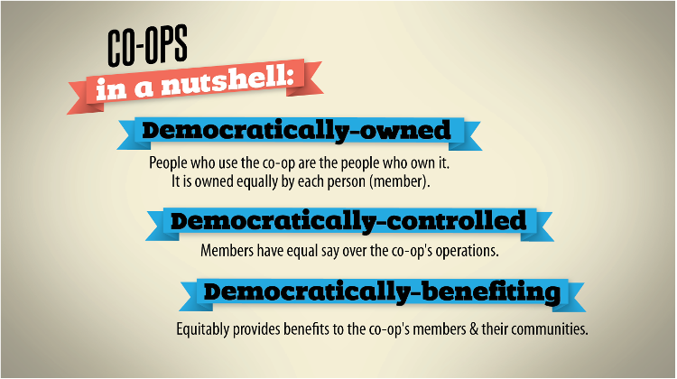
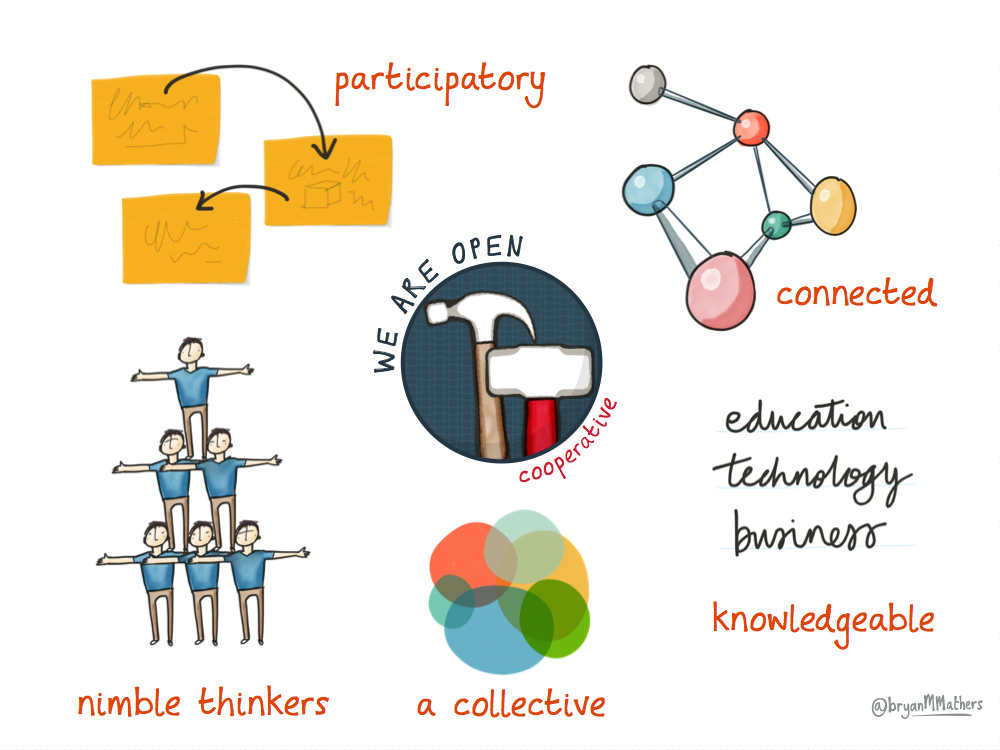
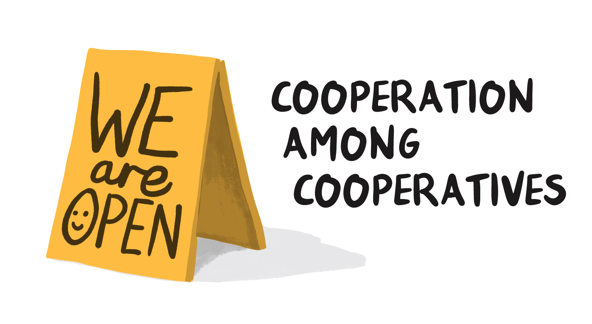
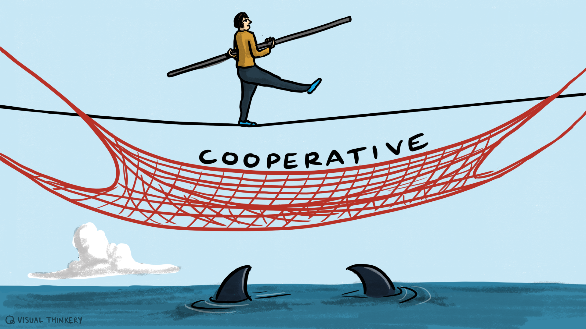

# Co-operative Principles

[← Back to main gallery](../)

### Co Op Door Coffee Break Sign

_A red door with decorative glass panel reading "WE ARE OPEN CO-OP" has a handwritten note taped below stating "POPPED OUT FOR COFFEE BACK IN 5MINS" with a coffee cup doodle._

---

### Co Ops Three Democratic Principles Infographic

_An infographic explaining the three key principles of cooperatives: they are democratically-owned by their members, democratically-controlled with equal member input, and democratically-benefiting by providing equitable benefits to members and communities._

---

### Collaborative Thinking Modern Teamwork Concepts

_This illustration presents key characteristics of modern collaborative approaches, featuring interconnected elements like participatory processes, open cooperation, nimble thinking teams, collective action, and connected educational technology networks._

---

### Coop 2 Point 0 Innovation Logo Illustration

_A colorful illustrated logo showing "COOP 2.0" with various elements including a satellite dish, trees, buildings, a rocket, and flowers representing different aspects of cooperation and innovation._

---

### Cooperation Among Cooperatives Open Sign

_A yellow folding "WE are OPEN" sign with a smiley face stands next to text reading "COOPERATION AMONG COOPERATIVES" against a white background._

---

### Cooperative Ownership Tshirt Design Illustration

_A t-shirt design reading "I OWN MY OWN CO-OP" is shown alongside four diverse people wearing the same slogan on colorful shirts, illustrating cooperative ownership principles._

---

### Cotech Member Logo Blue

_A blue geometric logo consisting of interconnected angular shapes beside the text "Member of CoTech" in a modern sans-serif font._

---

### Democratic Member Control Open Sign

_A folding "WE are OPEN" sign with a smiley face stands next to text reading "DEMOCRATIC MEMBER CONTROL" illustrating openness and member participation in democratic organizations._

---

### Green Triangle Arrow Solidarity Text

_A green triangular arrow pointing right with the word "SOLIDARITY" written in white text across its center._

---

### Hammer Cooperative Open Illustration

_A hammer icon inside a dark blue circle with "WE ARE OPEN" curved above and "cooperative" written in red below, set against a light blue watercolor background._

---

### Hammer Cooperative Open Logo

_A circular logo featuring a hammer with a wooden handle and red grip on a blue grid background, with "WE ARE OPEN" curved above and "cooperative" in red text below._

---

### Hammer Logo We Are Open Cooperative

_A circular logo featuring a hammer illustration with "WE ARE OPEN" curved along the top and "cooperative" in red text along the bottom right, set against a dark blue grid background._

---

### Member Economic Participation Open Sign

_A red tent-style "WE are OPEN" sign with a smiley face stands next to black text reading "MEMBER ECONOMIC PARTICIPATION" on a white background._

---

### Open Collaborative Workspace Concept Map

_A hand-drawn concept map illustrating the cooperative and open nature of a work environment, featuring interconnected elements like collaborative character traits, tools, and an invitation to work together with various hand-drawn tools and a computer screen._

---

### Open Cooperative Participatory Connected Concept

_This illustration shows key characteristics of open and cooperative approaches, featuring participatory processes, nimble thinkers working as a collective, connected networks, and integration of education, technology and business in a knowledgeable way._

---

### Shared Pot Wealth Inequality Comic

_A three-panel comic showing a "shared pot" being claimed by a businessman who promises to share the wealth, but in the final panel he sits atop the pot while others reach up desperately from below._

---

### Tandem Bike Teamwork Go Far Together

_Four people ride a tandem bicycle together through a scenic landscape with trees and clouds, with one rider cheerfully raising their arms in celebration, illustrating the message "Go far. Go together."_

---

### Tightrope Walker Cooperative Safety Net Sharks

_A tightrope walker balances on a wire above shark-infested waters with a safety net labeled "COOPERATIVE" stretched below as protection._

---

### Voluntary Open Membership We Are Open Sign

_A green A-frame sign displaying "WE are OPEN" with a smiley face accompanies text reading "VOLUNTARY & OPEN MEMBERSHIP" to illustrate welcoming, accessible membership policies._

---

### Work Together Fist Screwdriver Solidarity

_A clenched fist grips a screwdriver with the word "WORK" above and "TOGETHER" below, symbolizing unity and collaboration in labor._

---

### Worker Cooperatives Vs Employer Care

_A cartoon illustration shows the word "COOPS" with smiling faces in the O's, alongside text reading "BECAUSE IN THE END, YOUR EMPLOYER DOESN't REALLY CARE" with a figure being thrown in a trash can._

---

**21 images** in this collection

All images © Bryan Mathers, available under [CC BY-ND 4.0](https://creativecommons.org/licenses/by-nd/4.0/)
