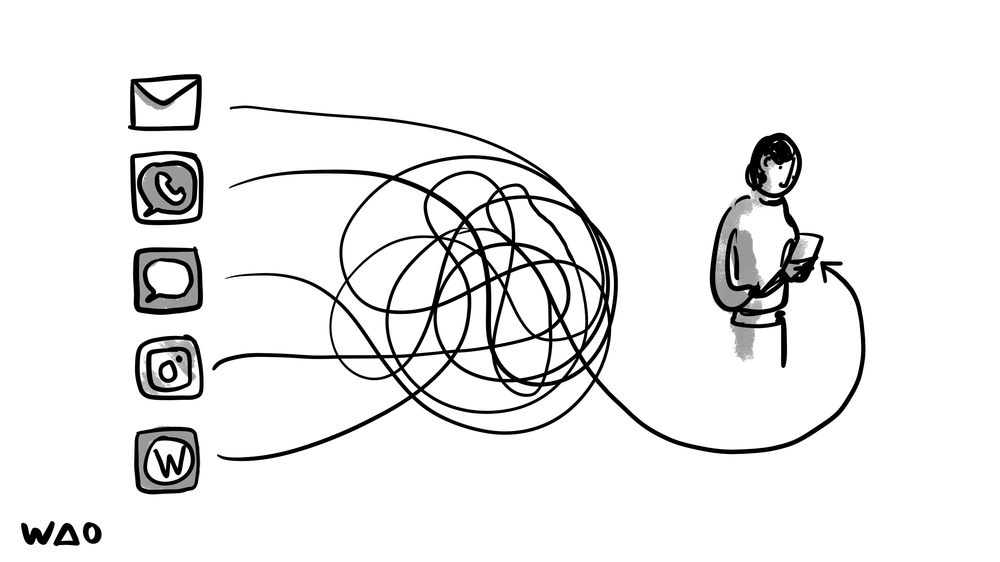
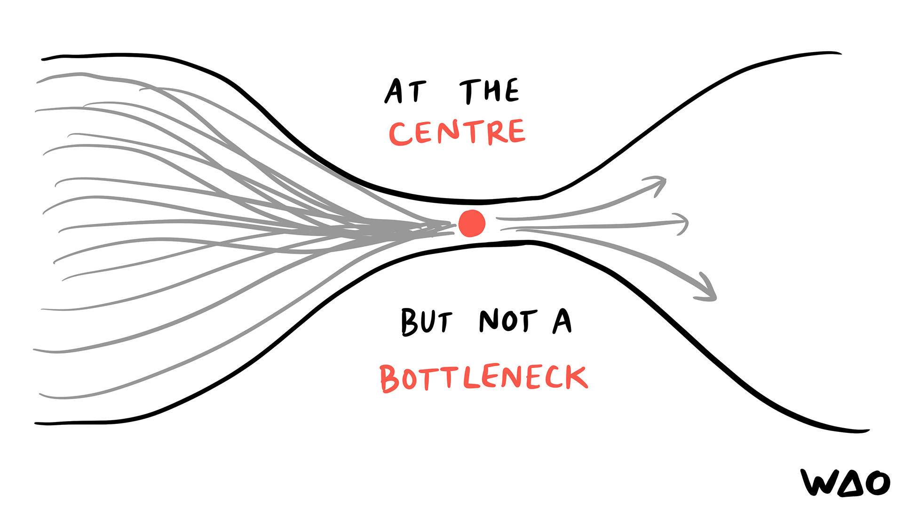
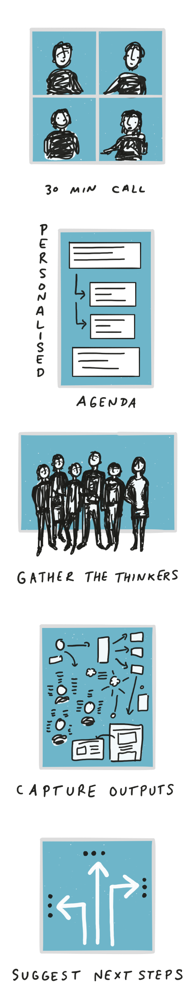
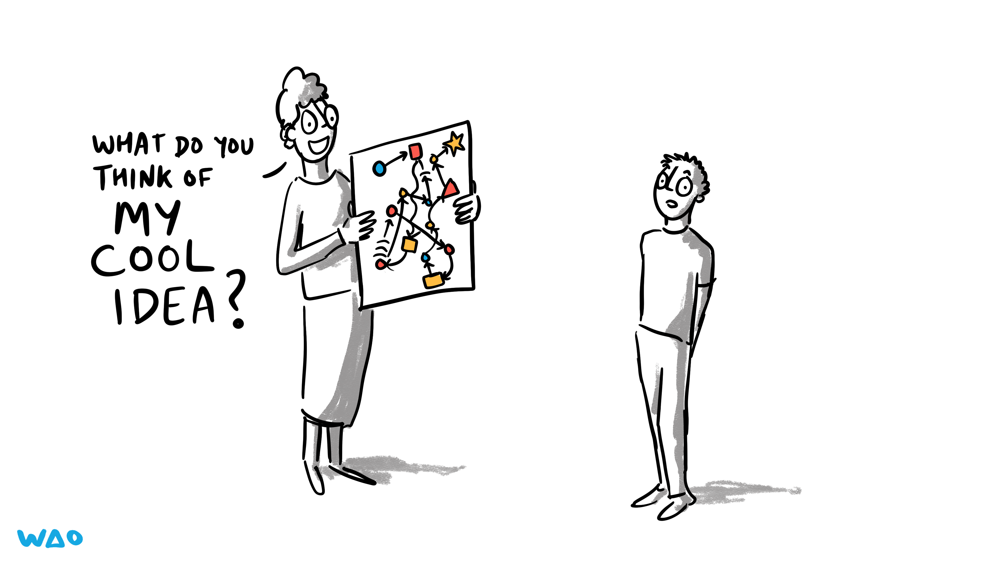
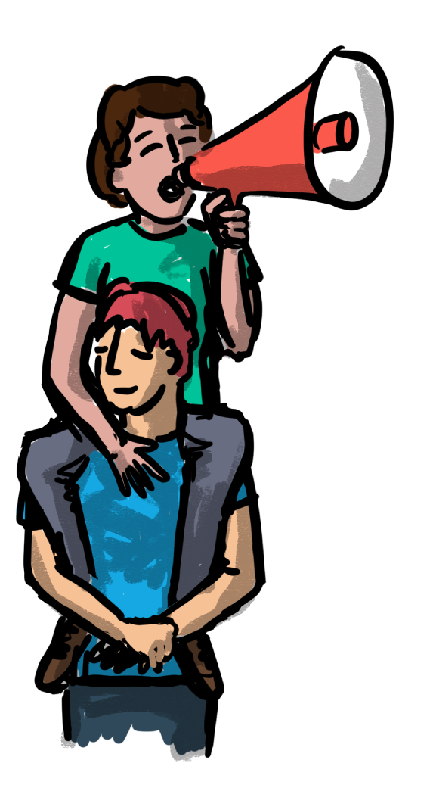
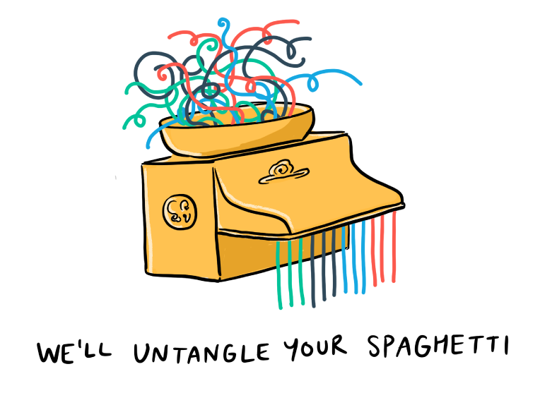
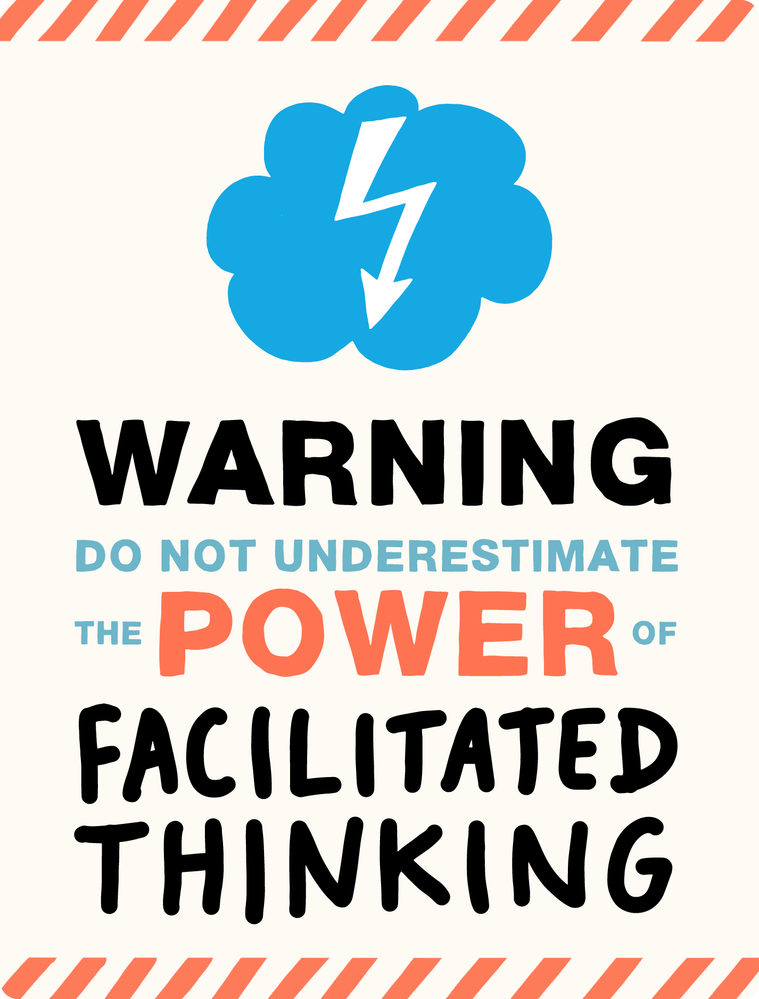

# Facilitation

[← Back to main gallery](../)

### Amplify Your Voice Guitar Amp Illustration

_A hand-drawn illustration of a guitar amplifier with "AMPLIFY" written above it and "YOUR VOICE" written below it in red text, conveying the message of using tools to make your voice heard._

---

### Benevolent Dictator Still Dictator Comic

_A cartoon showing a smiling man in a suit and tie claiming "But I'm a benevolent dictator!" while a skeptical woman in red responds "Still a dictator then..."_

---

### Blue Cloud Lightning Think A Thon Logo

_A blue cloud-shaped icon with a white lightning bolt symbol above the text "THINK-A-THON" in dark gray letters._

---

### Design Thinking Umbrella Facilitation Methods

_An umbrella labeled "facilitate thinking" shelters four design thinking activities: workshop, think-a-thon, strategic planning, and proto sprint._

---

### Digital Communication Chaos Tangled Connections

_A person holding a mobile device is connected to various communication app icons through tangled, chaotic lines representing the overwhelming complexity of digital communication channels._

---

### Doing To Vs Doing With Leadership Styles

_A figure sits on a cloud above two groups of people below labeled "DOING TO" and "DOING WITH," illustrating the contrast between top-down versus collaborative approaches to leadership or action._

---

### Flow Through Center Not Bottleneck Diagram

_A diagram shows flow lines converging at a central red dot labeled "AT THE CENTRE" then diverging outward, with text "BUT NOT A BOTTLENECK" below, illustrating centralized coordination without constriction._

---

### Meeting Process Five Steps Visual Guide

_This illustration shows a five-step process for conducting effective meetings: starting with a 30-minute personalized call, creating an agenda, gathering the right thinkers, capturing outputs, and suggesting next steps._

---

### Meeting Process Visual Guide Five Steps

_This illustration shows a five-step visual guide to running effective meetings: starting with a brief 30-minute call, creating a personalized agenda, gathering key thinkers, capturing all outputs, and defining clear next steps._

---

### Meeting Standard Vs Not Yet Meeting

_A simple diagram showing "MEETING" at the top labeled as "STANDARD" with arrows pointing up from "NOT YET MEETING" below it._

---

### No My Boss Said Prohibition Sign

_A red prohibition sign crosses out a speech bubble containing "MY BOSS SAID..." indicating that this phrase should not be used._

---

### Person Juggling Devices Critical Incident Training

_A person juggles multiple devices while presenting "Critical Incident Training" on a screen behind them, illustrating the challenge of managing technology during important presentations._

---

### Person Presenting Complex Idea To Colleague

_A person enthusiastically presents a complex diagram with interconnected elements to another person who stands listening with a neutral expression._

---

### Person With Megaphone Behind Distressed Listener

_A person with a megaphone stands behind another person who is covering their ears and looking distressed._

---

### Spotlight Attention Ladder Focus Illustration

_A person on a tall ladder shines a spotlight down on another person below, with "look right here" text in the light beam, illustrating the concept of directing attention or focus._

---

### Sync Vs Async Communication Spectrum

_A hand-drawn diagram illustrating the contrast between synchronous communication (showing stressed figures with speech bubbles) and asynchronous communication (showing relaxed scenarios with documents and emails) along an "online-offline" axis._

---

### Untangling Spaghetti Metaphor

_A pasta-making machine with tangled, colorful lines emerging from the top and straight lines coming out the bottom, illustrating the concept of untangling spaghetti-like complexity._

---

### Warning Power Facilitated Thinking Storm Cloud

_A warning sign with a storm cloud and lightning bolt icon stating "Warning: Do not underestimate the power of facilitated thinking" in bold typography with orange and blue accents._

---

**18 images** in this collection

All images © Bryan Mathers, available under [CC BY-ND 4.0](https://creativecommons.org/licenses/by-nd/4.0/)
