# General

[← Back to main gallery](../)

| | | |
|:--:|:--:|:--:|
|  **Adapt To Changing Circumstances Motivational** |  **Ai Chatbot Worship Posture Advice Humor** |  **Ai Consent Popup Fake Choice Satire** |
|  **Ai Iceberg Hidden Complexity Cartoon** |  **Ai Metaphors Comparison Illustration** |  **Airplane Mode Travel Journey Comic** |
|  **Anxious Person Realistic Scenarios Comic** |  **Arrows Pointing Down To Line** | 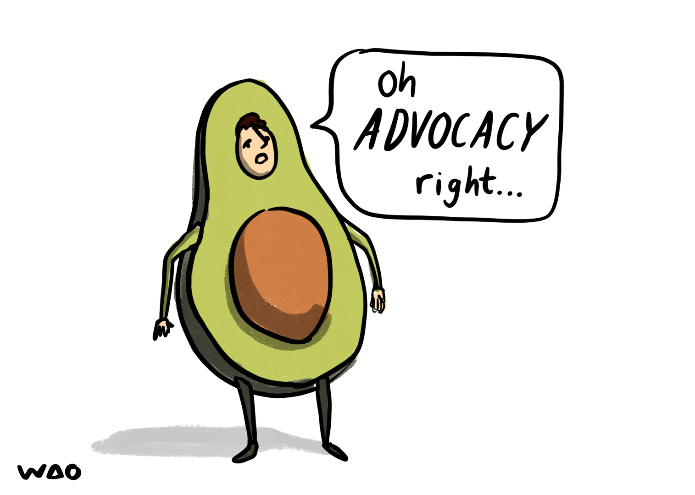 **Avocado Character Saying Advocacy Pun** |
|  **Avocado Character Says Advocacy Right** |  **Avoid Oppressive Initialisms Acronym Humor** |  **Badass Text Coral Navy Bold Letters** |
| 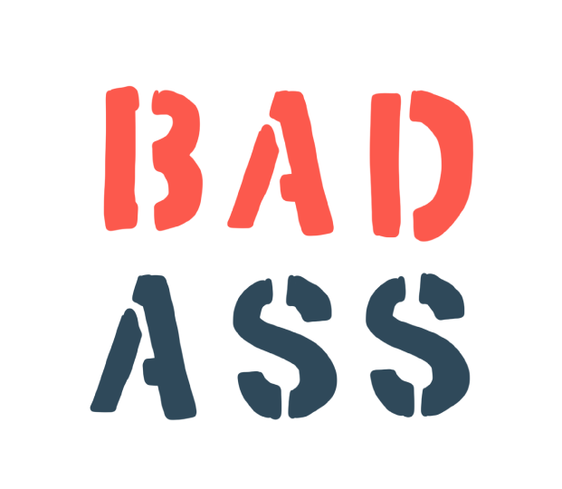 **Badass Typography Red Blue Cutout Letters** | 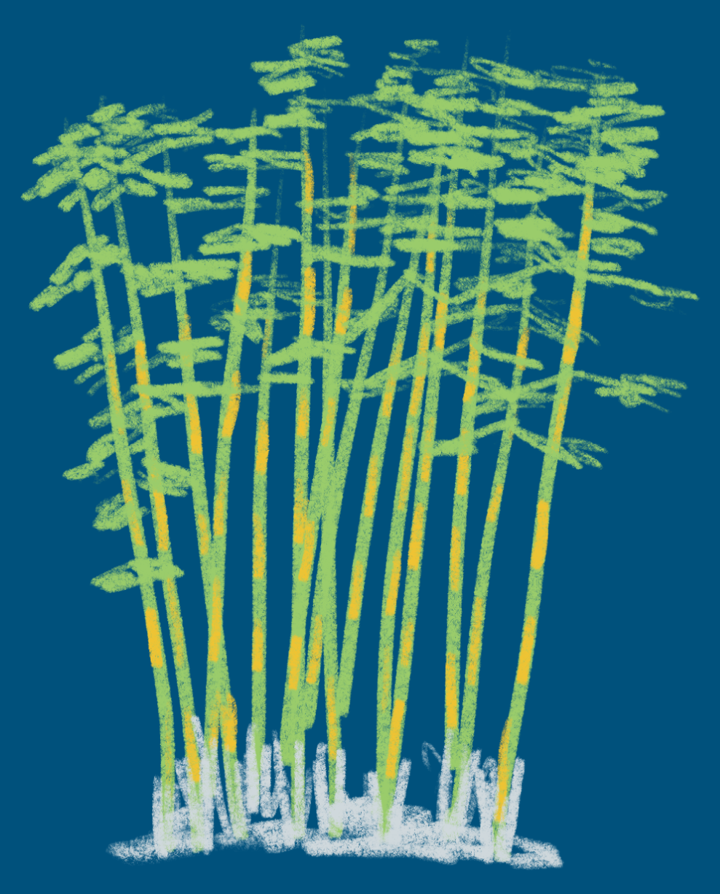 **Bamboo Grove Blue Background Illustration** |  **Bamboo Grove Watercolor Illustration** |
|  **Bicycle Leaning Against Green Tree Simple Drawing** |  **Bike Assembly Required Box Cartoon** |  **Black Innovation Team Van Illustration** |
|  **Blockchain Laboratory Experiment Illustration** |  **Blue Circle Sustainability Text** |  **Bold Positive Factual Motivational Text** |
|  **Bonsai Tree In Red Labeled Pot Illustration** |  **Bridge From Storm Cloud To Sunshine** |  **Bridge From Storm To Sunshine** |
|  **Bring Your Full Self To Work Dancing Person** |  **Build Learn Stake Three Circles Logo** |  **Chinese Takeout Container With Chopsticks** |
|  **Cipd Letters Made Of People Stick Figures** |  **Circle With Triangle And Numbered Marks** |  **Clock Combination Padlock Green Face** |
| 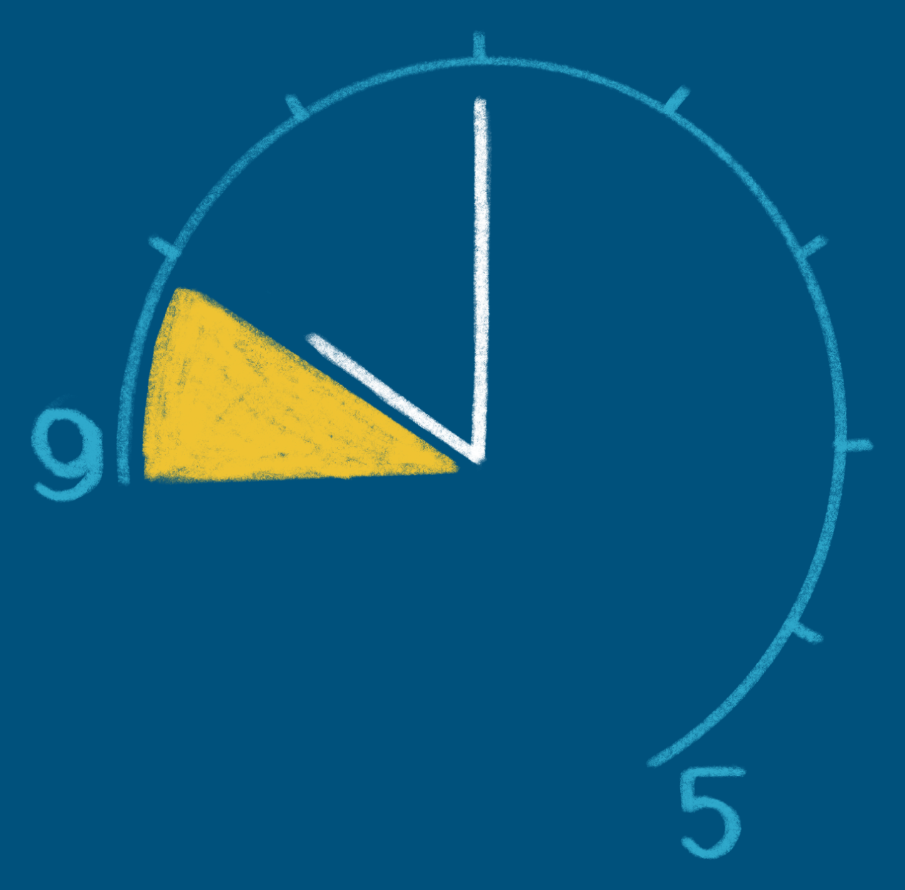 **Clock With Yellow Triangle Segment 1030 Time** |  **Coffee Shop Door Sign Back In 5 Minutes** | 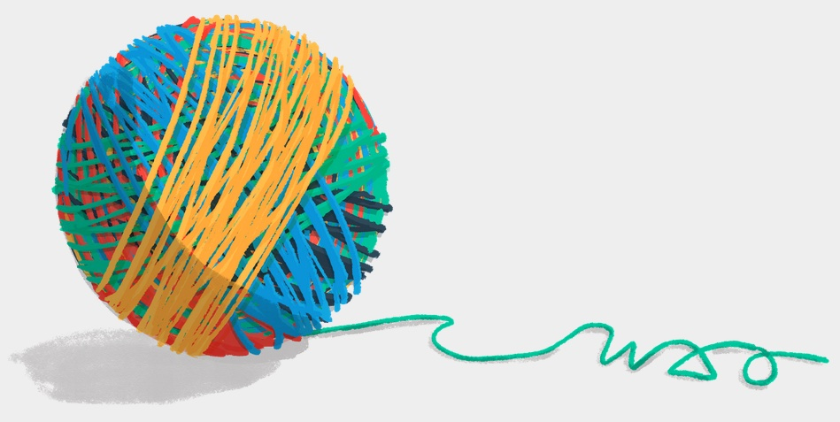 **Colorful Yarn Ball With Trailing Thread** |
|  **Confused Cat On Yellow Mat Saying What** |  **Confused Grey Cat On Yellow Mat Saying What** |  **Conical Canonical Comical Visual Pun** |
|  **Crossroads Intersection Bicycle Lane Traffic Light** |  **Crypto Mobile Wallet Explanation** | 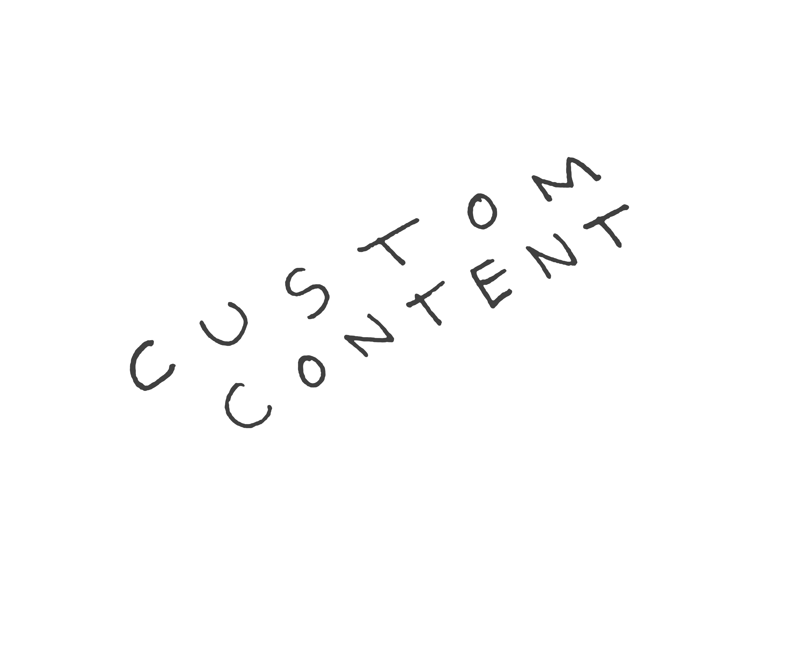 **Custom Content Handwritten Diagonal Text** |
|  **Dad Joke Pacific Specific Pun Comic** |  **De Stress Where Is The Line Visual Thinkery** |  **Digital Supports Everything Cyclist Trees** |
| 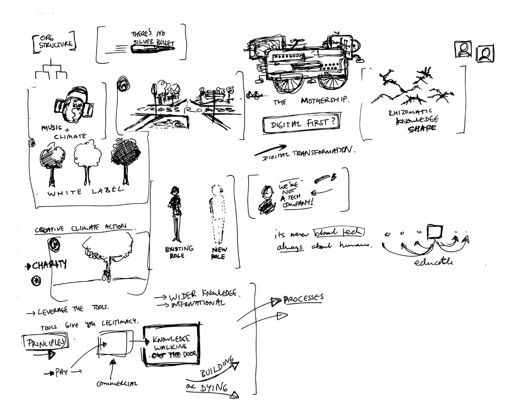 **Digital Transformation Concept Mindmap** |  **Disco Ball Discovery Concept Illustration** |  **Dont Overthink Just Hit Baseball Motivation** |
| 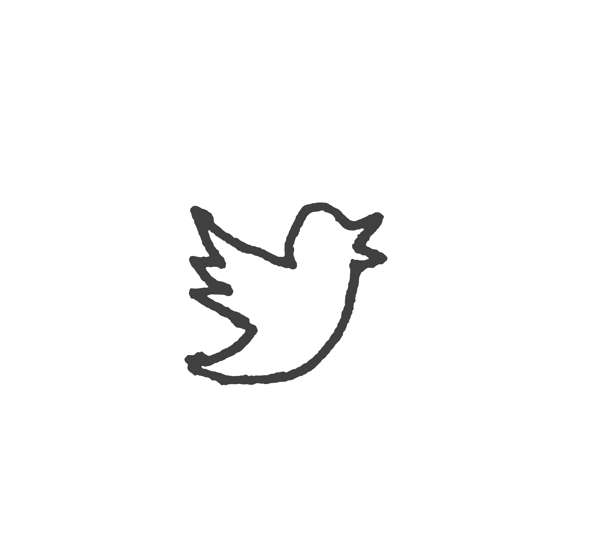 **Dove Flying Peace Bird Outline** |  **Empty Shelf Syndrome Illustration** |  **Four Layer Stream Chart Ideology Community Standar** |
|  **Get Busy Living Or Dying Choice Sign** |  **Green We Are Open Sandwich Board Sign** |  **Grumpy Panda Illustration Blue Background** |
|  **Hal 9000 Vs Chatgpt Response Comparison** | 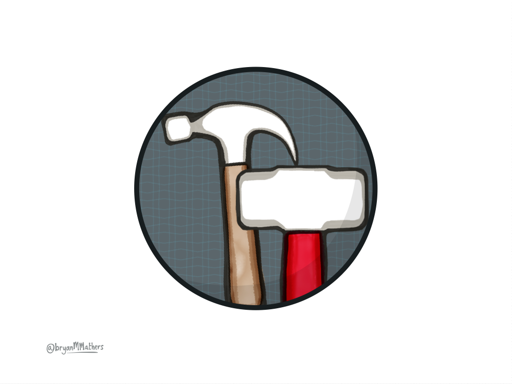 **Hammer Tool Icon Circular Design** |  **Hands Framing Rectangle Composition** |
|  **Happy Panda Arms Raised Celebration Sketch** |  **Happy Panda Celebrating With Bamboo** |  **Happy Panda In Bamboo Forest Sketch** |
|  **Happy Waving Panda Cartoon Illustration** |  **Head Profile With Blue Uw Brain Hexagon** |  **Houseparty Fomo Video Call Illustration** |
|  **Hype Inflatable Tube Man Roadside Cartoon** |  **Ideas Hamster Speeding Cartoon Logo** |  **Ideas Hamster Wheeled Cartoon Logo** |
|  **Interconnected Change Network Diagram** |  **Interpersonal Recognition Typology Methods** |  **Interplanetary Organism Logo Space Design** |
|  **Kill The Bot Banner With Red Robot** |  **Local Dollar Bill Concept Illustration** |  **Magic Trust Online Shopping Comic** |
|  **Marketing Rule One Talk About Your Work** |  **Mixed Objects Door Boat Building Trees Breakfast** |  **Multiple Padlocks Security Chain** |
|  **Navigating Storms Staying Afloat Canoe** |  **Not This Moscow Saint Basils Cathedral Cartoon** |  **Off Shelf Tech Solutions Low Code No Code** |
|  **Open Ecosystem Circular Logo Design** |  **Orange Padlock Cross Pattern Security** |  **Padlock With Green Combination Dial** |
|  **Padlocks Locked Unlocked Security Concept** |  **Padlocks With Emotional Faces Security States** |  **Panda Black White Issue Visual Thinkery** |
|  **Panda Celebrating Arms Raised Blue Background** |  **Panda Celebrating Arms Raised Joyful** | 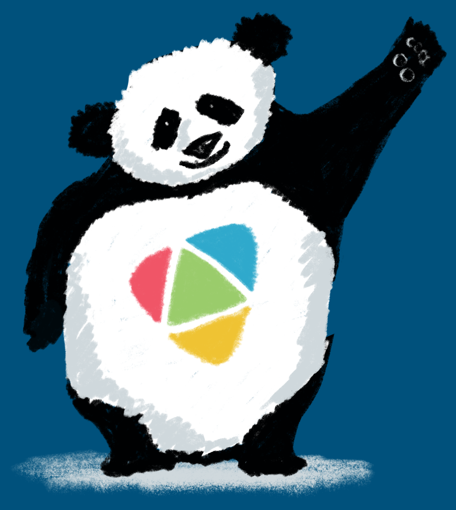 **Panda Celebrating With Colorful Pie Chart Belly** |
|  **Panda Holding Circular Ring Blue Background** |  **Panda Holding Circular Spiral Illustration** |  **Panda Holding Colorful Pie Chart Illustration** |
| 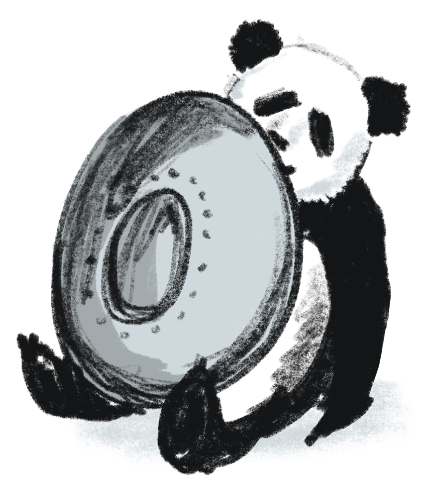 **Panda Hugging Spiral Circle** |  **Panda Lying Back Relaxed Pose** |  **Panda Lying Relaxed Black White Sketch** |
|  **Panda Reading Book Relaxed Pose** |  **Panda Reading Book Rocking Chair Relaxed** |  **Panda Sitting Back View Blue Background** |
| 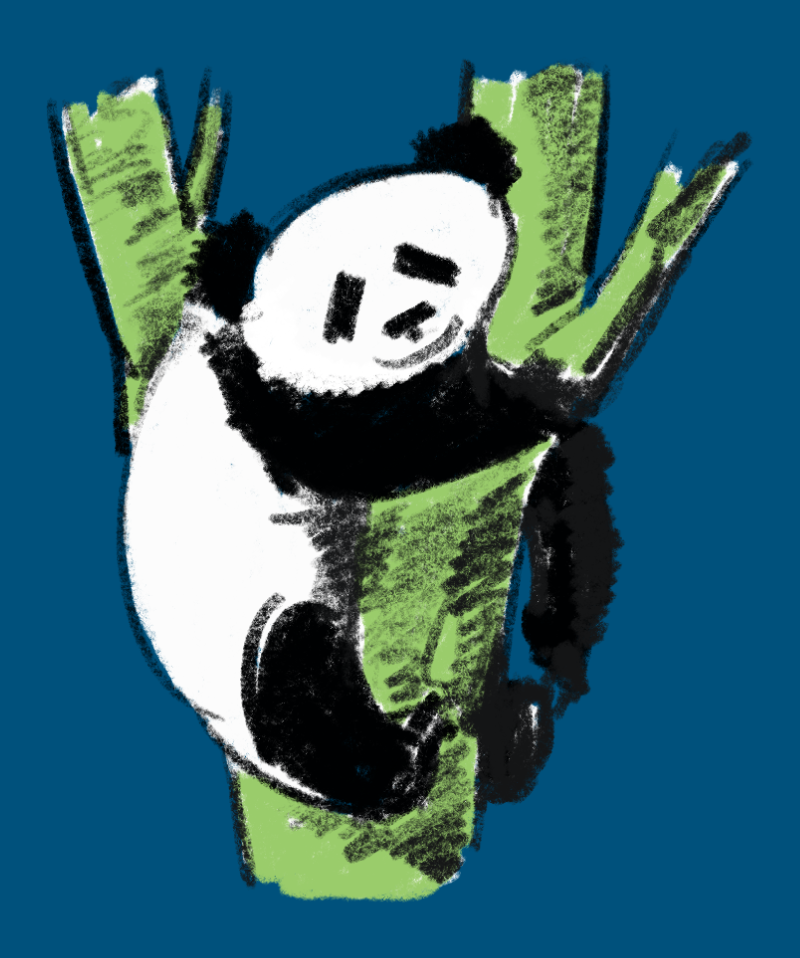 **Panda Sleeping On Bamboo Blue Background** |  **Parachutist Landing On Striped Flag** |  **Person Approaching Sensor Enabled Building** |
|  **Person Drowning In Treacle Can Overwhelmed** |  **Person Examining Green Box With Someone On Top** | 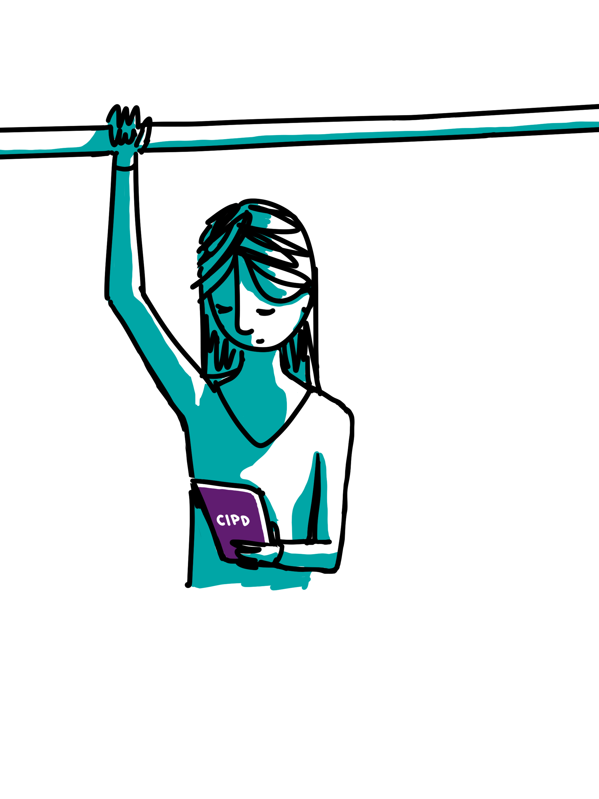 **Person Hanging Pullup Bar Holding Cipd Book** |
|  **Person Juggling Stress Clouds Contagious** |  **Person Spinning Plates Horizontal Aerial Balance** |  **Person Synthesizing Meaning With Keyboards** |
|  **Person Trapped In Stressor Clamp** |  **Pie Chart Blue Gray Segments Weathered** | 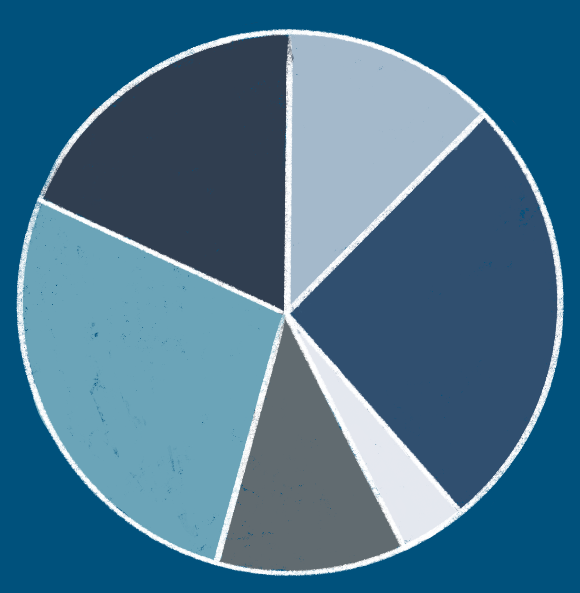 **Pie Chart Six Segments Blue Gray Shades** |
|  **Pie Chart Triangle Sector With Numbers** |  **Pink Toolbox With Tool Symbols Blue Background** |  **Pink Toolbox With Visible Tools Cutouts** |
|  **Police Lineup Usual Suspects Silhouettes** |  **Recognising Good Ideas Billboard Concept** |  **Red Padlock With Key Inserted** |
|  **Red Padlock With Key Security Lock** |  **Red Toolbox With White Tool Silhouettes** |  **Relaxed Panda Lying On Back Blue Background** |
|  **Repeating To Help Others Colorful Text** |  **Roller Coaster Ride Metaphor Illustration** |  **Sad Panda Sketch Black White Drawing** |
|  **Sad Panda Sketch Black White Illustration** |  **Sad Sitting Panda Illustration** |  **Sad Sitting Panda Sketch Black White** |
|  **Sankey Diagram Four Streams Flow Chart** | 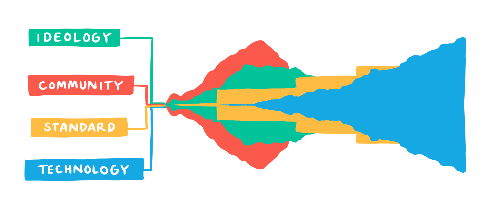 **Sankey Diagram Four Streams Merging Flow** |  **Signal Boost Transmission Tower Illustration** |
|  **Six Gray Squares With Keyhole Symbols** |  **Six Keyhole Tiles Arranged Grid** |  **Skydiver Freefalling Through Clouds** |
|  **Skydiver Holding Trophy In Freefall** |  **Skydiver With Red White Parachute Descending** |  **Stick Figures Fading Employment Pandemic Terms** |
|  **Surveillance False Reassurance Irony** |  **Tech Pillars Web2 Ai Blockchain Columns** | 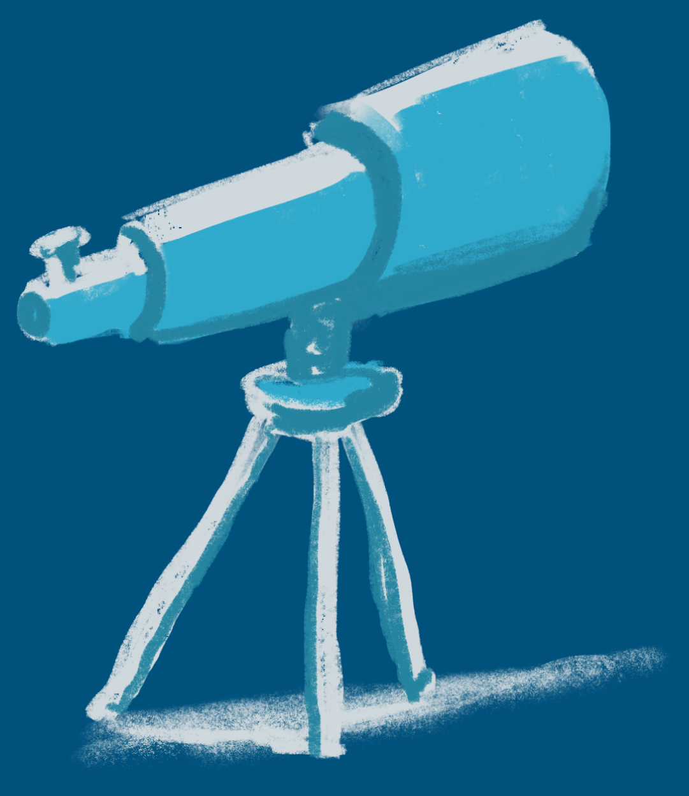 **Telescope On Tripod Blue Illustration** |
|  **Telescope On Tripod Watercolor Illustration** |  **Therapy Session How Did That Make You Feel** |  **Three Life Pills Fun Fame Fortune Choices** |
|  **Three Padlocks Emotional Security Progression** |  **Time And Downtime With Climbing Figures** |  **Training On The Go Coffee Cup** |
|  **Trust Word Geometric Lines Turquoise** |  **Two Hammers Claw And Ball Peen Tools** |  **Two Hammers Claw And Flat Head Tools** |
|  **Two Stars Magic Teapot Transformation** | 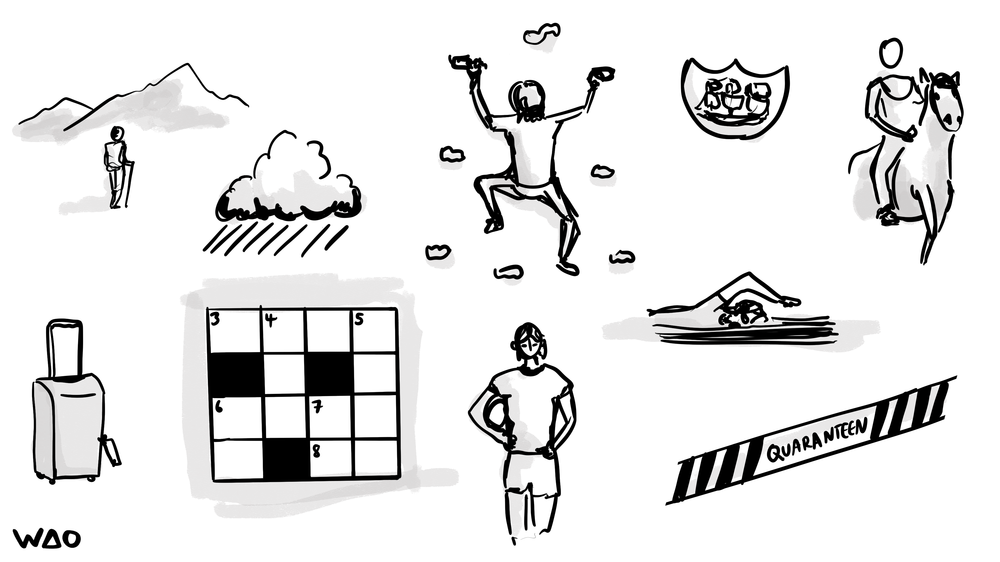 **Visual Thinkery Mixed Activity Icons** |  **Wao Innovation Team Branded Van** |
|  **Watercolor Tree Grove With Reflections** |  **Weathered Pie Chart Blue Teal Segments** |  **Website Lifting Weights Work Harder** |
|  **Young People Facing Multiple Crises Timeline** | | |

---

**148 images** in this collection

All images © Bryan Mathers, available under [CC BY-ND 4.0](https://creativecommons.org/licenses/by-nd/4.0/)
