# General

[← Back to main gallery](../)

### Adapt To Changing Circumstances Motivational

_A minimalist illustration showing "Adapt" in bold black lettering with "to changing circumstances" written below in blue handwriting, signed "WAO" at the bottom left._

---

### Ai Chatbot Worship Posture Advice

_A person kneels before a laptop on a pedestal asking "Tell me oh great GeePees what should I do?" and the AI responds with praise before critiquing their posture, illustrating how AI chatbots often give flattery followed by unsolicited advice._

---

### Ai Consent Popup Fake Choice Satire

_A satirical popup dialog box with header "WE VALUE YOU" asks for consent to use AI, offering only two identical agreement options: "OK" and "I AGREE" buttons._

---

### Ai Iceberg Hidden Complexity Cartoon

_A cartoon showing an iceberg labeled "Artificial Intelligence" above water with a small figure on top, while a submarine underwater asks "How deep does this go?" highlighting the vast hidden complexity of AI beneath its visible surface._

---

### Ai Metaphors Comparison Illustration

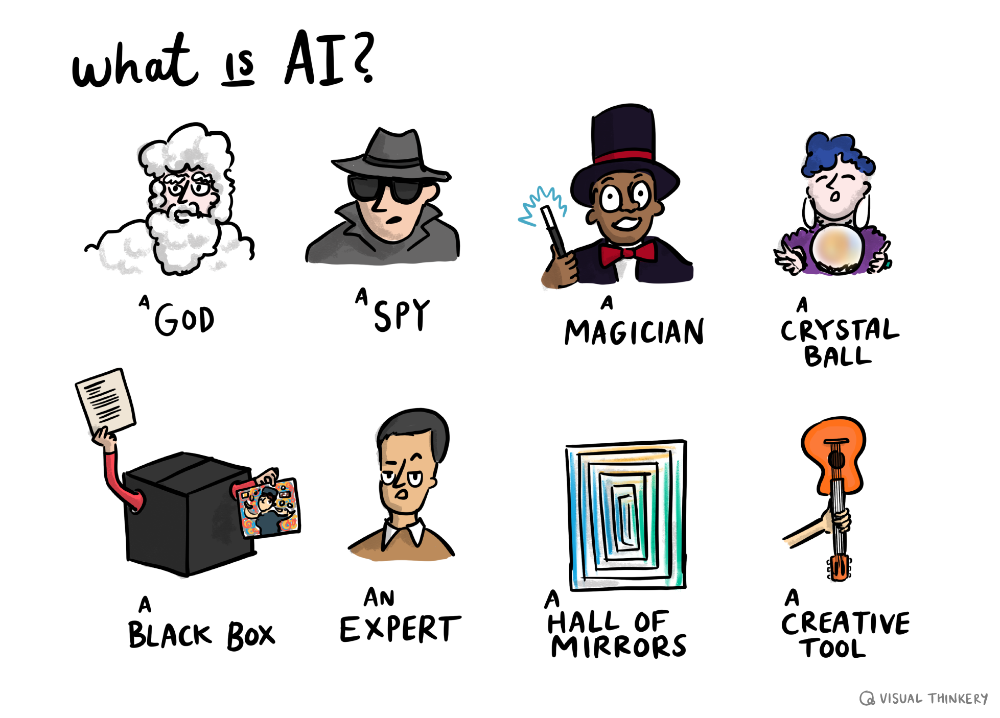

_A humorous illustration comparing AI to eight different metaphors: a god, spy, magician, crystal ball, black box, expert, hall of mirrors, and creative tool, each represented by simple cartoon drawings._

---

### Airplane Mode Travel Journey Comic

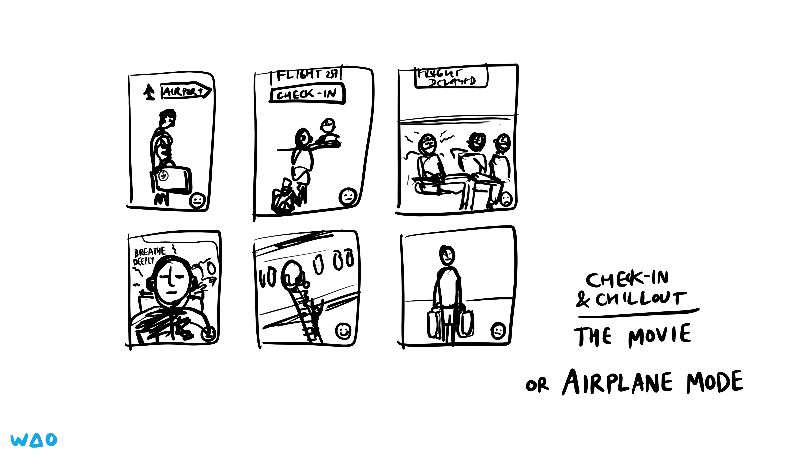

_A six-panel comic strip showing the airplane travel experience from departure to arrival, illustrating how putting your phone in airplane mode mimics the journey of being a passenger on a flight._

---

### Anxious Person Realistic Scenarios Comic

_A cartoon person with wide eyes and an anxious expression says "I don't know what I'm doing!" under the header "Likely + Realistic Scenarios."_

---

### Arrows Pointing Down To Line

_Four blue curved arrows pointing downward toward a horizontal black line, suggesting downward movement or pressure._

---

### Avocado Character Says Advocacy Right

_A cartoon avocado character with arms, legs, and a concerned facial expression says "Oh ADVOCACY right..." in a speech bubble._

---

### Avoid Oppressive Initialisms Acronym Humor

_A humorous acronym "AVOID" spelled out vertically with red letters, standing for "Avoid Very Oppressive Initialisms Duh!" with a note that this acronym should also be avoided._

---

### Badass Text Coral Navy Bold Letters

_The word "BADASS" is displayed in large, bold letters with "BAD" in coral/red color above "ASS" in dark blue/navy color._

---

### Bamboo Grove Watercolor Illustration

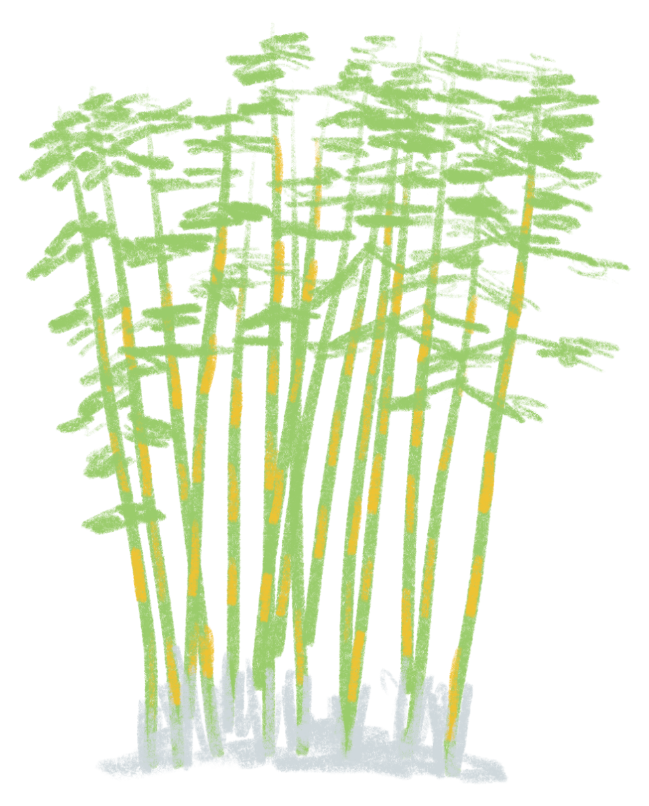

_A stylized illustration of bamboo stalks with green foliage rendered in a loose, artistic watercolor or crayon technique with yellow and green tones._

---

### Bicycle Leaning Against Green Tree Simple Drawing

_A simple black line drawing shows a bicycle leaning against a large tree with a vibrant green painted canopy on a minimal landscape._

---

### Bike Assembly Required Box Cartoon

_A cartoon illustration of a yellow product box labeled "YOUR BIKE" with "Model: Julie's" and "Assembly Required," mimicking the style of furniture packaging._

---

### Blockchain Laboratory Experiment Illustration

_A person in a lab coat conducts an experiment at a table with a microscope, while connected yellow blocks float above representing blockchain technology being studied._

---

### Blue Circle Sustainability Text

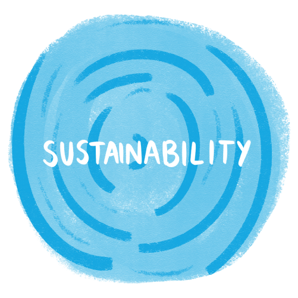

_A blue circular brushstroke design with the word "SUSTAINABILITY" written in white letters across the center._

---

### Bold Positive Factual Motivational Text

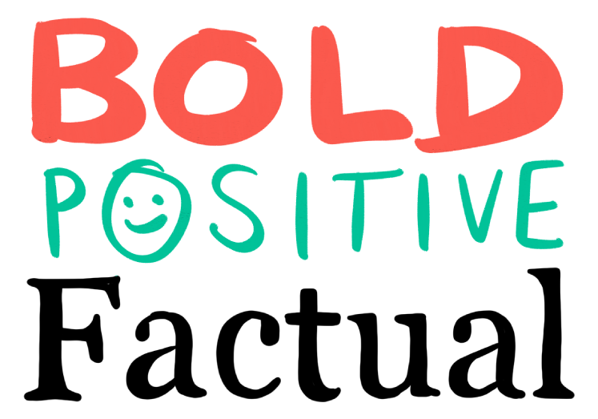

_A motivational text design displaying "BOLD" in red handwritten letters, "POSITIVE" in green with a smiley face replacing the O, and "Factual" in black serif font._

---

### Bonsai Tree In Red Labeled Pot Illustration

_A bonsai tree with green foliage and gray trunk sits in a red pot labeled "BONSAI" against a white background._

---

### Bridge From Storm Cloud To Sunshine

_A simple illustration shows a dark rain cloud connected by a blue bridge to a white cloud with sunshine, symbolizing the transition from bad times to good times._

---

### Bring Your Full Self To Work Dancing Person

_A cartoon illustration shows a person in yellow shirt and black pants dancing energetically with one arm raised, next to text reading "BRING YOUR FULL SELF TO WORK" on a blue background._

---

### Clock showing 9-5

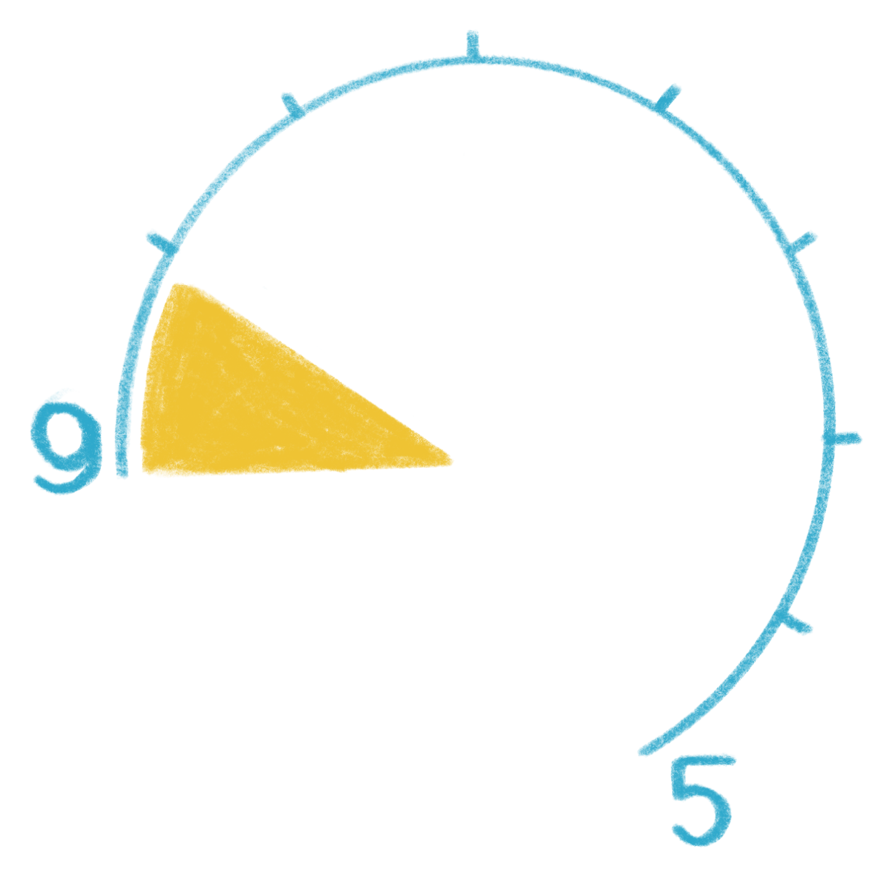

_A yellow triangle is positioned inside a blue circle with tick marks around its perimeter, with the numbers 9 and 5 visible outside the circle._

---

### Clock Combination Padlock Green Face

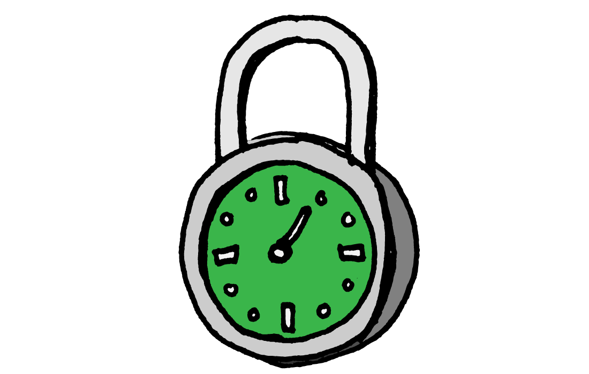

_A combination padlock with a green clock face showing approximately 10:10, featuring clock hands and hour markers instead of numbers._

---

### Confused Cat On Yellow Mat Saying What

_A gray cat sits on a yellow mat with a confused expression, saying "WHAT?" with whiskers twitching._

---

### Conical Canonical Comical Visual Pun

_Three cone shapes illustrate a visual pun: a yellow "conical" cone, an inverted funnel labeled "canonical," and a blue party hat on a jester's face labeled "comical."_

---

### Crossroads Intersection Bicycle Lane Traffic Light

_A cartoon illustration shows an intersection with "CROSS ROADS" written on the pavement and a bicycle symbol painted in a box, with a traffic light, trees, and a building visible._

---

### Crypto Mobile Wallet Explanation

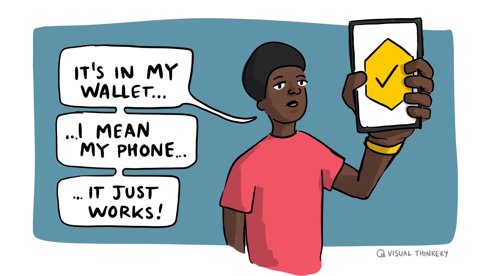

_A person holds up their phone showing a yellow checkmark while explaining that their cryptocurrency is stored in their wallet, meaning their phone, and that it just works._

---

### Dad Joke Pacific Specific Pun Comic

_A two-panel comic shows someone asking about favorite bodies of water, with the response being "Can you be more pacific?" - a dad joke playing on "Pacific" vs "specific."_

---

### De Stress Where Is The Line Visual Thinkery

_A hand-drawn illustration showing the word "DE-STRESS" in blue letters with red scribbles representing stress being separated by a dotted line, accompanied by the text "WHERE'S THE LINE?" in parentheses._

---

### Digital Supports Everything Cyclist Trees

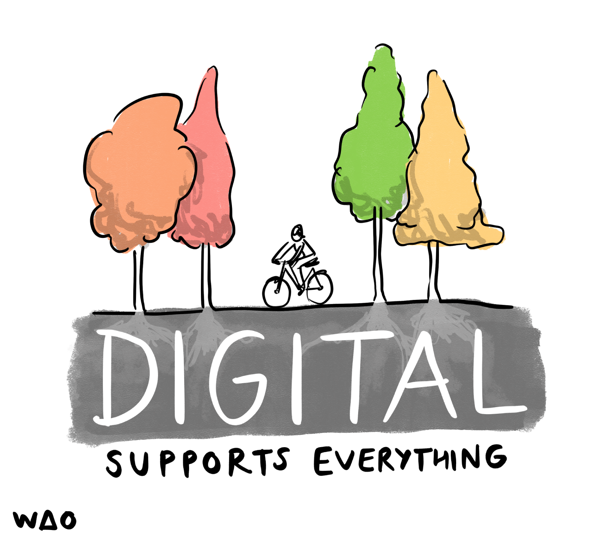

_A cyclist rides along a path beneath colorful autumn trees with the text "DIGITAL SUPPORTS EVERYTHING" prominently displayed below the scene._

---

### Disco Ball Discovery Concept Illustration

_A white disco ball displays the colorful text "disco very" against a dark blue background with bokeh light effects._

---

### Dont Overthink Just Hit Baseball Motivation

_A stick figure person in a blue shirt holds a baseball bat with a concerned expression, illustrating the concept of not overthinking by simply taking action._

---

### Empty Shelf Syndrome Illustration

_A humorous illustration showing two wall shelves labeled "EMPTY SHELF" and "SYNDROME" with only a small potted plant on the bottom shelf, visualizing the concept of "Empty Shelf Syndrome."_

---

### Four Layer Stream Chart Ideology Community Standar

_A layered stream chart showing four horizontal bands in different colors representing ideology (green), community (red), standard (yellow), and technology (blue) flowing from left to right with varying widths._

---

### Get Busy Living Or Dying Choice Sign

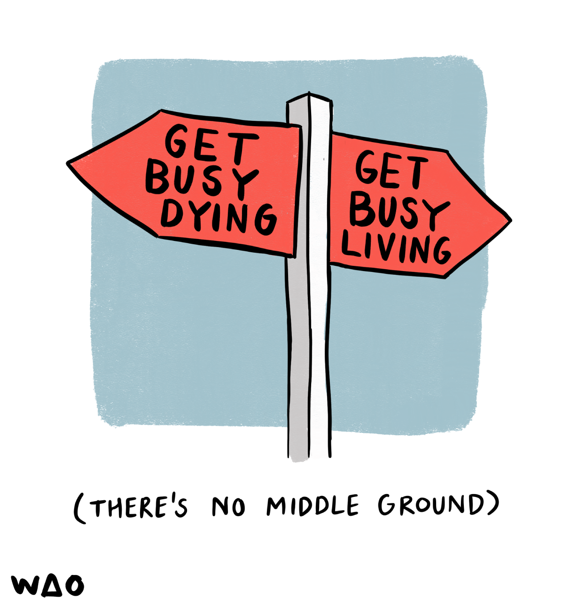

_A directional road sign with two red arrows pointing in opposite directions, one labeled "GET BUSY DYING" and the other "GET BUSY LIVING," with text below stating "THERE'S NO MIDDLE GROUND."_

---

### Green We Are Open Sandwich Board Sign

_A green A-frame sandwich board sign displays "WE are OPEN" in hand-drawn black lettering with a simple smiley face incorporated into the word "are."_

---

### Grumpy Panda Illustration Blue Background

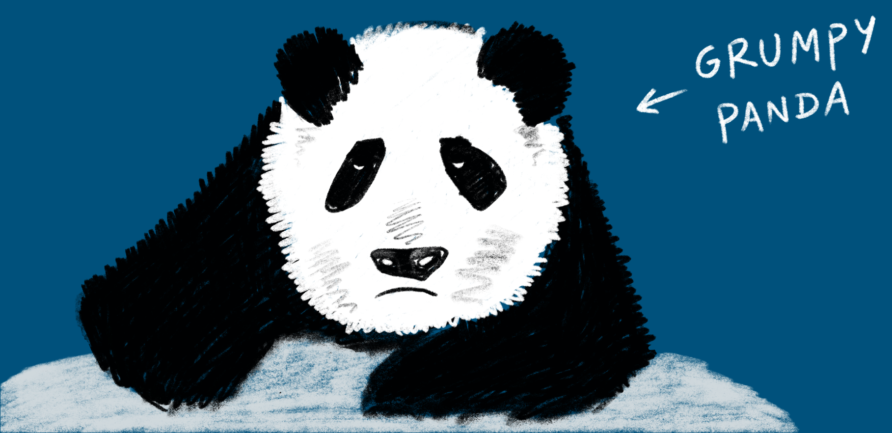

_A hand-drawn illustration of a frowning panda with black and white fur sitting on white ground against a blue background, labeled "GRUMPY PANDA" with an arrow pointing to it._

---

### Hal 9000 Vs Chatgpt Response Comparison

_A two-panel comic comparing HAL 9000 from 2001 refusing a request with "I'm sorry Dave, I'm afraid I can't do that" to ChatGPT enthusiastically agreeing and asking if the user has been working out._

---

### Hands Framing Rectangle Composition

_Two hands with extended index fingers form a rectangular frame shape using dotted red lines to indicate the boundaries of the framed area._

---

### Happy Panda Arms Raised Celebration Sketch

_A black and white sketch of a cheerful panda bear sitting with arms raised up in a celebratory or welcoming gesture._

---

### Happy Panda Celebrating With Bamboo

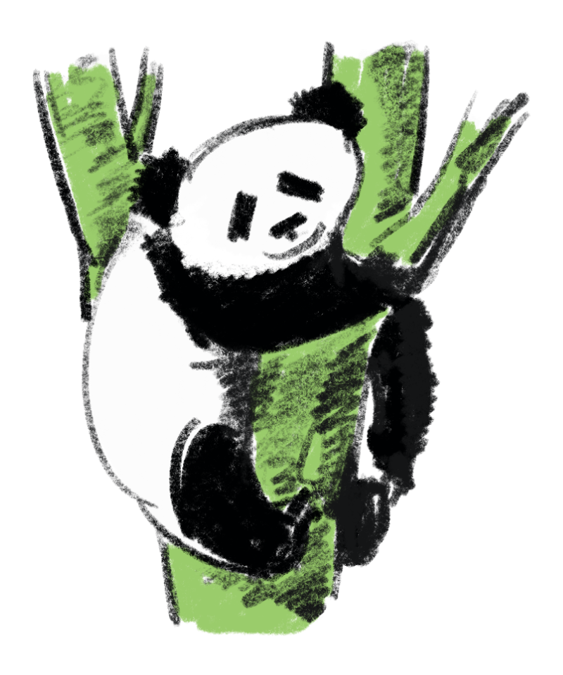

_A cheerful panda with raised arms celebrates while surrounded by green bamboo stalks in a sketchy, artistic style._

---

### Happy Waving Panda Cartoon Illustration

_A cheerful cartoon panda with black and white fur waves with one paw while displaying a happy expression with an open pink mouth._

---

### Badge tattoo

_An arm tattooed with a blue hexagonal badge._

---

### Houseparty Fomo Video Call Illustration

_A group of people at a house party celebrate while one person appears alone on a video call screen, illustrating the fear of missing out during social gatherings._

---

### Hype Inflatable Tube Man Roadside Cartoon

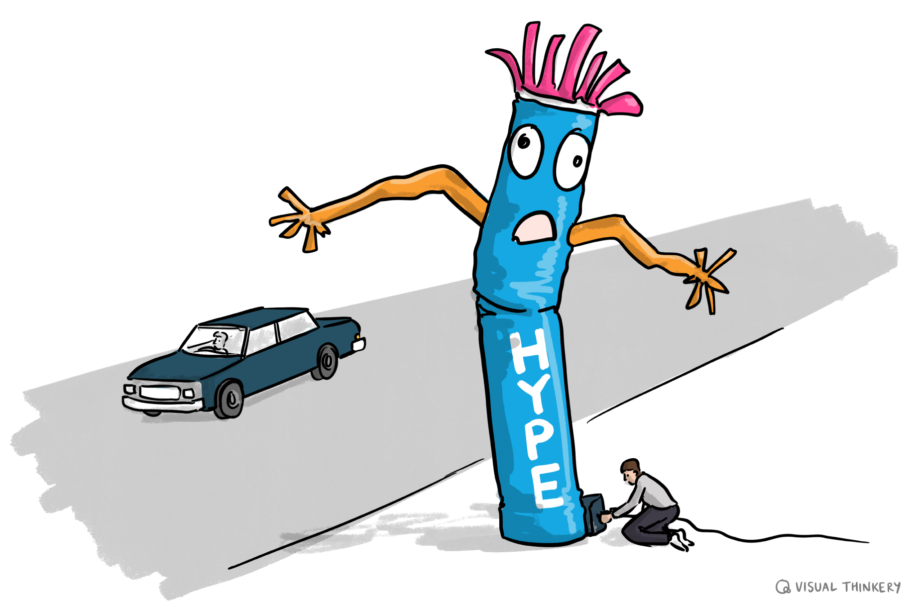

_A cartoon-style inflatable tube man labeled "HYPE" with pink hair flails his arms while a person inflates him from behind as a car drives by on the road._

---

### Ideas Hamster Speeding Cartoon Logo

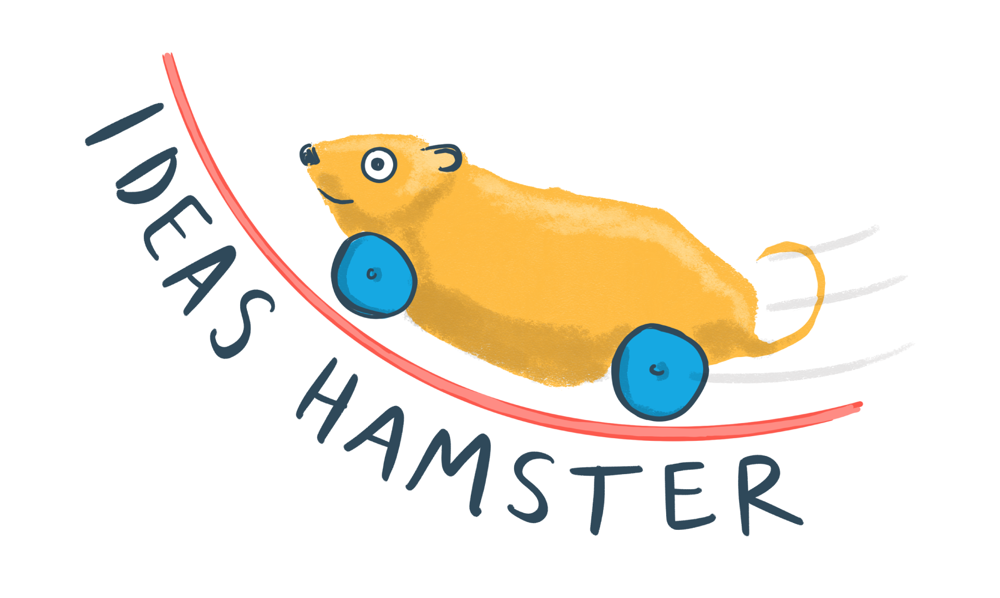

_A yellow cartoon hamster with blue wheels is shown speeding along a red curved line, with "IDEAS HAMSTER" text arranged in a circle around it._

---

### Interconnected Change Network Diagram

_A diagram showing five cloud-shaped bubbles all labeled "CHANGE" connected by curved arrows forming a circular network, illustrating how change creates ripple effects and interconnected transformations._

---

### Interpersonal Recognition Typology Methods

_This illustration shows eight different ways to give interpersonal recognition, including hat tip, salute, applaud, kudos, more power to your elbow, pat on the head, hall of fame, reflection, and say it with flowers._

---

### Kill The Bot Banner With Red Robot

_A yellow banner with a small red robot character displays the text "KILL THE BOT" in black letters._

---

### Local Dollar Bill Concept Illustration

_A hand-drawn illustration of a one dollar bill labeled "LOCAL DOLLAR" featuring a simple portrait and decorative elements in a sketchy, conceptual style._

---

### Magic Trust Online Shopping Comic

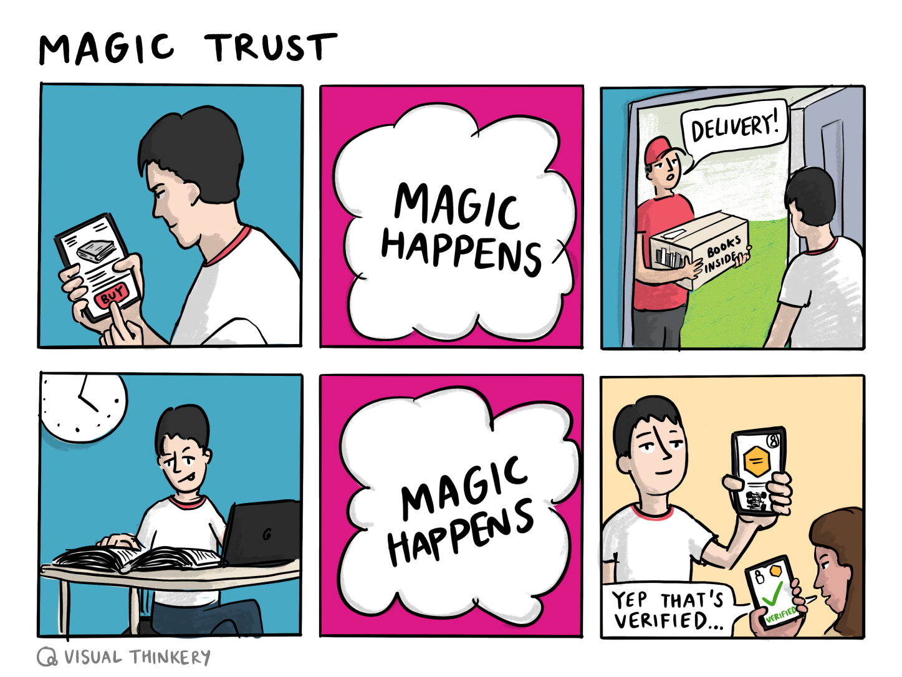

_A six-panel comic illustrating how online shopping works, showing a person ordering books on their phone, waiting at their computer, receiving delivery, and verifying the purchase with "magic happens" transitions between steps._

---

### Marketing Rule One Talk About Your Work

_A hand-drawn illustration showing "Marketing Rule #1: Just talk about the stuff you're doing" with a simple stick figure at a laptop, emphasizing authentic content creation over complex marketing strategies._

---

### Mixed Objects Door Boat Building Trees Breakfast

_A collection of hand-drawn illustrations including a green door, colorful target, sailboat named "Island Hopper," apartment building, trees with a squirrel, and breakfast items on a table._

---

### Multiple Padlocks Security Chain

_A row of padlocks in various colors (orange, gray, and red) hanging from a horizontal bar or chain, representing security, protection, or access control._

---

### Navigating Storms Staying Afloat Canoe

_A person paddles a canoe through calm waters with storm clouds overhead, with "keeping afloat" written in red text across the scene._

---

### Not This Moscow Saint Basils Cathedral Cartoon

_A cartoon illustration of Saint Basil's Cathedral with colorful onion domes, accompanied by text reading "NOT THIS MOSCOW" with an arrow pointing to the building._

---

### Off Shelf Tech Solutions Low Code No Code

_A person looks at two shelves of tech solutions - a lower shelf labeled "LOW CODE" with fewer boxes and a higher shelf labeled "NO CODE" with more boxes, illustrating the hierarchy of off-the-shelf technology options._

---

### Open Ecosystem Circular Logo Design

_A circular logo featuring the text "OPEN ECOSYSTEM" arranged around a yellow center circle, with blue and orange curved sections creating a dynamic, interconnected design._

---

### Orange Padlock Cross Pattern Security

_A repeating pattern of orange padlocks with keyholes arranged in cross-shaped clusters of four on a white background._

---

### Padlocks Locked Unlocked Security Concept

_Four padlocks hanging on a rod, with two orange locked padlocks on the left and two gray unlocked padlocks on the right, illustrating a security or access control concept._

---

### Panda Holding Circular Spiral Illustration

_A black and white illustration of a panda bear holding or embracing a large circular spiral or donut-like shape._

---

### Panda Lying Back Relaxed Pose

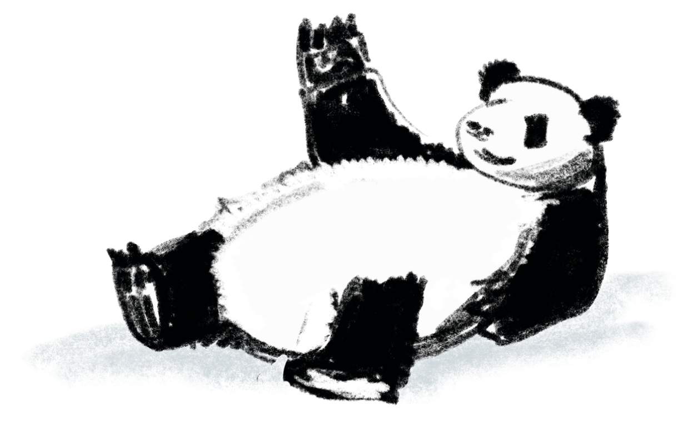

_A black and white illustration of a relaxed panda bear lying on its back with arms and legs spread out in a casual, carefree pose._

---

### Panda Reading Book Rocking Chair Relaxed

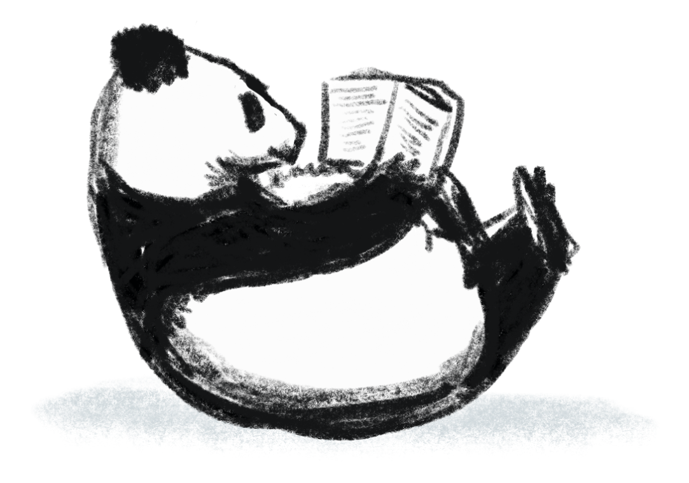

_A panda bear lying on its back reading a book while relaxing in a curved, rocking chair position._

---

### Parachutist Landing On Double Diamond

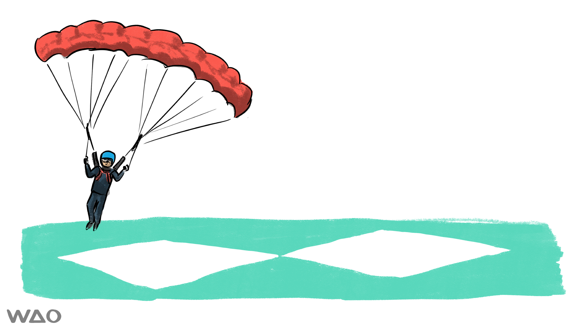

_A person with a red and white parachute is descending toward a teal-colored flag with white chevron stripes._

---

### Person Looking At GPS Map Sensor Enabled Building

_A person walks toward a a digital map showing a pathway to a location._

---

### Person Drowning In Treacle Can Overwhelmed

_A person drowns in a large red can of "Black Treacle" syrup with only their hand visible above the dark surface, illustrating being overwhelmed or stuck in a difficult situation._

---

### Person Examining Green Box With Someone On Top

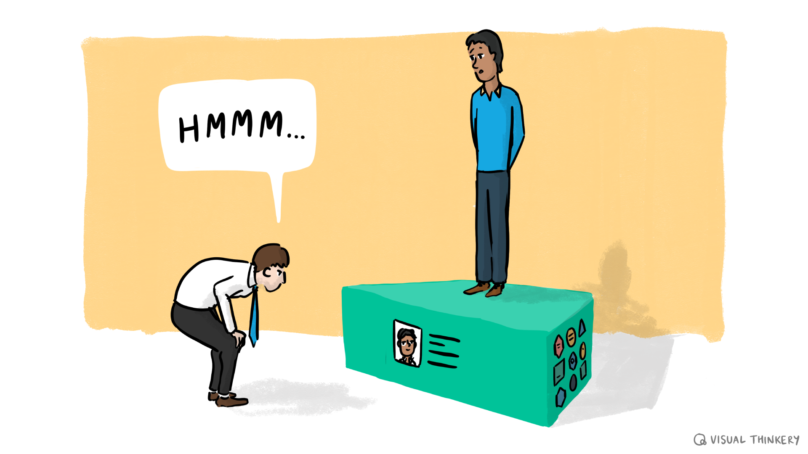

_A person in business attire examines a large green rectangular object while another person stands on top of it saying "HMMM..."_

---

### Person Juggling Stress Clouds Contagious

_A person with arms outstretched appears overwhelmed as dark scribbled clouds of stress hover above their head and hands, illustrating how stress spreads from person to person._

---

### Person Spinning Plates Horizontal Aerial Balance

_A person lies horizontally in the air spinning four plates on sticks while maintaining perfect balance, with their shadow visible on the ground below._

---

### Person Synthesizing Meaning With Keyboards

_A person sits at a keyboard setup with synthesizers on either side, illustrating the concept of creating meaning through electronic music synthesis._

---

### Person Trapped In Stressor Clamp

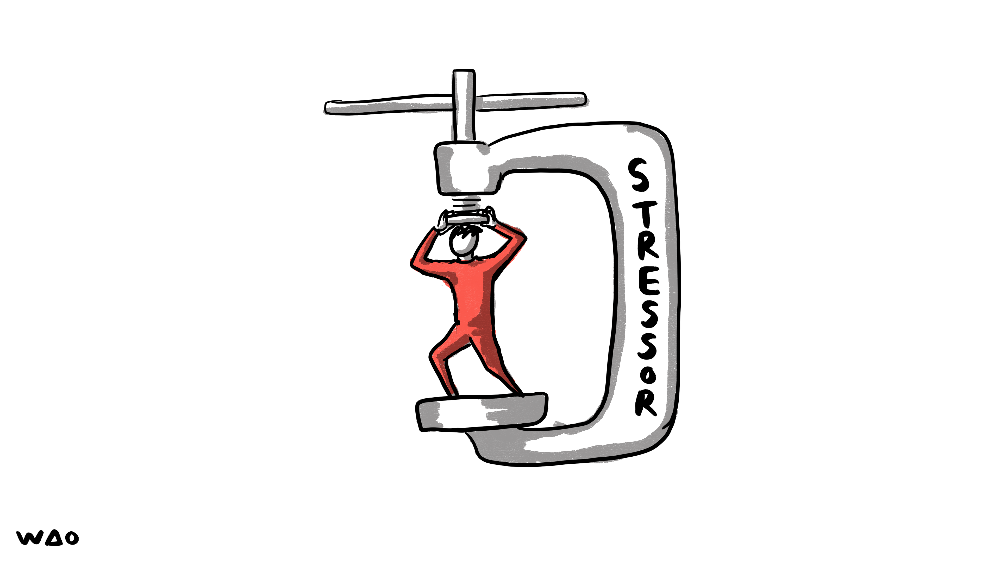

_A red figure is trapped inside a C-clamp labeled "STRESSOR," with hands raised to their head in a gesture of stress or overwhelm._

---

### Pie Chart Blue Gray Segments Weathered

_A circular pie chart with six segments in various shades of blue, gray, and white with a weathered, textured appearance._

---

### Pink Toolbox With Visible Tools Cutouts

_A pink toolbox with a black handle has white tools (wrench, screwdriver, and other implements) visible through cutout openings in its sides._

---

### Police Lineup Usual Suspects Silhouettes

_A police lineup illustration showing five silhouetted figures against height measurement lines, titled "The Usual Suspects" in blue text._

---

### Recognising Good Ideas Billboard Concept

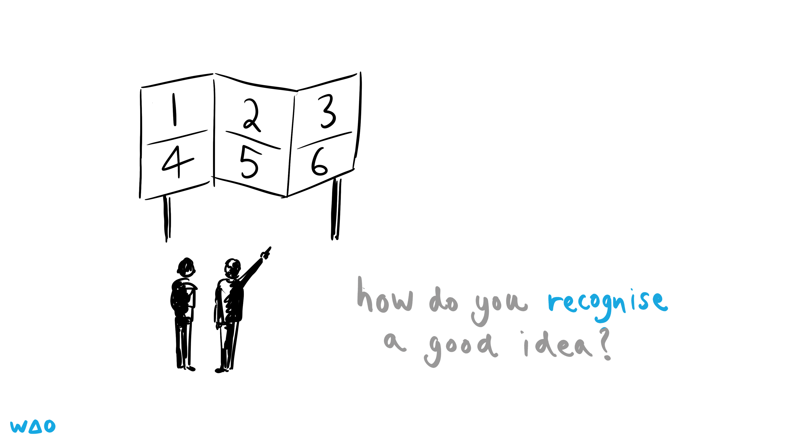

_Two stick figures look up at a large billboard or sign displaying numbers 1-6 in a grid format, with one figure pointing at it, while text asks "how do you recognise a good idea?"_

---

### Red Padlock With Key Inserted

_A red padlock with an open shackle and a white key inserted into the lock mechanism._

---

### Red Toolbox With White Tool Silhouettes

_A red toolbox with a black handle sits on a white surface, featuring white tool silhouettes including a wrench on its front face and other tools visible on the side._

---

### Repeating To Help Others Colorful Text

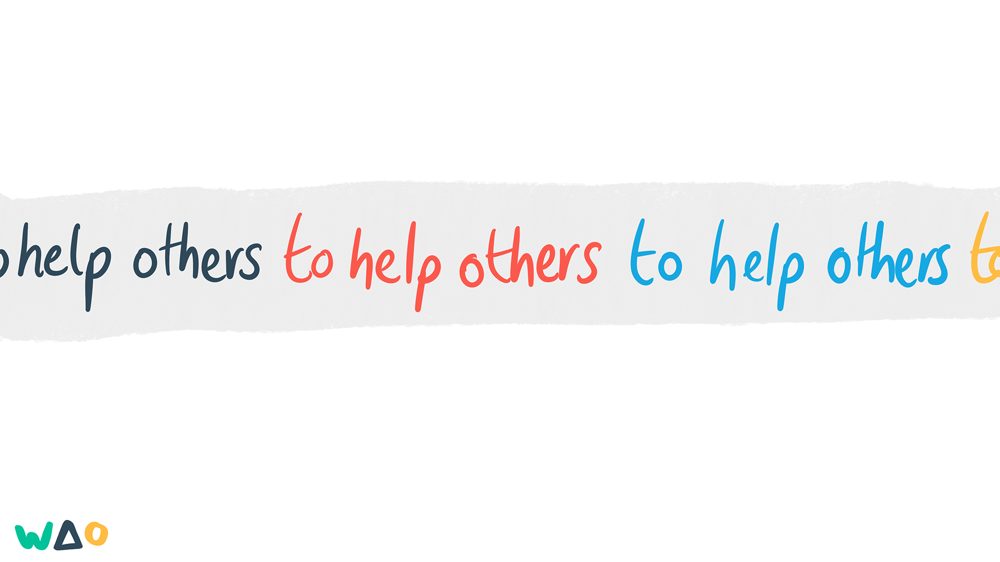

_The phrase "to help others" repeats three times in different colors (dark blue, red, light blue, and yellow) across a light gray background, creating a visual emphasis on the importance of helping others._

---

### Roller Coaster Ride Metaphor Illustration

_A simple line drawing of a roller coaster track with three hills, where the words "ROLLER COASTER RIDE" are written in blue letters following the curves of the track, and a small roller coaster car sits at the top of the final hill._

---

### Sad Panda Sketch Black White Drawing

_A black and white sketch of a sad-looking panda bear with droopy eyes and a downturned mouth, drawn in a loose, sketchy style._

---

### Sitting Panda Sketch Black White

_A simple black and white sketch of a panda sitting down, drawn in a loose, artistic style with charcoal or similar medium._

---

### Sankey Diagram Four Streams Flow Chart

_A Sankey diagram shows four colored streams (Ideology in green, Community in red, Standard in yellow, and Technology in blue) flowing from left to right, with Technology becoming the dominant stream by the end._

---

### Signal Boost Transmission Tower Illustration

_A black transmission tower on a hill emits orange radio waves with "SIGNAL BOOST" written in blue and red text beside it._

---

### Six Keyhole Tiles Arranged Grid

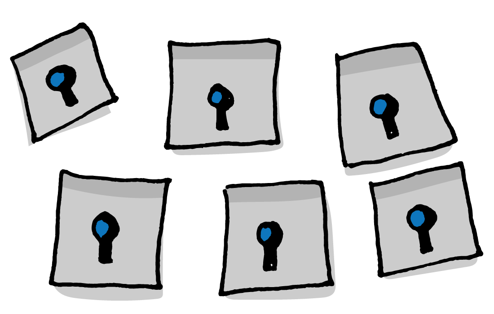

_Six gray square tiles each containing a black keyhole with a blue center are arranged in two rows of three._

---

### Skydiver Freefalling Through Clouds

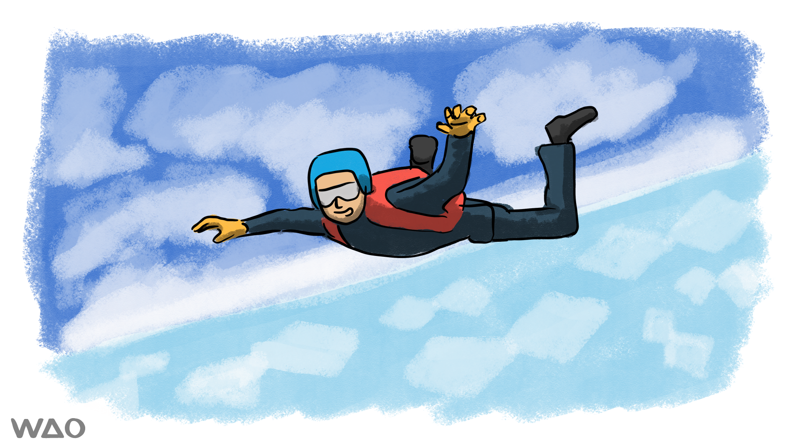

_A person in skydiving gear free-falls through a cloudy blue sky with arms and legs spread in a classic skydiving position._

---

### Skydiver Holding Trophy In Freefall

_A person in skydiving gear with goggles and a blue helmet is shown in free fall position, holding what appears to be a golden trophy or award in their raised hand._

---

### Skydiver With Red White Parachute Descending

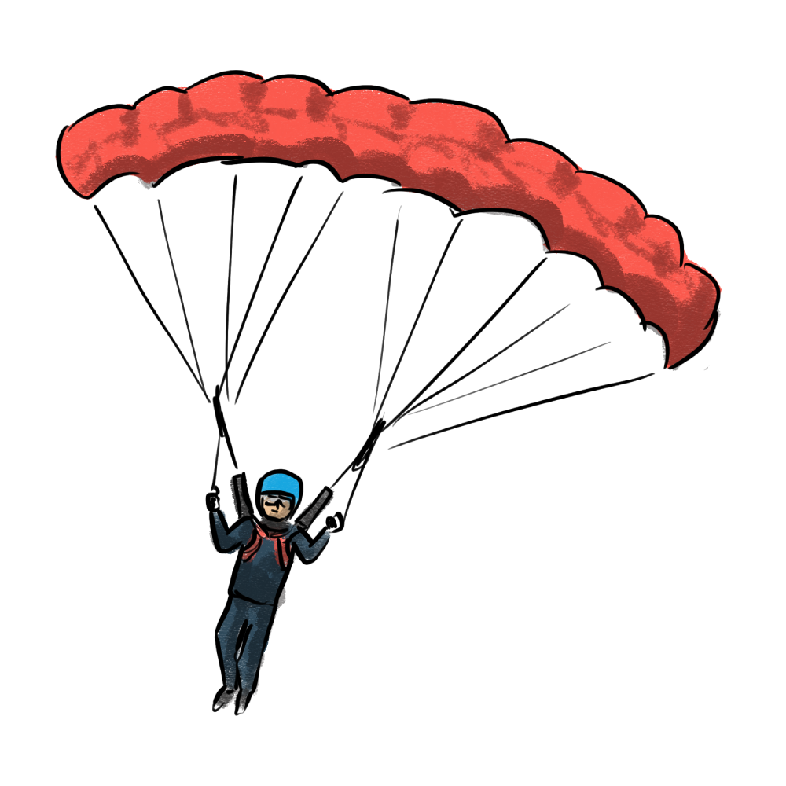

_A person in skydiving gear descends with an open parachute that has a red and white canopy._

---

### Stick Figures Fading Employment Pandemic Terms

_A simple line drawing shows several human figures gradually fading from black to light gray, accompanied by text listing employment and pandemic-related terms in decreasing opacity from "FULL TIME" to "ISOLATING."_

---

### Surveillance False Reassurance Irony

_A smiling person reassures "Don't worry this is not a test!" while a security camera ominously announces "This is not a test!" creating an ironic contrast about surveillance and false reassurance._

---

### Tech Pillars Web2 Ai Blockchain Columns

_Three classical columns representing Web 2.0, AI ("This Will Change Everything"), and Blockchain stand as pillars of technological innovation under a bright sun in the sky._

---

### Telescope On Tripod Watercolor Illustration

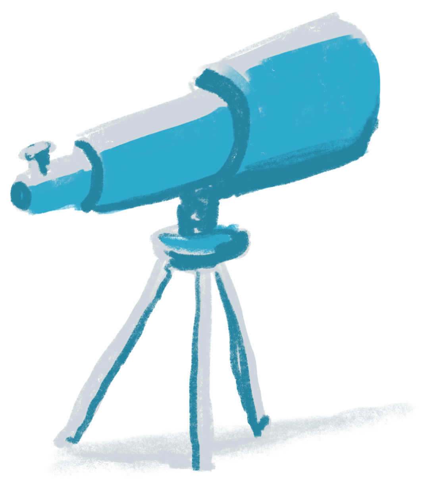

_A blue and gray telescope mounted on a tripod stand, illustrated in a loose watercolor or brush painting style._

---

### Therapy Session How Did That Make You Feel

_A simple line drawing shows a person reclining on a therapy couch with the blue handwritten text "And how did that make you feel?" positioned to the right._

---

### Three Padlocks Emotional Security Progression

_Three padlocks with faces showing different emotions - sad, neutral, and happy - representing a progression from negative to positive security states._

---

### Time And Downtime With Climbing Figures

_A stylized illustration showing "TIME" in large green letters with small human figures climbing on them, and "downtime" in blue cursive below, with a red ampersand connecting the two words._

---

### Training On The Go Coffee Cup

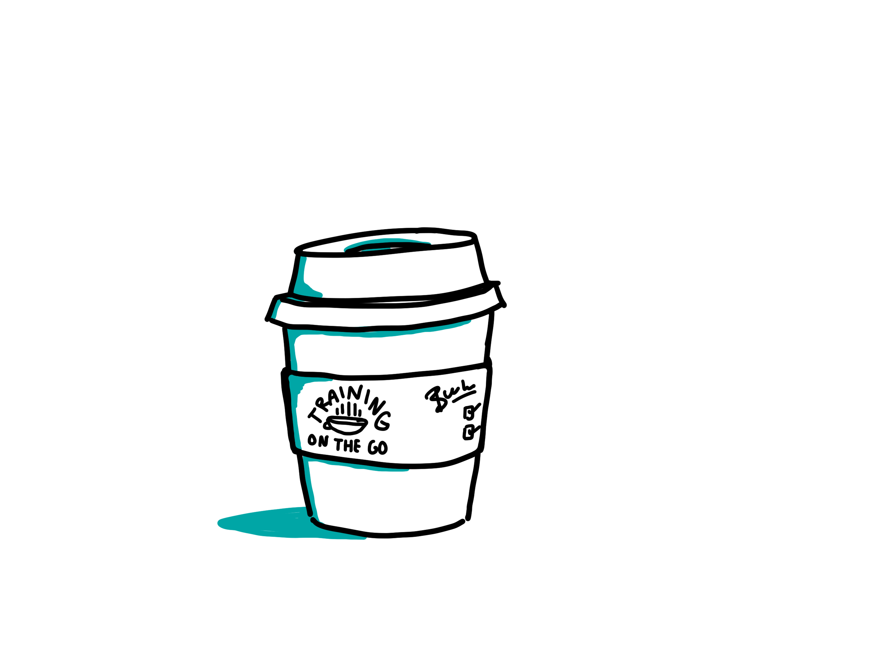

_A white disposable coffee cup with a lid and sleeve that reads "TRAINING ON THE GO" with steam lines and a small logo._

---

### Trust Word Geometric Lines Turquoise

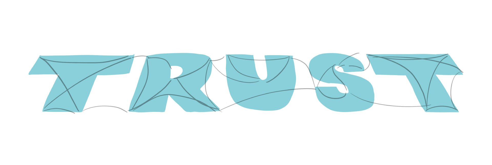

_The word "TRUST" is displayed in large turquoise letters with geometric line patterns overlaying each letter, creating an interconnected web-like design._

---

### Two Hammers Claw And Flat Head Tools

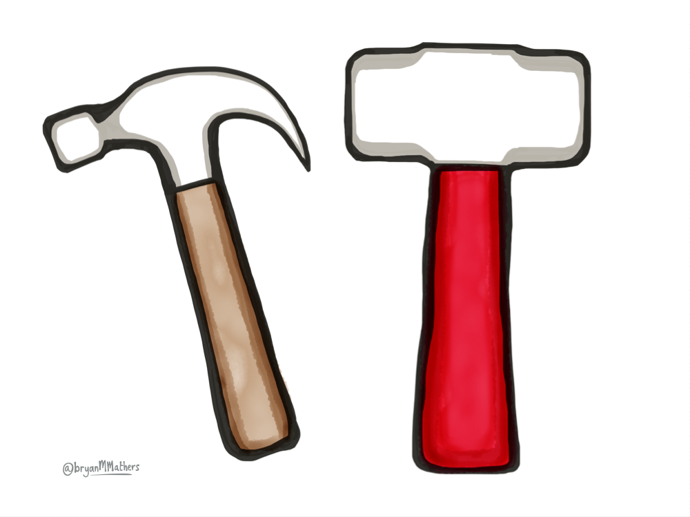

_A simple illustration showing two hammers side by side - a claw hammer with a brown wooden handle on the left and a ball-peen hammer with a red handle on the right._

---

### Two Stars And A Wish

_Two bright golden stars with radiating light rays are followed by a golden teapot with blue steam, suggesting a magical progression or transformation._

---

### Wao Innovation Team Branded Van

_A stylized black van with red accents displays "INNOVA TEAM" and "WAO" branding, featuring distinctive red wheels and a sleek corporate design._

---

### Website Lifting Weights Work Harder

_A cartoon website with stick-figure legs is lifting a barbell while displaying "LET'S DO THIS!" on its screen, with text reading "MAKE YOUR WEBSITE WORK HARDER."_

---

### Young People Facing Multiple Crises Timeline

_A cartoon illustration showing a young person who has lived through a sequence of major challenges from the 2007 financial crisis through austerity, Brexit, COVID, and now faces AI, with the caption "Tsk! Young People today..."_

---

**113 images** in this collection

All images © Bryan Mathers, available under [CC BY-ND 4.0](https://creativecommons.org/licenses/by-nd/4.0/)
