# Learning Design

[← Back to main gallery](../)

| | | |
|:--:|:--:|:--:|
|  **5Ws And H Question Framework Diagram** |  **5Ws And H Questioning Framework Diagram** |  **Accountability Pyramid Low To High Stakes** |
|  **Are You Content With Your Content Question** |  **Books With Emotions On Chairs** | 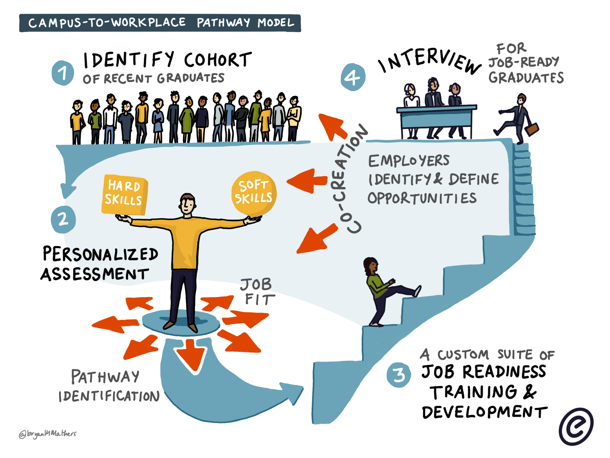 **Campus To Workplace Pathway Model** |
| 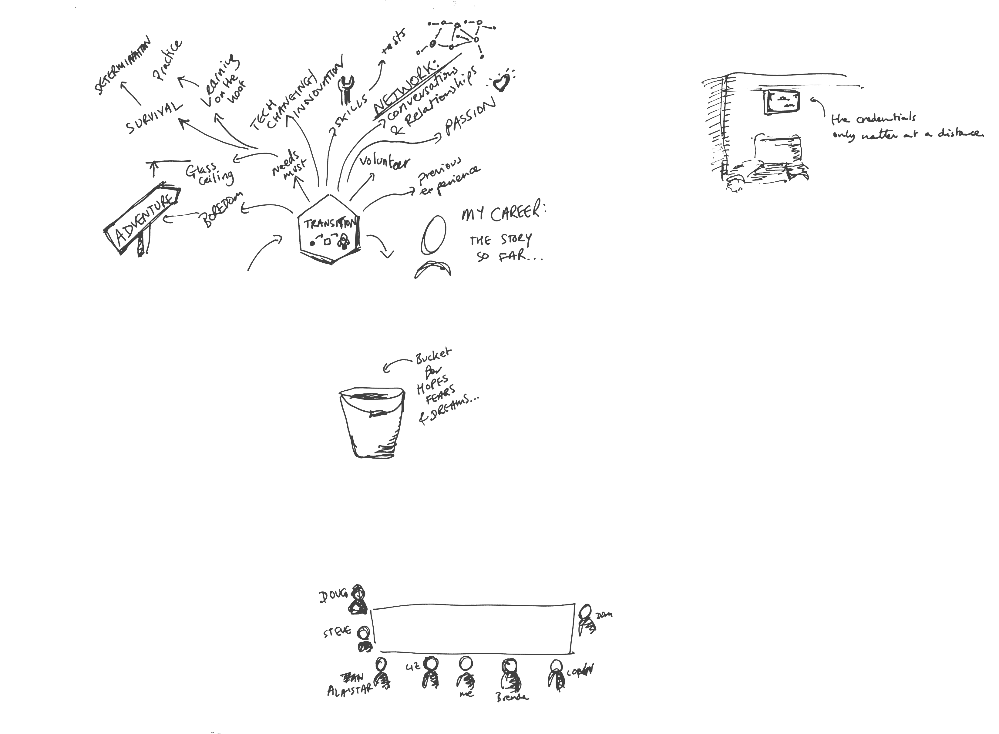 **Career Transition Mindmap Sketch** |  **Cereal Box To Rocket Reuse Illustration** |  **Child Development Paths Education Socialization** |
|  **Choices Pie Slice Decision Making Diagram** |  **Content Experimentation Test Tubes** |  **Content Is Queen Playing Cards Hand** |
| 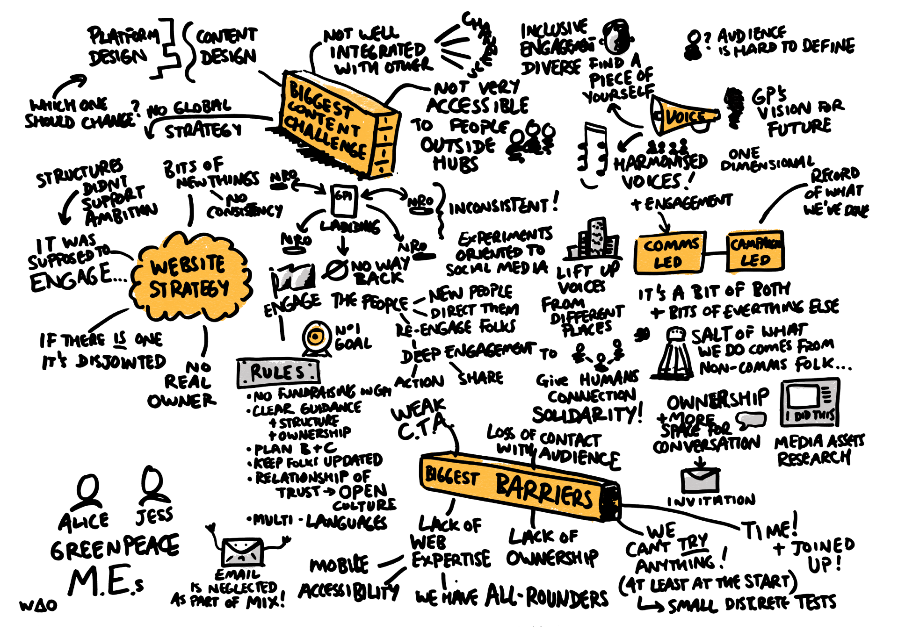 **Content Strategy Challenges Mindmap** | 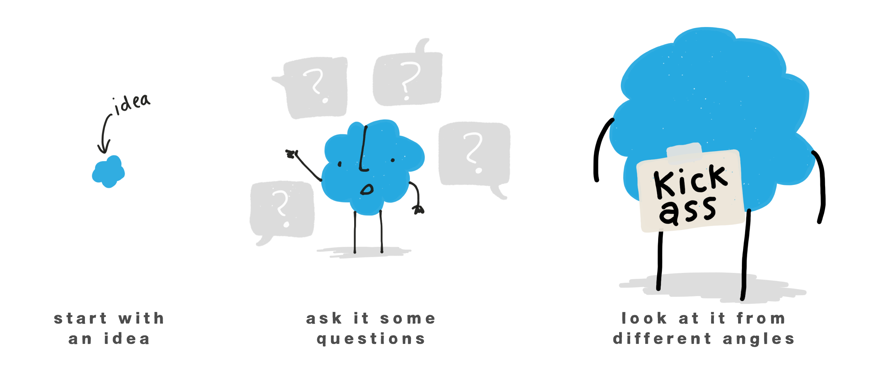 **Creative Process Idea Development Stages** |  **Critical Incident Training Cycle Community** |
| 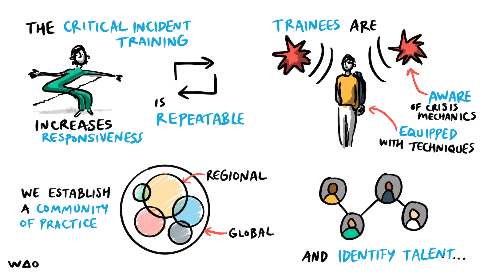 **Critical Incident Training Cycle Diagram** |  **Cybersecurity Workplace Culture Sketch** |  **Decision Making Platform With Guidance Arrows** |
|  **Digital Comfort Zone Frustration Cartoon** |  **Digital Education Platform Concept Map** |  **Discovery Two Steps Forward One Step Back** |
|  **Ecosystem Network Connections Illustration** |  **Edu Tech Goals Handwritten List** |  **Educational Strategy Mindmap Sketchnotes** |
| 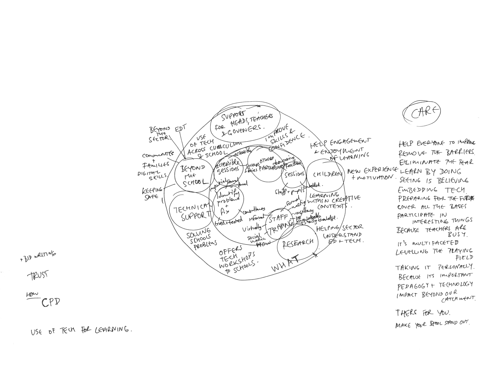 **Educational Tech Care Mindmap Sketch** |  **Enhancement Vs Transformation Visual Concept** |  **Five Ws And H Question Words Diagram** |
| 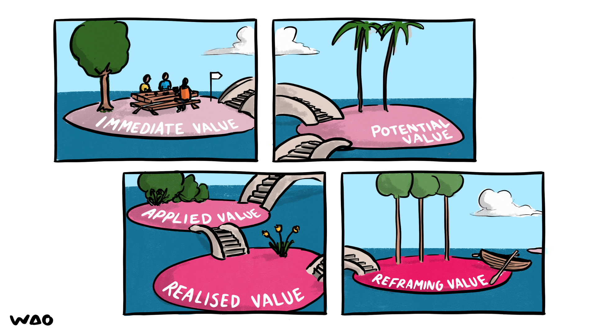 **Four Islands Types Of Value Bridges Comic** |  **Four Layer Foundation Stack Diagram** |  **Good Fit Solution Development Faces** |
|  **Grid Puzzle Keyhole Arrow Solution** |  **Innovation Adoption Distribution Bell Curve** | 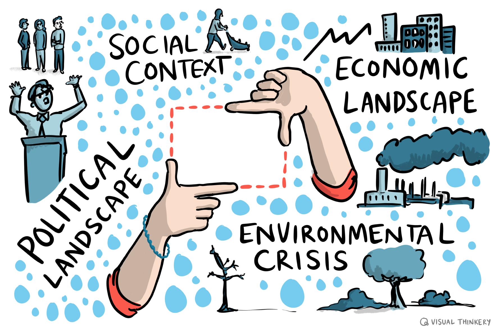 **Interconnected Systems Pointing Hands Diagram** |
|  **Keypad Interface With Red Arrow Pointer** | 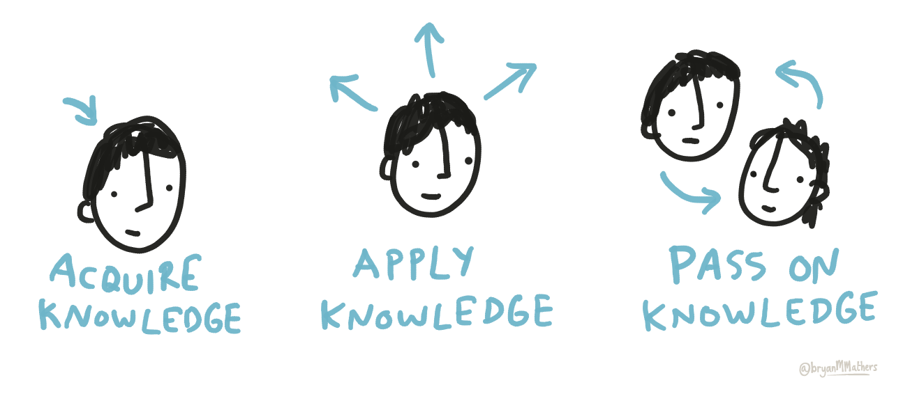 **Knowledge Acquisition Application Teaching Cycle** |  **Knowledge Assessment Self Peer Expert Circles** |
|  **Knowledge Awareness Pie Chart** |  **Learn With We Are Open Room Sketch** |  **Leaving Comfort Zone Road Sign** |
|  **Make It Digital Climbing Typography** |  **Meaningful High Value Online Laptop Cartoon** |  **Orange Creativity Cloud Illustration** |
|  **Outcome Context Need Framework Diagram** |  **Panda Holding Colorful Pie Chart Wheel** |  **Person Fleeing Overwhelming Wall Of Text** |
|  **Person Identifying With Shapes On Clothesline** |  **Person Waving Video Player Timeline Weeks** |  **Progression People Climbing Upward Steps** |
|  **Question To Solution Journey Path** |  **Reactivity Vs Proactivity Mindset Diagram** |  **Safety Valve Stress Management Mechanism** |
|  **Same Problems Different Tools Flower Knife** |  **Same Problems Different Tools Swiss Knife** |  **Skateboard Experiment Development Journey** |
|  **Small Changes Skateboard Backpack Speed** |  **Space Talent Recruitment Game Interface** | 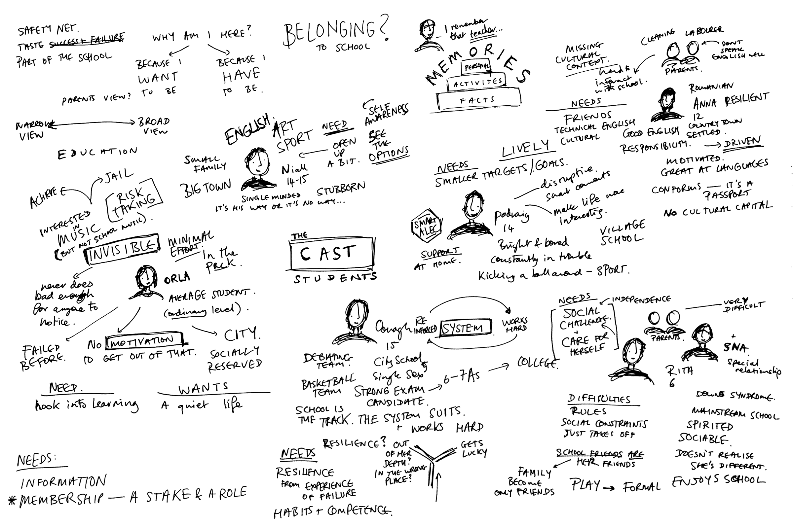 **Student Belonging School Engagement Mindmap** |
|  **T Shaped Graduate Learning Model** |  **Tech Adoption Mindmap Scattered Notes** |  **Three Books With Different Emotions** |
|  **Three Buckets Fame Fortune Fun Priorities** |  **Tools Connecting Learning Data Networking** |  **Trigger Looking For Food Risks Barriers** |
| 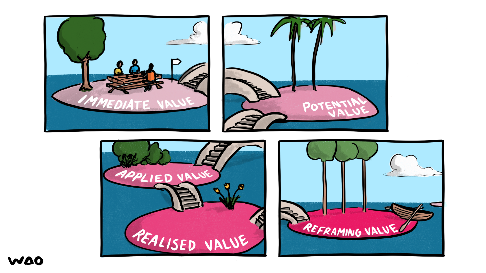 **Value Types Islands Bridges Illustration** |  **Visual Thinking Cube Mindmap Connections** | 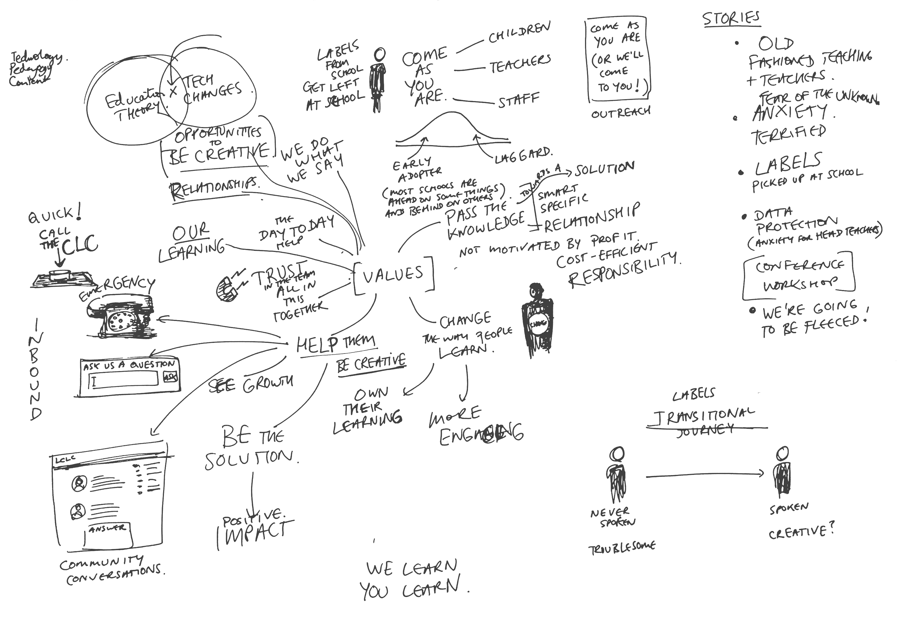 **Visual Thinking Education Transformation Mindmap** |
| 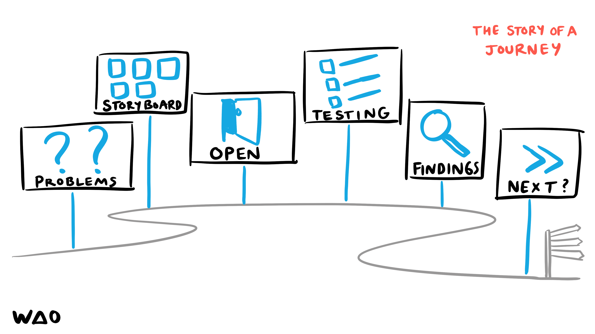 **Visual Thinking Problem Solving Cycle Journey** | | |

---

**67 images** in this collection

All images © Bryan Mathers, available under [CC BY-ND 4.0](https://creativecommons.org/licenses/by-nd/4.0/)
