# Learning Design

[← Back to main gallery](../)

### 5Ws And H Question Framework Diagram

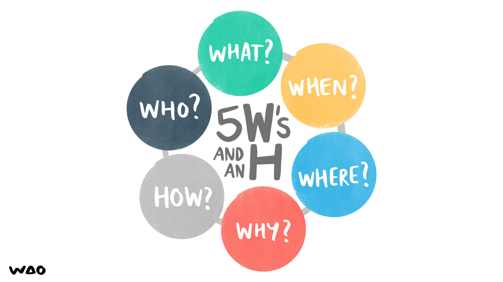

_A colorful diagram showing the "5Ws and an H" framework with six interconnected circles containing the question words WHO, WHAT, WHEN, WHERE, WHY, and HOW arranged around the central text._

---

### 5Ws And H Questioning Framework Diagram

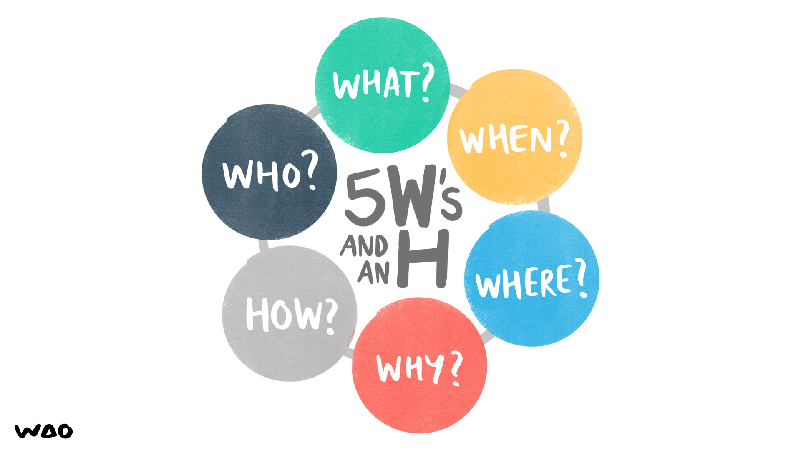

_A colorful diagram showing the "5Ws and an H" questioning framework with six circles arranged in a flower pattern, each containing one of the key question words: WHO, WHAT, WHEN, WHERE, WHY, and HOW._

---

### Accountability Pyramid Low To High Stakes

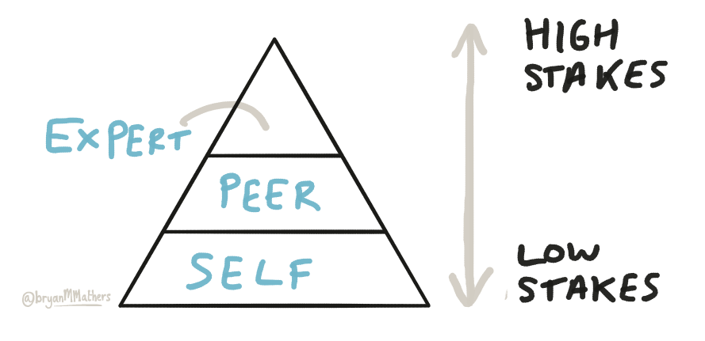

_A pyramid diagram shows three levels of accountability from bottom to top (Self, Peer, Expert) with an arrow indicating stakes increase from low at the bottom to high at the top._

---

### Are You Content With Your Content Question

_A hand-drawn illustration asking "are you content with your CONTENT?" with a thoughtful person's profile and question mark, emphasizing the dual meaning of contentment and content creation._

---

### Books With Emotions On Chairs

_Three anthropomorphized books sitting on chairs display different emotions: the first appears happy and relaxed, the middle one looks sad or worried, and the third seems distressed or crying._

---

### Campus To Workplace Pathway Model

_A circular pathway model showing four steps for transitioning graduates to employment: identifying graduate cohorts, conducting personalized skills assessments, providing custom job readiness training, and facilitating employer interviews through co-creation between educational institutions and employers._

---

### Career Transition Mindmap Sketch

_A hand-drawn mind map showing career transition thoughts with branching paths from a central "TRANSITION" box leading to various concepts like "SURVIVAL," "ADVENTURE," "CALLING," and personal reflections, accompanied by sketches of a bucket, notebook, and people sitting in a row._

---

### Cereal Box To Rocket Reuse Illustration

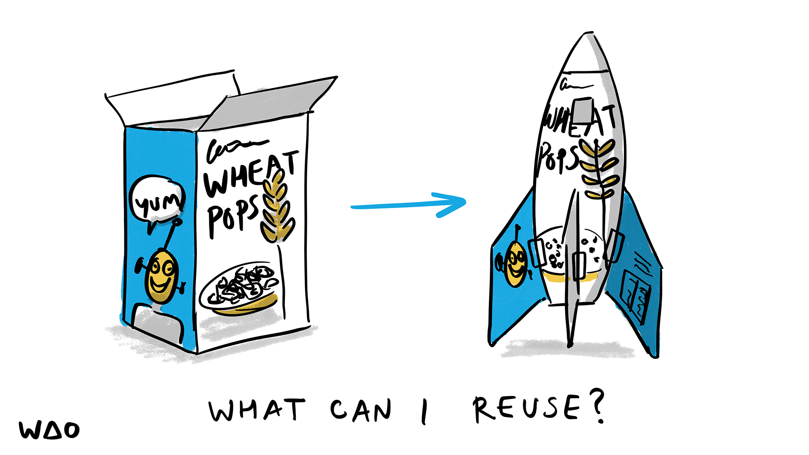

_A cartoon illustration shows a cereal box transforming into a rocket ship with an arrow between them, demonstrating creative reuse of packaging materials._

---

### Child Development Paths Education Socialization

_A stick figure child progresses from school through peer groups to individual development, with arrows pointing toward three life paths: education, socialization, and personal development._

---

### Choices Pie Slice Decision Making Diagram

_A blue pie slice hovers above a circular pie tin divided into sections, with the word "CHOICES" written below in blue letters._

---

### Content Experimentation Test Tubes

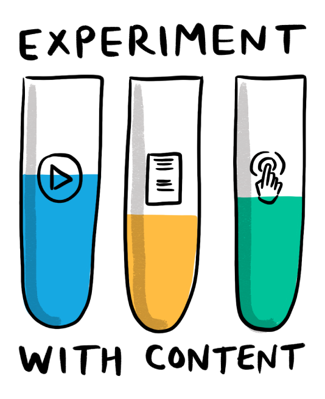

_Three test tubes filled with different colored liquids contain icons representing video, text document, and interactive content, illustrating content experimentation._

---

### Content Is Queen Playing Cards Hand

_A hand of playing cards spells out "CONTENT" with the Queen of Hearts as the final card, illustrating that "content is..." followed by the metaphor of being queen or king._

---

### Content Strategy Challenges Mindmap

_A hand-drawn mind map analyzing content strategy challenges, featuring orange highlighted boxes for "BIGGEST CONTENT CHALLENGE" and "BIGGEST BARRIERS" with various branching notes about platform design, website strategy, accessibility issues, and engagement problems._

---

### Creative Process Idea Development Stages

_This illustration shows the creative process in three stages: starting with a small idea, asking questions to develop it (represented by a confused blue brain character surrounded by question marks), and then viewing it from different angles (shown as a larger, more confident brain character holding a "kick ass" sign)._

---

### Critical Incident Training Cycle Community

_This illustration shows a cyclical training process where critical incident training increases responsiveness, trainees become aware of crisis mechanics and equipped with techniques, leading to the establishment of regional and global communities of practice that identify talent and repeat the cycle._

---

### Critical Incident Training Cycle Diagram

_This illustration shows a cyclical process where critical incident training increases responsiveness, trainees become equipped with crisis management techniques, and this creates a repeatable system that establishes regional and global communities of practice while identifying talent._

---

### Cybersecurity Workplace Culture Sketch

_A hand-drawn sketch illustrating various cybersecurity and workplace culture issues including password reuse, knowledge gaps, security concerns, and the social rather than technical nature of these problems._

---

### Decision Making Platform With Guidance Arrows

_A diagram showing a person at the bottom of a diamond-shaped platform with arrows pointing to different areas - green "YES" and "GOT IT" arrows leading to safe zones, red "AVOID" and "NO!" arrows pointing to danger areas, and blue question mark arrows indicating uncertainty._

---

### Digital Comfort Zone Frustration Cartoon

_A cartoon character with spiky hair looks frustrated while stepping outside their "Digital Comfort Zone" circle, with an arrow pointing to them labeled "So Frustrating."_

---

### Digital Education Platform Concept Map

_This hand-drawn sketch maps out concepts for digital education platforms, showing ideas around open access, community building, research tools, and user experience design with various interconnected elements and annotations._

---

### Discovery Two Steps Forward One Step Back

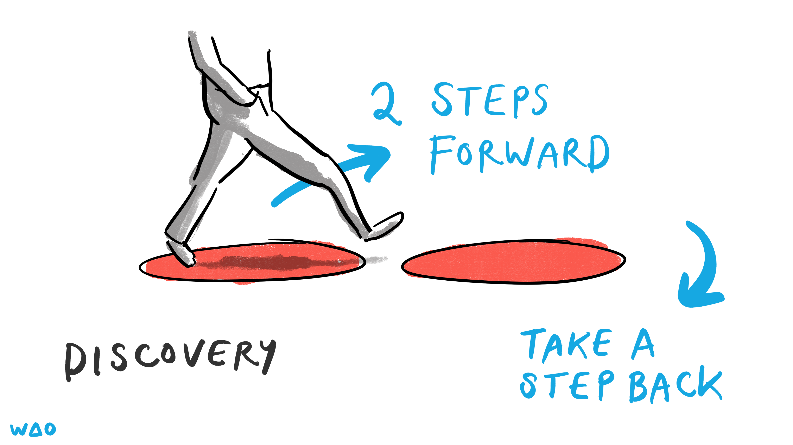

_A simple line drawing shows a person taking a step forward between two red oval stepping stones, with blue text indicating "2 STEPS FORWARD" and "TAKE A STEP BACK" to illustrate the concept of discovery as a process of progress and setbacks._

---

### Ecosystem Network Connections Illustration

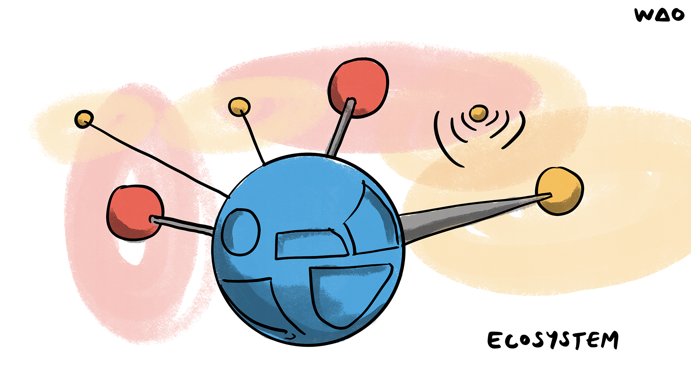

_A blue sphere with interconnected segments has multiple rods extending outward to colored circles, representing how different elements connect within an ecosystem._

---

### Edu Tech Goals Handwritten List

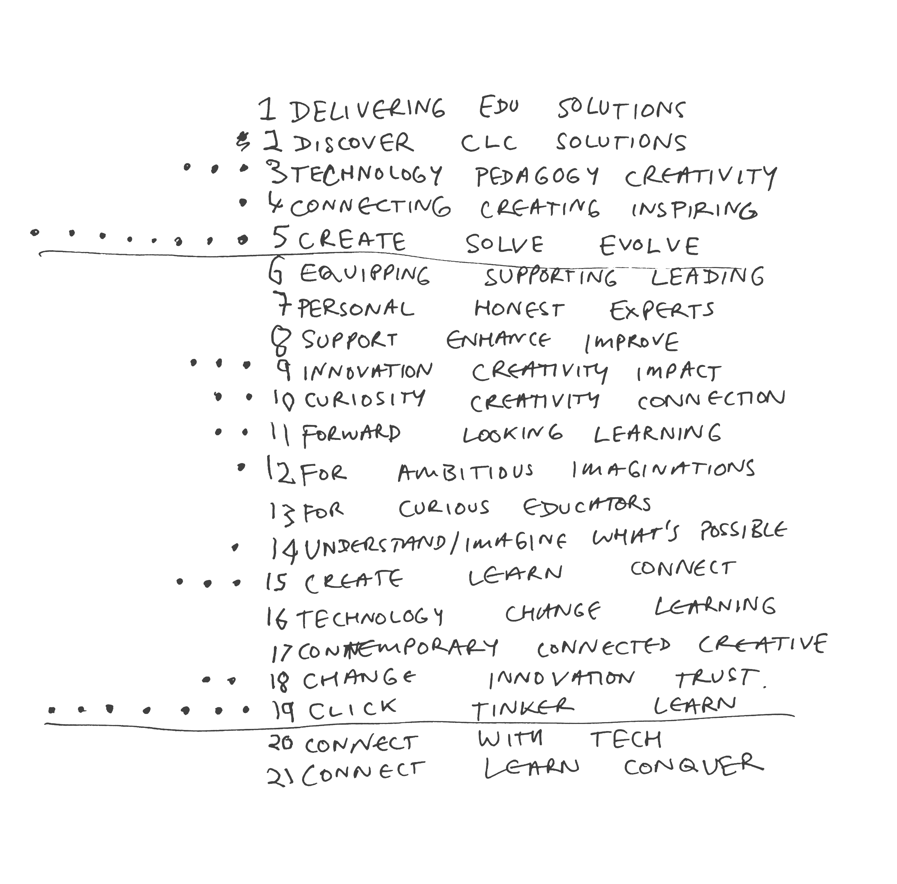

_A hand-drawn list of 21 numbered educational technology concepts and goals, including delivering solutions, connecting creativity, supporting innovation, and fostering learning connections._

---

### Educational Strategy Mindmap Sketchnotes

_A hand-drawn mind map exploring educational technology strategy, featuring interconnected concepts like relevance, partnerships, research, and teaching methods with sketched illustrations of people, newsletters, and various educational elements._

---

### Educational Tech Care Mindmap Sketch

_A hand-drawn mind map illustrating the concept of "CARE" in educational technology, with interconnected bubbles containing terms like "CPD," "TRUST," "CHILDREN," "STAFF TRAINING," and "RESEARCH," surrounded by detailed notes about helping teachers integrate technology and overcome barriers._

---

### Enhancement Vs Transformation Visual Concept

_This illustration shows the difference between enhancement (a small square becoming a larger square) and transformation (a small square becoming a circle), demonstrating that enhancement improves existing forms while transformation creates entirely new ones._

---

### Five Ws And H Question Words Diagram

_A colorful circular diagram showing the "5Ws and an H" with six colored circles containing the question words WHO?, WHAT?, WHEN?, WHERE?, WHY?, and HOW? arranged around central text._

---

### Four Islands Types Of Value Bridges Comic

_A four-panel comic showing islands connected by bridges, each labeled with different types of value: "Immediate Value" (with people at a picnic table), "Potential Value" (with palm trees), "Applied Value" and "Realised Value" (with vegetation), and "Reframing Value" (with tall trees and a boat)._

---

### Four Layer Foundation Stack Diagram

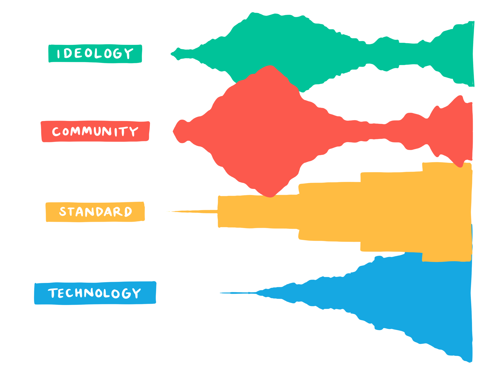

_A layered landscape diagram showing four horizontal strata labeled from top to bottom as Ideology (green), Community (red), Standard (orange), and Technology (blue), illustrating how these foundational elements build upon each other._

---

### Good Fit Solution Development Faces

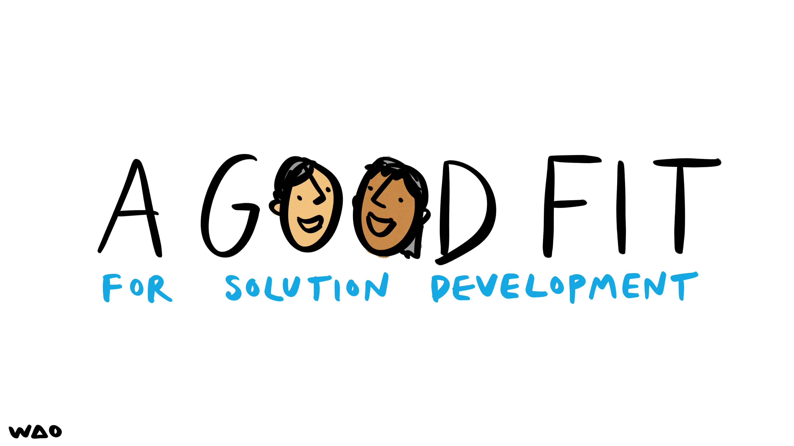

_A hand-drawn illustration showing "A GOOD FIT" in black letters with two smiling cartoon faces replacing the double O's, and "FOR SOLUTION DEVELOPMENT" written in blue below._

---

### Grid Puzzle Keyhole Arrow Solution

_A hand-drawn diagram showing a 3x4 grid with 10 blue hatched squares and 1 white square containing a keyhole, plus a red arrow pointing to the keyhole square._

---

### Innovation Adoption Distribution Bell Curve

_A bell curve showing the distribution of innovation adoption, with stick figures representing early adopters on the left, the majority at the peak, and laggards on the right._

---

### Interconnected Systems Pointing Hands Diagram

_A hand-drawn illustration showing two hands pointing at each other with dashed red lines, surrounded by four labeled sections: "Social Context" (with people), "Economic Landscape" (with buildings and chart), "Political Landscape" (with speaker at podium), and "Environmental Crisis" (with factory pollution and dying tree), all set against a background of blue dots._

---

### Keypad Interface With Red Arrow Pointer

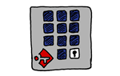

_A keypad or number pad interface with dark squares arranged in a grid pattern and a red arrow pointing to one of the buttons._

---

### Knowledge Acquisition Application Teaching Cycle

_A simple three-step learning process illustration showing stick figures: first acquiring knowledge (arrow pointing down to one person), then applying knowledge (arrows pointing up and diagonally from one person), and finally passing on knowledge (curved arrows showing one person teaching another)._

---

### Knowledge Assessment Self Peer Expert Circles

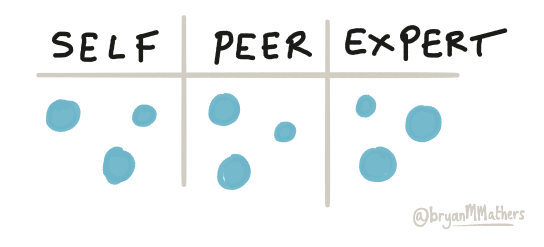

_This illustration shows three columns labeled "SELF," "PEER," and "EXPERT," each containing different sized and positioned circles representing varying levels of knowledge or skill assessment from different perspectives._

---

### Knowledge Awareness Pie Chart

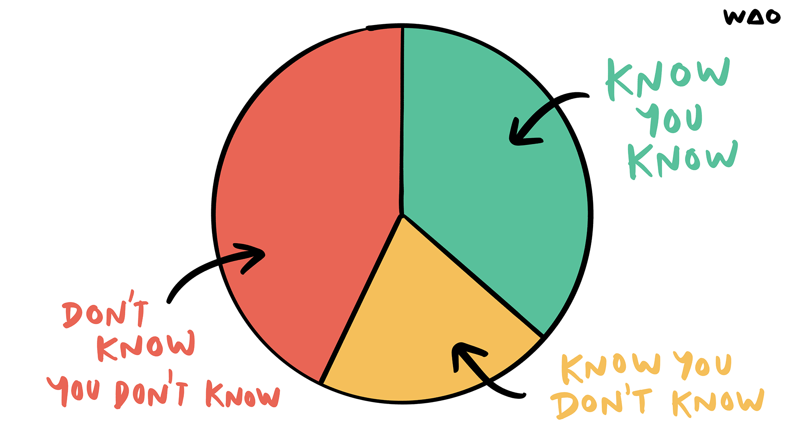

_A pie chart divided into three sections showing the relationship between knowledge and awareness: "Know You Know" (green), "Don't Know You Don't Know" (red), and "Know You Don't Know" (yellow)._

---

### Learn With We Are Open Room Sketch

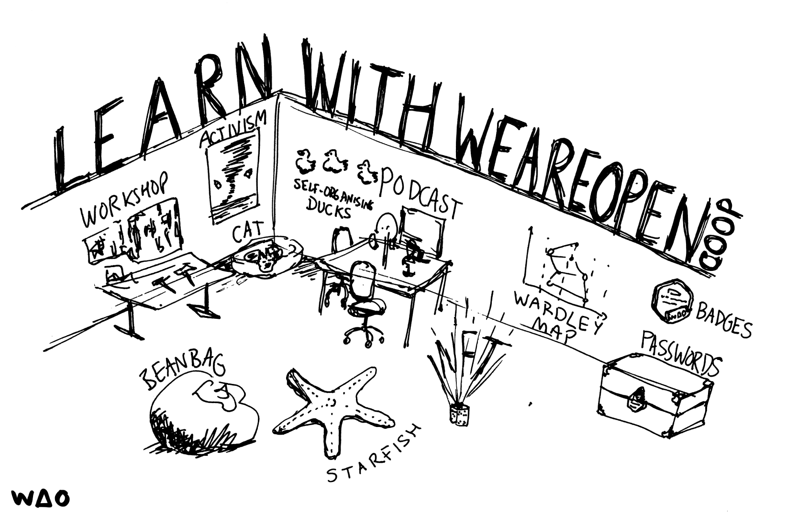

_A hand-drawn illustration depicting a "Learn With We Are Open" room containing various objects like a workshop desk, activism poster, cat, beanbag, starfish, podcast setup, wardrobe, and password-protected chest._

---

### Leaving Comfort Zone Road Sign

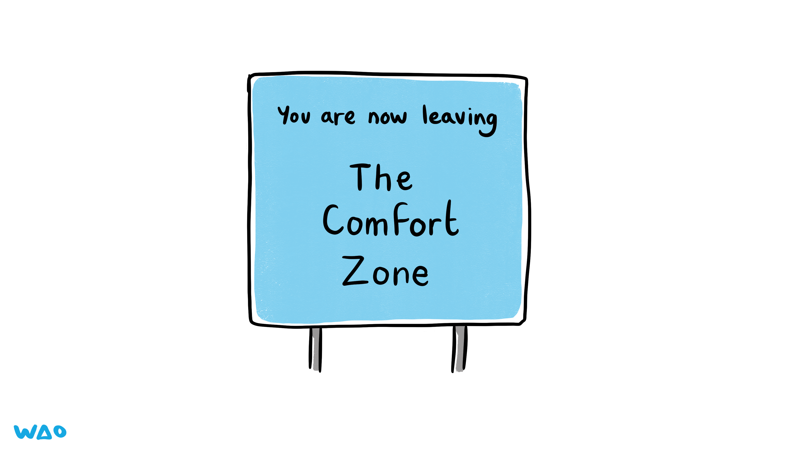

_A blue road sign on two posts reads "You are now leaving The Comfort Zone" in black text._

---

### Make It Digital Climbing Typography

_A minimalist design showing "make it DIGITAL" in cursive black text above bold blue letters, with tiny black silhouettes of people climbing and interacting with the large letterforms._

---

### Meaningful High Value Online Laptop Cartoon

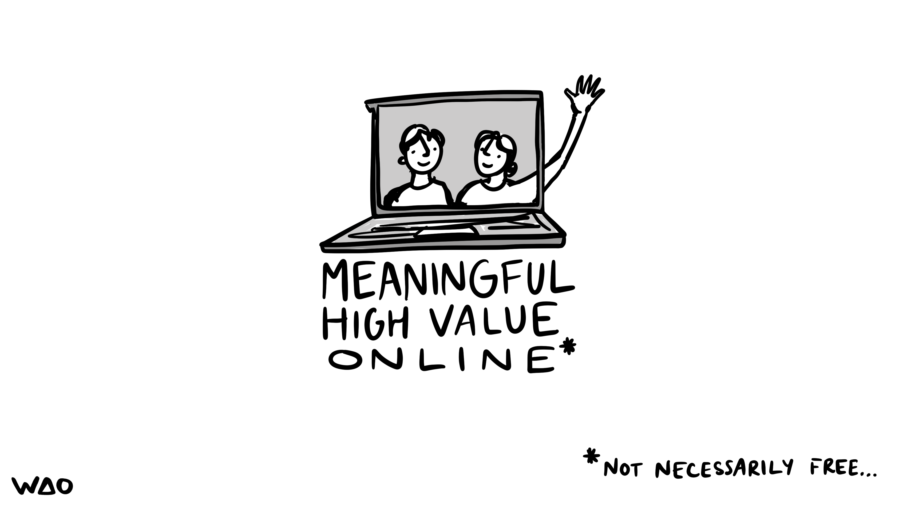

_A simple black and white cartoon shows two people on a laptop screen with one waving, accompanied by text reading "MEANINGFUL HIGH VALUE ONLINE" with a footnote "*NOT NECESSARILY FREE..."_

---

### Orange Creativity Cloud Illustration

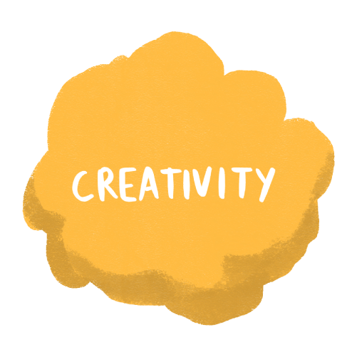

_A fluffy orange cloud with white text reading "CREATIVITY" in the center, featuring dimensional shading that gives it a soft, three-dimensional appearance._

---

### Outcome Context Need Framework Diagram

_A simple black and white illustration shows three interconnected cloud-like shapes labeled "OUTCOME," "CONTEXT," and "NEED" surrounding a central circular element marked "JIM."_

---

### Panda Holding Colorful Pie Chart Wheel

_A black and white panda bear holds a circular chart or wheel divided into colorful segments of red, green, blue, and yellow._

---

### Person Fleeing Overwhelming Wall Of Text

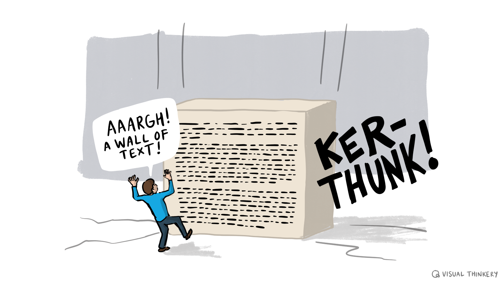

_A person runs away in alarm from a large block of dense text while a "KER-THUNK!" sound effect suggests the intimidating impact of the text wall._

---

### Person Identifying With Shapes On Clothesline

_A person hanging from a clothesline points to geometric shapes hanging like laundry while saying "THIS IS ME!" with a cat watching from below._

---

### Person Waving Video Player Timeline Weeks

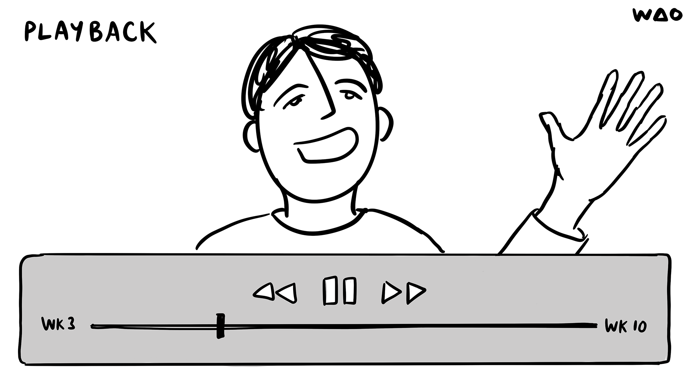

_A smiling person waves from behind a video player interface showing playback controls and a timeline from week 3 to week 10, with "PLAYBACK" written above._

---

### Progression People Climbing Upward Steps

_A stylized illustration showing people climbing upward on stepped circular platforms connected by paths, with "PROGRESSION" written alongside and an upward arrow, representing advancement and growth._

---

### Question To Solution Journey Path

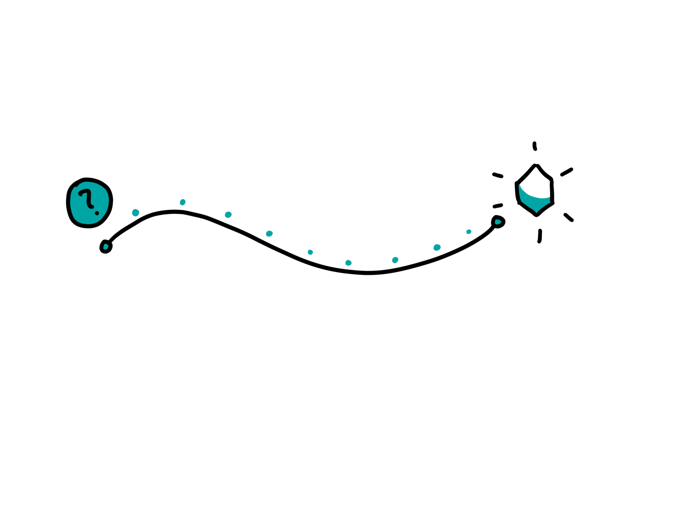

_A curved path with dots connects a question mark symbol on the left to a glowing hexagonal gem or crystal on the right._

---

### Reactivity Vs Proactivity Mindset Diagram

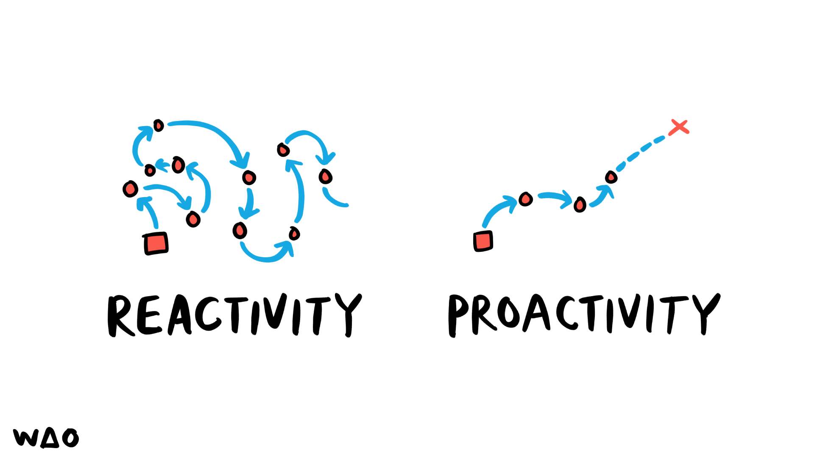

_A simple diagram contrasts reactivity (showing chaotic circular arrows and scattered dots around a red square) with proactivity (showing a purposeful straight path from a red square through connected dots to a target marked with an X)._

---

### Safety Valve Stress Management Mechanism

_A cartoon illustration shows a safety valve connected to a stress gauge, representing "mechanisms to deal with stress" as a pressure release system for managing psychological pressure._

---

### Same Problems Different Tools Flower Knife

_A cartoon Swiss Army knife with various flowers sprouting from its tools illustrates the concept that we face the same problems but use different tools to solve them._

---

### Same Problems Different Tools Swiss Knife

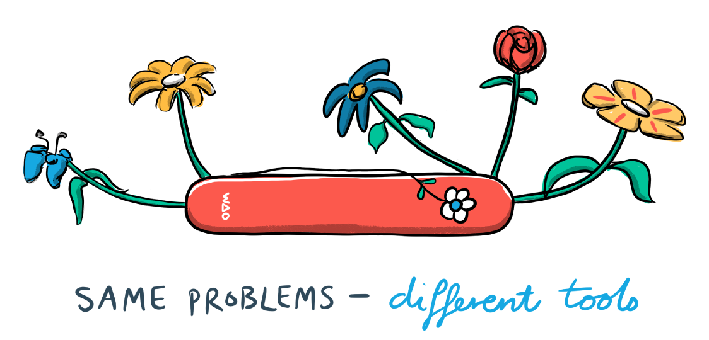

_A red Swiss Army knife with various flowers sprouting from its different tools, illustrating the concept that the same problems can be addressed using different approaches or tools._

---

### Skateboard Experiment Development Journey

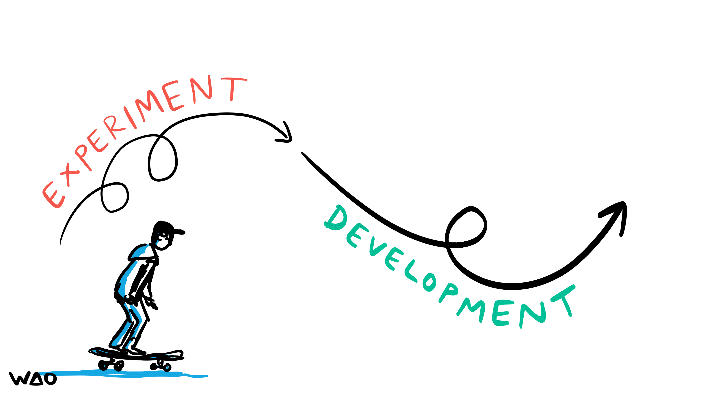

_A stick figure on a skateboard looks up at a curved path that rises steeply labeled "EXPERIMENT" then descends and rises again labeled "DEVELOPMENT" with an upward arrow at the end._

---

### Small Changes Skateboard Backpack Speed

_Two identical figures skateboarding, with the second figure wearing a backpack and appearing to move faster, illustrating that "small changes can make a big difference."_

---

### Space Talent Recruitment Game Interface

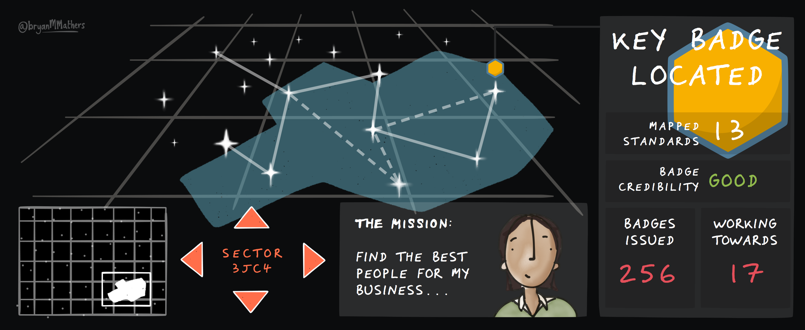

_A space-themed game interface showing a mission to find business talent, with constellation maps, navigation controls, and achievement badges displaying progress statistics._

---

### Student Belonging School Engagement Mindmap

_This is a hand-drawn mind map exploring student belonging and engagement in school, featuring interconnected concepts like "The Cast of Students," individual student profiles with their needs and motivations, and themes around academic achievement, social connections, and personal resilience._

---

### T Shaped Graduate Learning Model

_A person stands with arms outstretched in a T-shape, illustrating the concept of a "T-shaped graduate" who combines deep learning in one area (vertical axis) with broad cross-domain skills and attitudes (horizontal axis)._

---

### Tech Adoption Mindmap Scattered Notes

_A hand-drawn mind map exploring technology adoption and digital transformation concepts, featuring scattered notes about user engagement, learning approaches, and aspirational messaging with key phrases like "bigger than yours," "memorable authenticity," and "create learn collaborate."_

---

### Three Books With Different Emotions

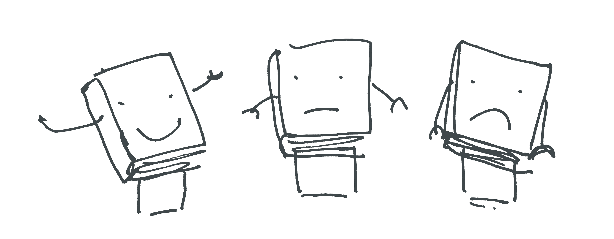

_Three anthropomorphized books with faces show different emotions - the first is happy and waving, the middle one looks sad or concerned, and the third appears worried or distressed._

---

### Three Buckets Fame Fortune Fun Priorities

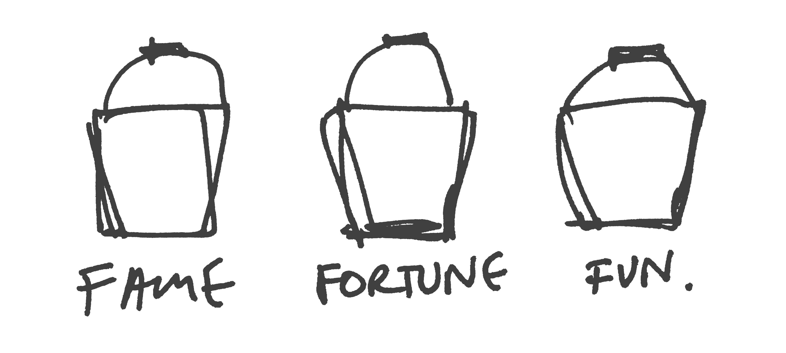

_Three simple hand-drawn buckets are labeled "FAME," "FORTUNE," and "FUN" from left to right, with each bucket appearing increasingly tilted or leaky._

---

### Tools Connecting Learning Data Networking

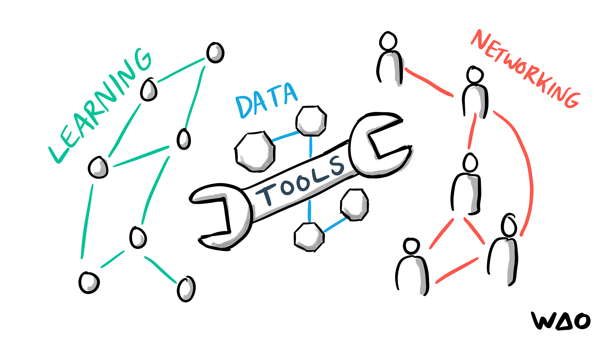

_A wrench labeled "TOOLS" sits at the center connecting three key elements: "LEARNING" (shown with connected nodes on the left), "DATA" (represented by hexagonal shapes), and "NETWORKING" (depicted by connected human figures on the right)._

---

### Trigger Looking For Food Risks Barriers

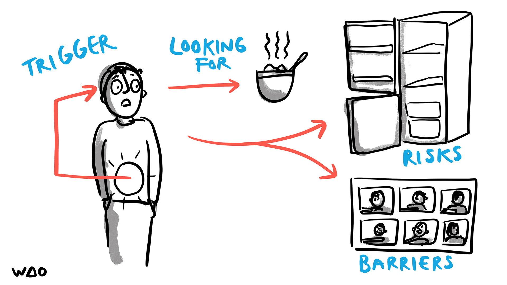

_A stick figure labeled "trigger" looks toward food while arrows point to "risks" (shown as filing cabinets) and "barriers" (depicted as faces in boxes), illustrating decision-making factors._

---

### Value Types Islands Bridges Illustration

_A four-panel illustration showing different islands connected by bridges, each labeled with different types of value: "Immediate Value" (with people at a picnic table), "Potential Value" (with palm trees), "Applied Value" and "Realised Value" (with vegetation), and "Reframing Value" (with tall trees and a boat)._

---

### Visual Thinking Cube Mindmap Connections

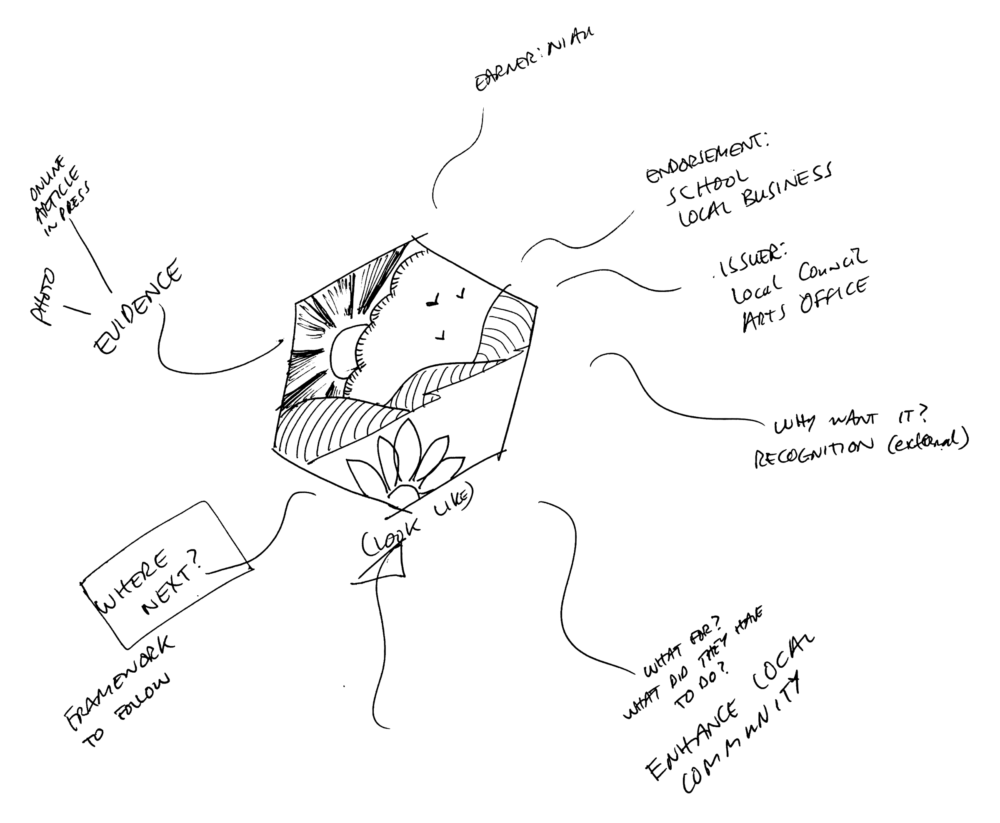

_A hand-drawn mind map with a detailed geometric cube at the center, surrounded by flowing lines connecting to various text labels including "EVIDENCE," "WHERE NEXT?," "FRAMEWORK TO FOLLOW," and questions about recognition and community enhancement._

---

### Visual Thinking Education Transformation Mindmap

_This mind map illustrates the transformation of educational relationships and approaches, showing how schools can move from traditional "labels picked up at school" to more collaborative, creative learning environments that embrace technology and community engagement._

---

### Visual Thinking Problem Solving Cycle Journey

_This illustration shows a circular journey through five stages of problem-solving: Problems (with question marks), Story Board (with grid layout), Open (with megaphone icon), Testing (with checklist), and Findings (with magnifying glass), ending with "Next?" and arrow symbols._

---

**67 images** in this collection

All images © Bryan Mathers, available under [CC BY-ND 4.0](https://creativecommons.org/licenses/by-nd/4.0/)
