# Open Badges & Recognition

[← Back to main gallery](../)

### Anyone Can Issue Verifiable Credentials Rat Chef

_A cartoon rat wearing a chef's hat and holding a wooden spoon stands next to text that reads "Anyone CAN issue VERIFIABLE CREDENTIALS!" in white and blue letters on an orange background._

---

### Badging Policy Elements Framework Diagram

_A visual diagram showing the key elements of a badging policy, with "Elements of a Badging Policy" in a central hexagon surrounded by ten components including scope & objectives, badge types & categories, issuing guidelines, criteria & assessment, endorsement mechanisms, design & taxonomy, inclusivity & accessibility, integration with existing systems, digital infrastructure, data privacy & ownership, quality assurance & trust, stakeholder engagement, and evaluation & iteration._

---

### Bridge Connecting Stated Recognised Value

_A simple line drawing of a bridge spanning between two sides labeled "STATED VALUE" on the left and "RECOGNISED VALUE" on the right, with water flowing beneath._

---

### Corporate Certification Credentials Announcement

_A person in business attire stands next to a large box labeled "BIG CORP PROFESSIONAL CERTIFICATION" while announcing they just released some great new exclusive credentials._

---

### Credential Collection Journey Pathway

_A diagram showing a winding path with small oval credentials collected along the journey leading to a final hexagonal credential that represents the end goal._

---

### Credential Granularity Size Spectrum Comparison

_This illustration shows three panels depicting credentials of increasing size from a small token to a medium ball to an oversized sphere, with arrows indicating a spectrum from "more granular" to "less granular" to answer the question "How big should a credential be?"_

---

### Credential Project Blueprint Header Design

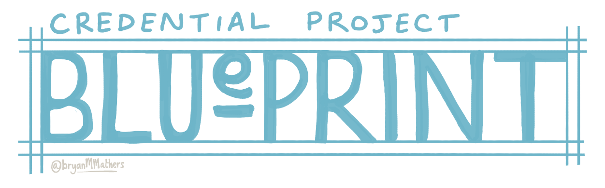

_A blueprint-style header design with "CREDENTIAL PROJECT" at the top and "BLUEPRINT" as the main title in large white letters on a light blue background with technical drawing border elements._

---

### Credential Protect Blueprint Visual Thinkery

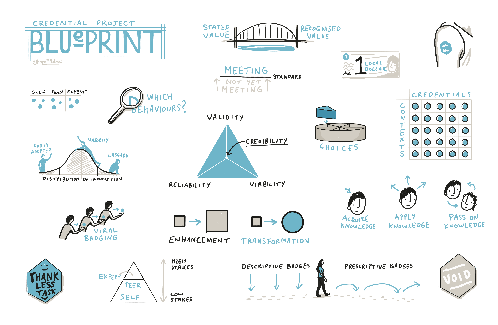

_A visual blueprint illustrating the concept of credential protection through various elements including peer validation, behavioral analysis, innovation distribution curves, credibility triangles, viral badging, and knowledge transformation processes._

---

### Credentialling To Recognition Spectrum

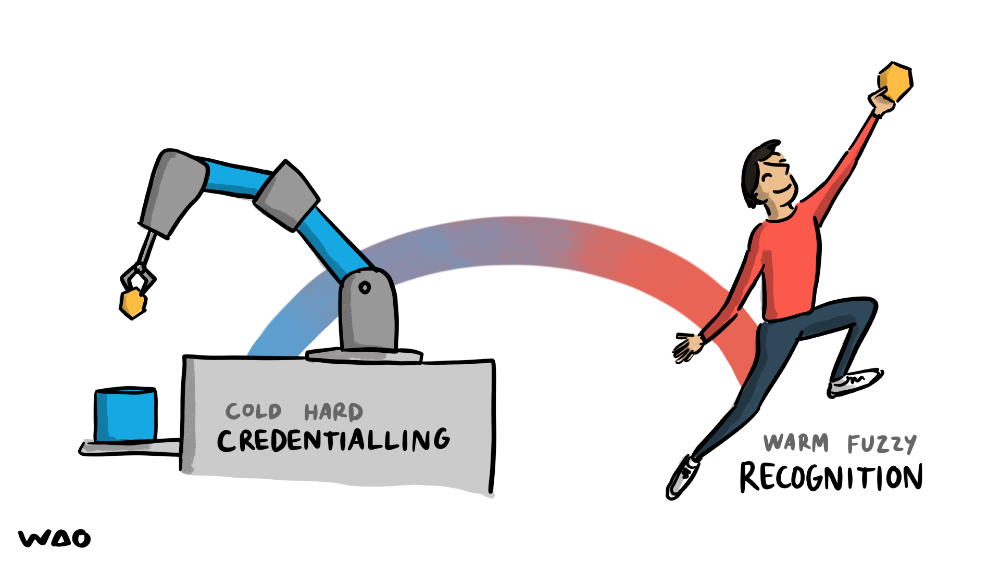

_A robotic arm labeled "Cold Hard Credentialling" extends a credential toward a person jumping joyfully labeled "Warm Fuzzy Recognition" with a rainbow connecting them._

---

### Credentials Contexts Grid Matrix

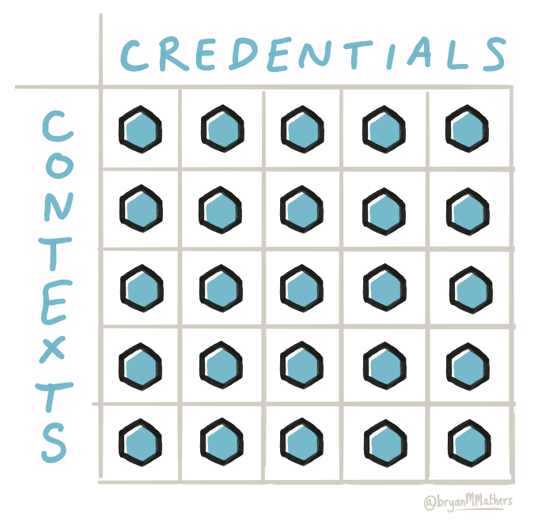

_A grid labeled "CREDENTIALS" horizontally and "CONTEXTS" vertically shows 25 hexagonal icons in various shades of blue, representing the intersection of different credentials across different contexts._

---

### Credibility Of Credentials Triangle Diagram

_A triangular diagram showing the three components of credential credibility: validity at the top, reliability at bottom left, and viability at bottom right, with credibility indicated by an arrow pointing to the center._

---

### Descriptive Vs Prescriptive Badges Pathway

_A figure walks along a dotted path with downward arrows labeled "descriptive badges" on the left side and curved forward arrows labeled "prescriptive badges" on the right side, illustrating the transition from describing current state to guiding future direction._

---

### Digital Credentials Types Hexagon Diagram

_The illustration shows different types of digital credentials represented as hexagonal shapes, including block cert, open badge, e-certificate, digital credential, alternative digital credential, micro credential, and credential arranged in a honeycomb-like pattern._

---

### Digital Identity Trust Levels Concentric Circles

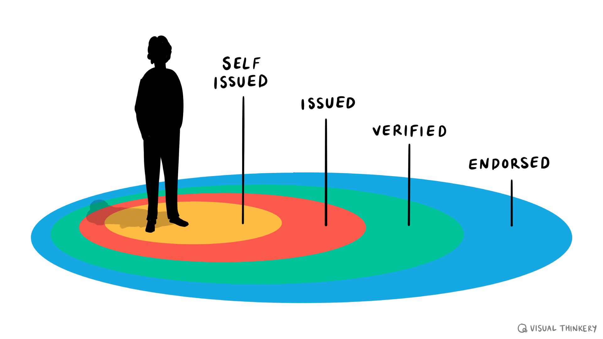

_A silhouetted person stands at the center of concentric colored circles representing increasing levels of digital identity trust, from "self issued" at the innermost yellow circle to "endorsed" at the outermost blue circle._

---

### Digital Verification Bloop Just Works

_This illustration shows three scenarios where physical items (train ticket, wallet, and certificate) are converted to digital formats on smartphones and then used successfully with a "bloop" sound effect, demonstrating how digital verification "just works."_

---

### Hexagonal Void Stamp Badge

_A beige hexagonal badge with "VOID" written in white letters, designed to look like a rubber stamp or watermark._

---

### Historical Butter Churning Credential Comic

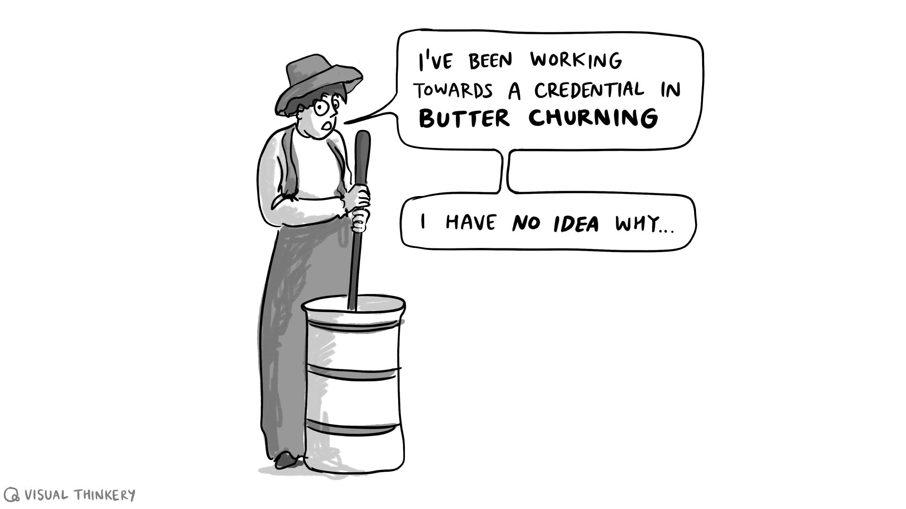

_A person in old-fashioned clothing churns butter with a wooden churn while saying they're working toward a credential in butter churning but have no idea why._

---

### Keeping Badges Weird Signpost Illustration

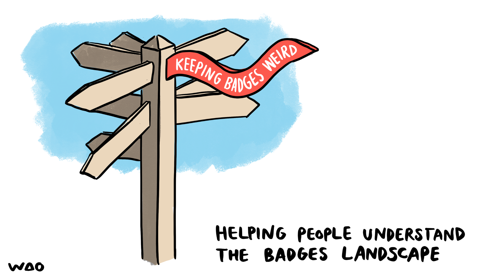

_A wooden signpost with multiple directional arrows has a red ribbon banner reading "KEEPING BADGES WEIRD" wrapped around it, with text below stating "HELPING PEOPLE UNDERSTAND THE BADGES LANDSCAPE."_

---

### Meaning Of Recognition Three Strands Weaving

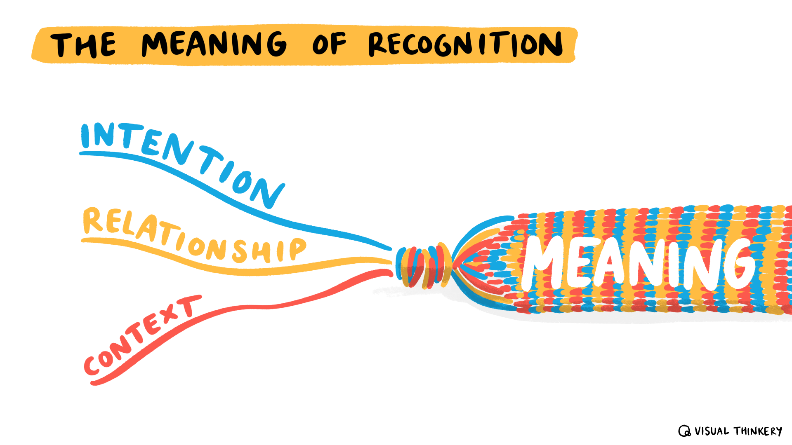

_Three colored strands labeled "Intention," "Relationship," and "Context" weave together to form the word "MEANING" under the title "The Meaning of Recognition."_

---

### Micro Credentials Course Slicing Cartoon

_A cartoon showing a person slicing a "big course" like salami while another person asks for a digital micro credential with evidence linked to open standards that would be meaningful to employers._

---

### Microcredentialing Vs Recognition Policies Compari

_This illustration contrasts microcredentialing policies (shown as a structured staircase with formal learning elements) against recognition policies (depicted as informal, decentralized badge-like elements scattered across the image)._

---

### Mutual Recognition Credentialing Exchange

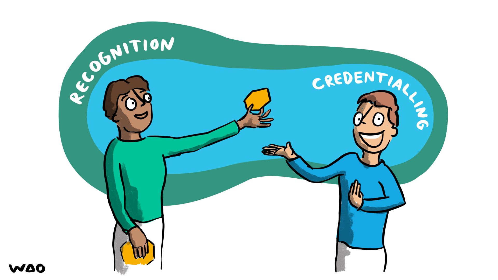

_Two people exchange recognition and credentialing in a circular flow, with one person in green holding a credential passing it to another person in blue who reciprocates the gesture._

---

### Open Hub Learning Microcredentials Diagram

_A diagram showing an "Open Hub" at the center with radiating rectangular blocks representing "structured chunks of learning" that connect to hexagonal "micro-credentials" for recognizing achievements._

---

### Person More Than Resume Shapes Illustration

_A cartoon illustration shows a person in a yellow shirt with arms outstretched, surrounded by colorful geometric shapes, with text reading "I AM MORE THAN JUST MY RESUMÉ" against a dark blue and white background._

---

### Punctuality Credential Comic Illustration

_A man wearing a clock t-shirt proudly claims to have a "punctuality credential" while a diverse group of people respond that not having such a credential doesn't mean they're not punctual._

---

### Recognition Credentialing Exchange Cycle

_Two people exchange recognition and credentialing in a circular flow, with one person in green giving recognition to another in blue who returns credentialing, illustrating a mutual professional validation system._

---

### Recognition Trophy Celebration Support

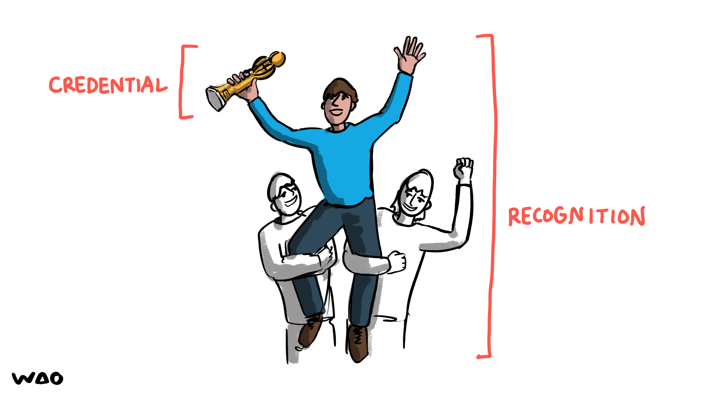

_A cartoon shows a person in blue holding a trophy with raised arms while being carried on the shoulders of two supporters, with "CREDENTIAL" labeled on the left and "RECOGNITION" on the right._

---

### Space Game Badge Alert Interface

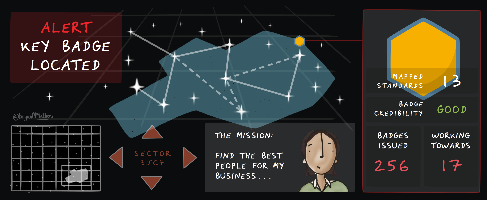

_A space-themed game interface showing an alert that a key badge has been located, with navigation controls, mission objective to find business talent, and badge statistics displaying 256 issued and 17 in progress._

---

### Technology Tree Microcredentials Community Roots

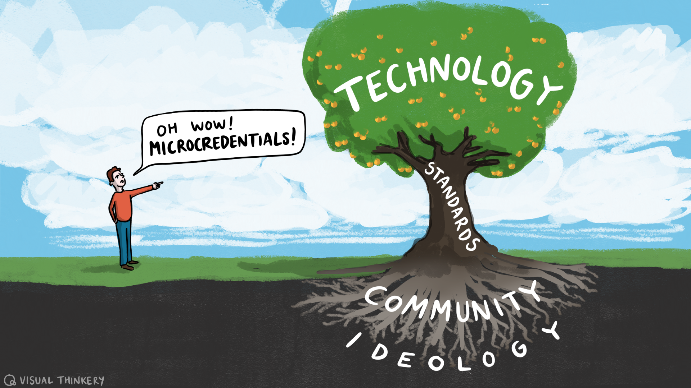

_A person points excitedly at a tree labeled "Technology" with "Standards" on the trunk and "Community Ideology" in the root system, exclaiming "Oh wow! Microcredentials!"_

---

### Thankless Task Hexagon Badge Smile

_A cheerful blue hexagonal badge with a smiling face displays "THANKLESS TASK" in bold black letters._

---

### Trough Of Disillusionment Open Badge Comic

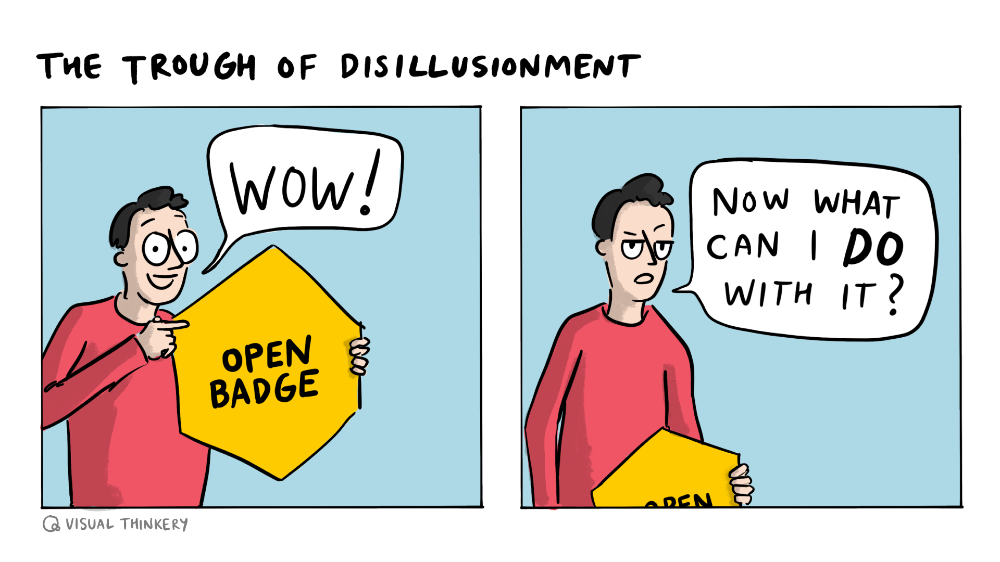

_A two-panel comic showing a person's excitement turning to confusion after receiving an "open badge" - first saying "WOW!" then asking "Now what can I do with it?"_

---

### Viral Badging Chain Illustration

_Three figures pass a viral badge from person to person in a chain, illustrating how viral content spreads through social networks._

---

**33 images** in this collection

All images © Bryan Mathers, available under [CC BY-ND 4.0](https://creativecommons.org/licenses/by-nd/4.0/)
