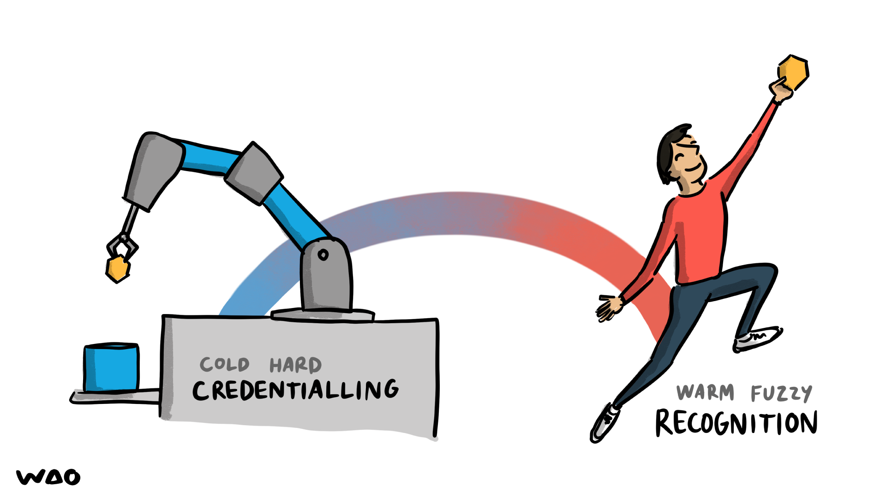
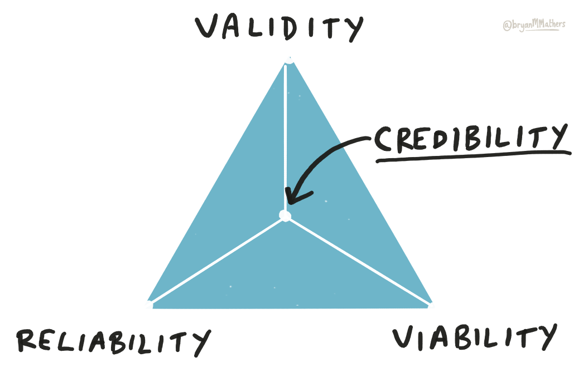
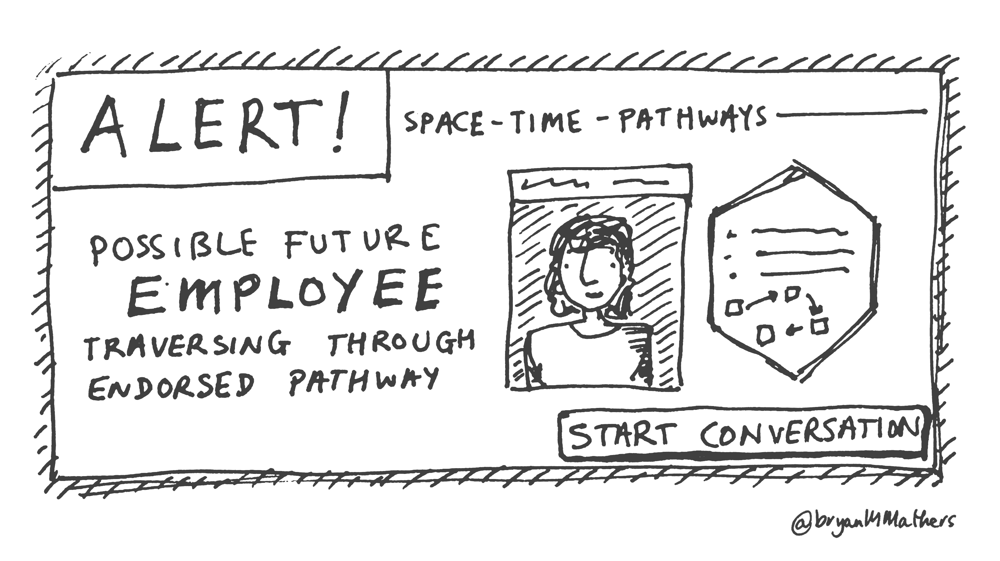
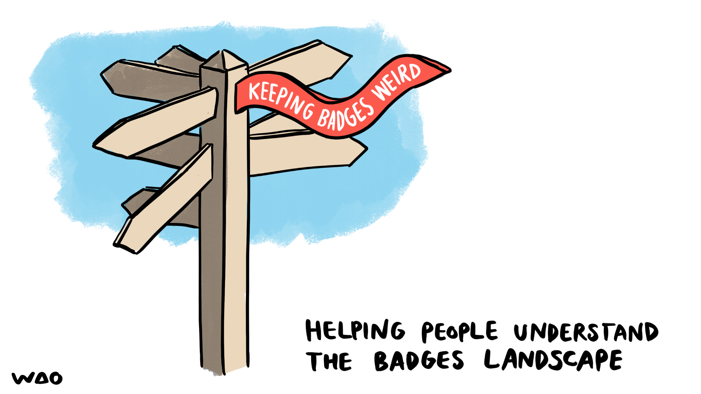

# Open Badges & Recognition

[← Back to main gallery](../)

| | | |
|:--:|:--:|:--:|
|  **Anyone Can Issue Verifiable Credentials Rat Chef** |  **Badging Policy Elements Framework Diagram** |  **Bridge Connecting Stated Recognised Value** |
|  **Corporate Certification Credentials Announcement** |  **Credential Collection Journey Pathway** |  **Credential Granularity Size Spectrum Comparison** |
|  **Credential Project Blueprint Header Design** |  **Credential Protect Blueprint Visual Thinkery** |  **Credential Vs Recognition Trophy Celebration** |
|  **Credentialing To Recognition Rainbow Bridge** |  **Credentialing Vs Recognition Spectrum** |  **Credentialling To Recognition Spectrum** |
|  **Credentials Contexts Grid Matrix** |  **Credibility Of Credentials Triangle Diagram** |  **Credibility Triangle Validity Reliability Viabilit** |
|  **Descriptive Vs Prescriptive Badges Pathway** |  **Digital Badge Credibility Levels Concentric Model** |  **Digital Credentials Types Hexagon Diagram** |
|  **Digital Identity Trust Levels Concentric Circles** |  **Digital Verification Bloop Just Works** |  **Future Employee Spacetime Pathway Alert** |
|  **Futuristic Employee Alert Notification Comic** |  **Hexagonal Void Stamp Badge** |  **Historical Butter Churning Credential Comic** |
|  **Hr Function To Profession Evolution** |  **Keeping Badges Weird Signpost Illustration** |  **Meaning Of Recognition Three Strands Weaving** |
|  **Micro Credentials Course Slicing Cartoon** |  **Microcredentialing Vs Recognition Policies Compari** |  **Mutual Recognition Credentialing Exchange** |
|  **Open Hub Learning Microcredentials Diagram** |  **Person More Than Resume Shapes Illustration** |  **Punctuality Credential Comic Illustration** |
|  **Recognition Credentialing Exchange Cycle** |  **Recognition Trophy Celebration Support** |  **Signpost Keeping Badges Weird Navigation** |
|  **Space Game Badge Alert Interface** |  **Technology Tree Microcredentials Community Roots** |  **Technology Tree Microcredentials Standards Communi** |
|  **Thankless Task Hexagon Badge Smile** |  **Trough Of Disillusionment Open Badge Comic** |  **Viral Badging Chain Illustration** |
|  **Wooden Signpost Keeping Badges Weird Banner** | | |

---

**43 images** in this collection

All images © Bryan Mathers, available under [CC BY-ND 4.0](https://creativecommons.org/licenses/by-nd/4.0/)
