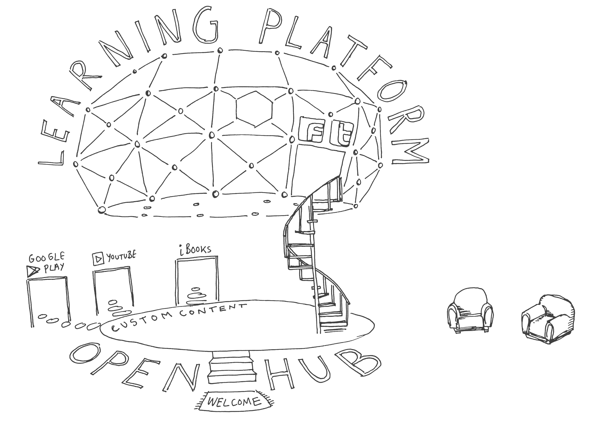

# Open Education

[← Back to main gallery](../)

| | | |
|:--:|:--:|:--:|
|  **Autonomy Independence We Are Open Sign** |  **Citizen Science Open Ethics Mindmap** |  **Educate Engage Earth Cycle Illustration** |
|  **External Content Pathways Diagram** |  **Happy Book Character Celebrating Arms Up** |  **Learning Platform Dome Educational Hub** |
|  **Learning Platform Dome Hub Sketch** |  **Licensing Work Copyright To Creative Commons Slide** |  **Online Education Platform Building Blocks** |
|  **Openness Resilience Tree Roots Illustration** |  **Tree Roots Openness Resilience Illustration** |  **We Are Open Education Training Information Sign** |

---

**12 images** in this collection

All images © Bryan Mathers, available under [CC BY-ND 4.0](https://creativecommons.org/licenses/by-nd/4.0/)
