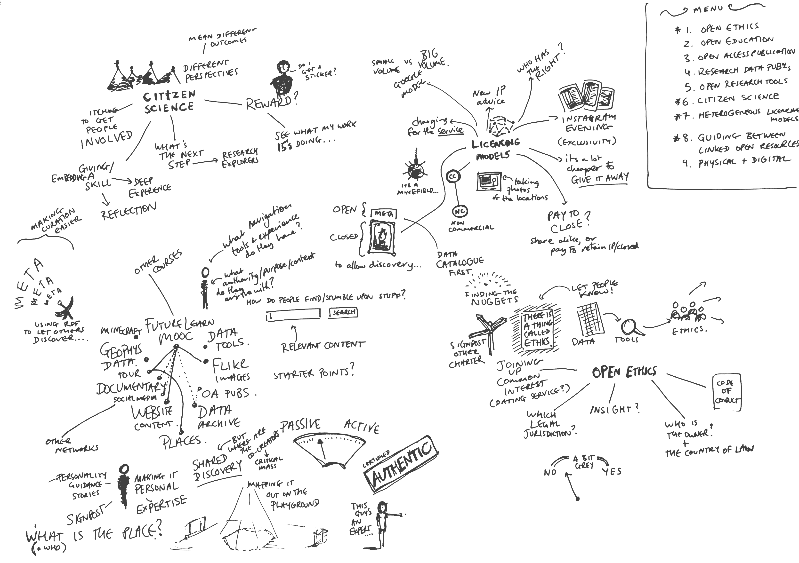
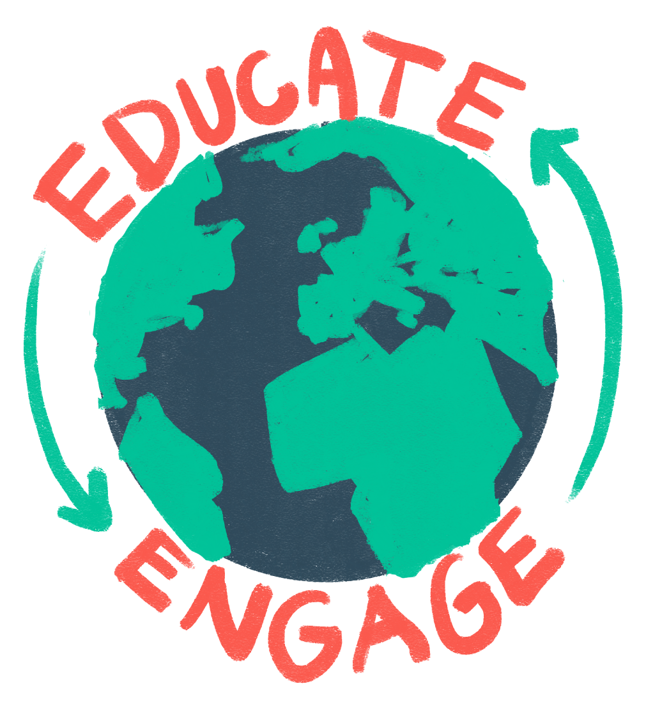
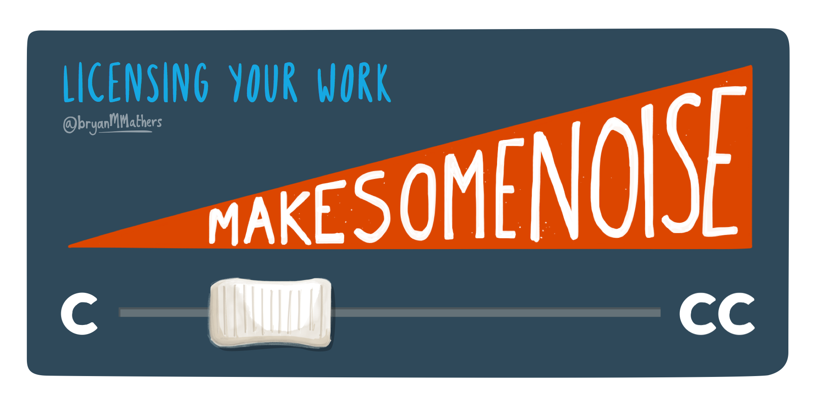
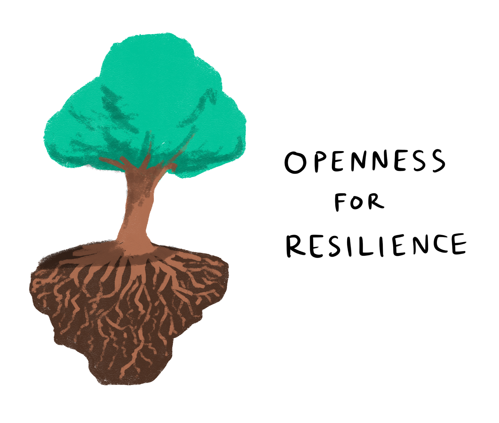

# Open Education

[← Back to main gallery](../)

### Autonomy Independence We Are Open Sign

_A green A-frame sign displaying "WE are OPEN" with a smiley face accompanies bold black text reading "AUTONOMY & INDEPENDENCE" against a white background._

---

### Citizen Science Open Ethics Mindmap

_A hand-drawn mind map exploring concepts around citizen science, open ethics, licensing models, and data sharing, with interconnected topics branching out from central themes and including a numbered menu of related concepts._

---

### Educate Engage Earth Cycle Illustration

_A hand-drawn illustration of Earth with green continents and dark blue oceans, surrounded by red text reading "EDUCATE" at the top and "ENGAGE" at the bottom, with green arrows forming a circular flow around the globe._

---

### External Content Pathways Diagram

_A simple line drawing shows three doorways labeled "Khan Academy," "Maths Websites," and "Maths Websites" with stepping stones leading to each, all connected to "External Content" text below._

---

### Happy Book Character Celebrating Arms Up

_A cheerful anthropomorphized open book character with stick arms, hands, legs, eyes and a mouth celebrates with both arms raised in the air._

---

### Learning Platform Dome Educational Hub

_A dome-shaped learning platform with "LEARNING PLATFORM" text around the curved top, containing a networked structure above and various educational resources like Google Play, YouTube, and Khan Academy arranged around the base level labeled "OPEN HUB" with a "WELCOME" mat at the entrance._

---

### Learning Platform Dome Hub Sketch

_A sketch showing a dome-shaped learning platform with "LEARNING PLATFORM" text curved around the top and "OPEN HUB" at the bottom, featuring a geodesic structure above a circular base with stairs, content areas for Google Play/YouTube/Books, custom content space, chairs, and a welcome mat._

---

### Licensing Work Copyright To Creative Commons Slide

_A slider graphic showing licensing options from "C" (copyright) to "CC" (Creative Commons), with an orange banner reading "MAKE SOME NOISE" and the title "Licensing Your Work" by @BryanMMathers._

---

### Online Education Platform Building Blocks

_A hand-drawn diagram showing building blocks of online education, with "Scalable Hosting" as the foundation, "Open Hub" and "edX" as middle blocks, and "Structured Learning" represented as a networked sphere on top, connected by an orange arrow pathway._

---

### Openness Resilience Tree Roots Illustration

_A stylized tree with green foliage and extensive brown roots underground illustrates the concept "Openness for Resilience" showing how deep foundations support growth._

---

### Tree Roots Openness Resilience Illustration

_A watercolor-style illustration of a tree with green foliage above ground and extensive brown roots below, accompanied by the text "OPENNESS FOR RESILIENCE."_

---

### We Are Open Education Training Information Sign

_A red tent-style sign displaying "WE are OPEN" with a smiley face stands next to black text reading "EDUCATION, TRAINING & INFORMATION" against a white background._

---

**12 images** in this collection

All images © Bryan Mathers, available under [CC BY-ND 4.0](https://creativecommons.org/licenses/by-nd/4.0/)
