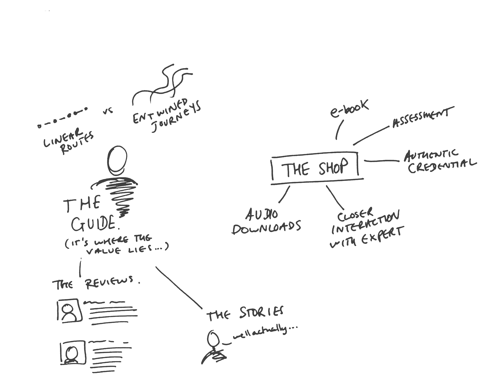
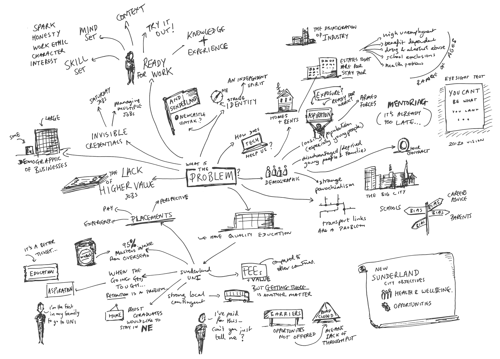
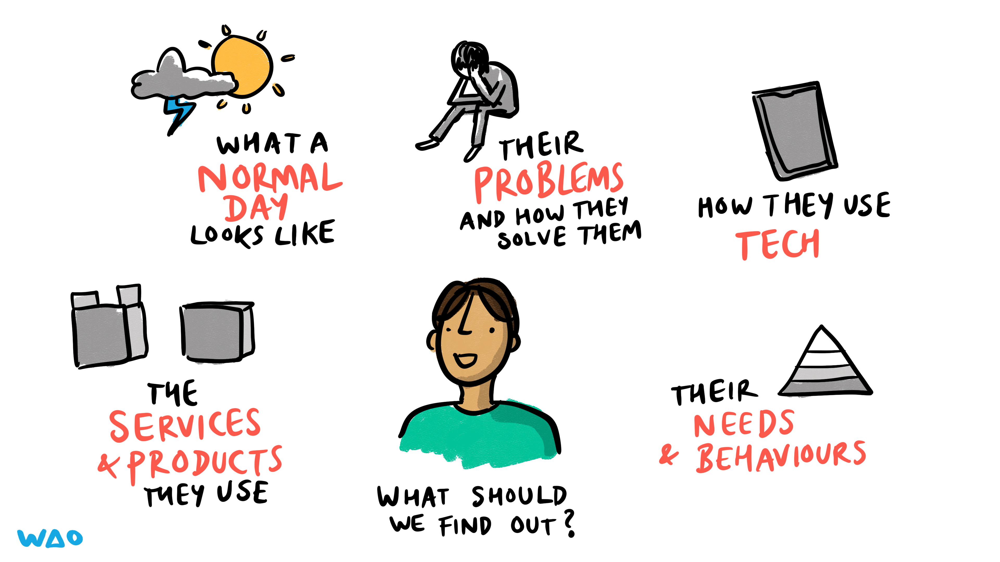
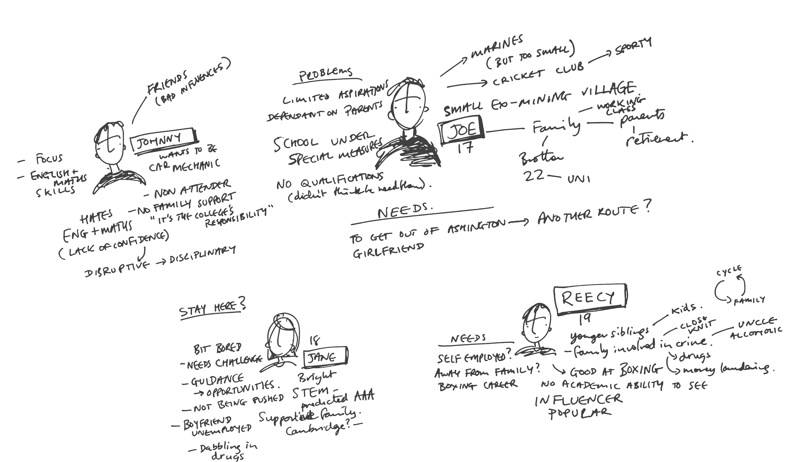

# User Research

[← Back to main gallery](../)

| | | |
|:--:|:--:|:--:|
|  **Burning Data Letters Political Cartoon** |  **Candidate Skills Evaluation Balancing Act** |  **Cheese Wheel User Research Pun Illustration** |
|  **Constellation Sensemaking Synthesis Visual** |  **Curiosity Binoculars Questions Network Diagram** |  **Customer Journey Guide Vs Shop Diagram** |
|  **Customer Personas Education Tech Notes** |  **Discovery With Build Measure Learn Cycle Magnifyin** |  **Diversify User Research Illustration** |
|  **Do My Users Care Ometer Thermometer** |  **Dodgy Assumptions Cartoon** |  **Employment Challenges Mindmap Northeast England** |
|  **Extreme Users Wide Arms Stretch Concept** |  **Magnifying Glass Examining D Which Behaviours** |  **Middle Aged White European Male Silhouette** |
|  **Pathfinding Job Search Algorithm Alert** |  **Person Covering Face What Not Want To Happen** |  **Person Framing Face Camera Viewfinder Gesture** |
|  **Person On Couch Clicked Link Get Users Talking** |  **Persona Spectrum Common Traits Diagram** |  **Police Interrogation No Comment Rights** |
|  **Seeing Other Peoples Ideas Visual Thinking** |  **Stakeholder Analysis Education Personas Mindmap** |  **Unknown Unknowns Iceberg Knowledge Gap** |
|  **Unmoderated User Testing Tangled Paths** |  **User Research Discovery Framework** |  **User Research Unexpected Results Cartoon** |
|  **User Testing Exploratory Vs Validating** |  **User Testing Five Users Eighty Percent Problems** |  **Word Cloud Excited Descriptive Terms** |
|  **Youth Pathway Mapping Diagram** | | |

---

**31 images** in this collection

All images © Bryan Mathers, available under [CC BY-ND 4.0](https://creativecommons.org/licenses/by-nd/4.0/)
