# User Research

[← Back to main gallery](../)

### Burning Data Letters Political Cartoon

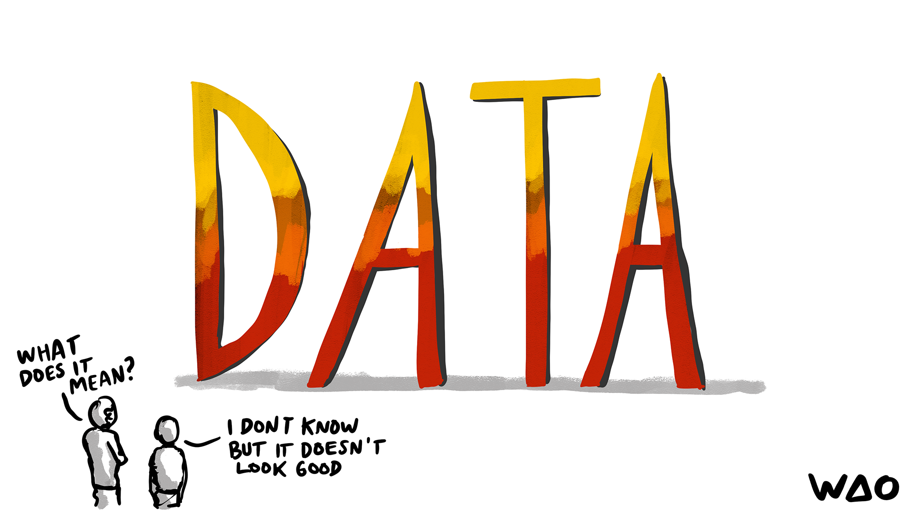

_A political cartoon shows two figures looking at large burning letters spelling "DATA" with one asking what it means and the other responding they don't know but it doesn't look good._

---

### Candidate Skills Evaluation Balancing Act

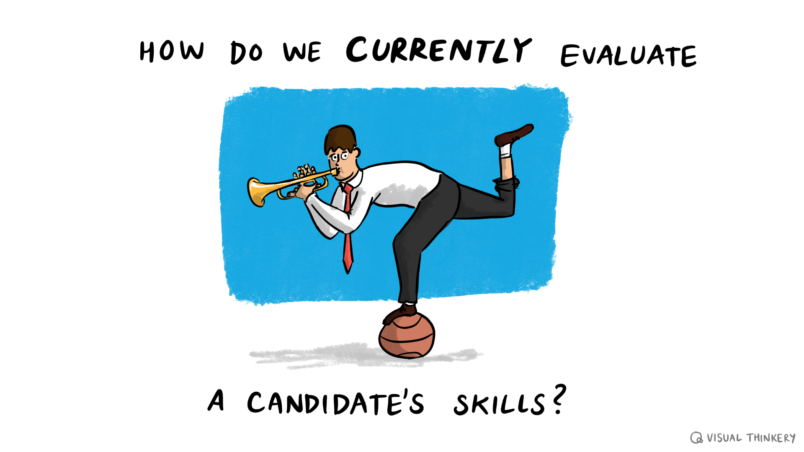

_A cartoon businessman in a suit and tie performs an awkward balancing act while playing a trumpet and standing on one foot on a ball, illustrating the absurd way we often evaluate job candidates' skills._

---

### Cheese Wheel User Research Pun Illustration

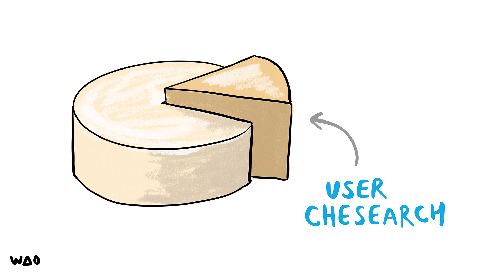

_A wheel of cheese with a wedge cut out and an arrow pointing to it, labeled "USER CHESEARCH" as a play on "user research."_

---

### Constellation Sensemaking Synthesis Visual

_A constellation-style illustration on a dark starry background shows scattered white dots connected by green lines forming the letter "N" on the left, and blue lines forming what appears to be a hand or tree-like pattern on the right, with "Sense making & synthesis" written in white text._

---

### Curiosity Binoculars Questions Network Diagram

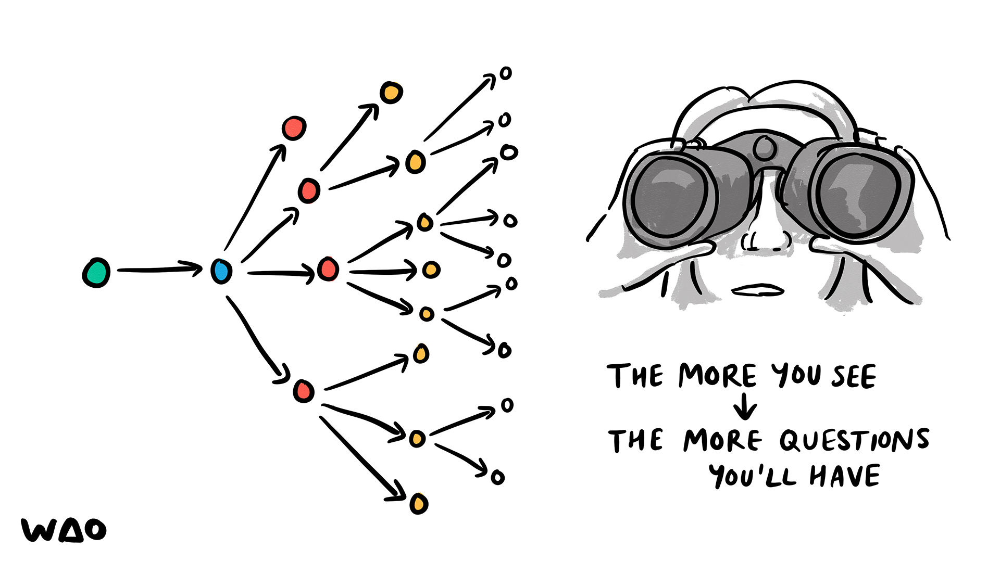

_A cartoon showing a person with binoculars observing a branching network diagram, illustrating that "the more you see, the more questions you'll have."_

---

### Discovery With Build Measure Learn Cycle Magnifyin

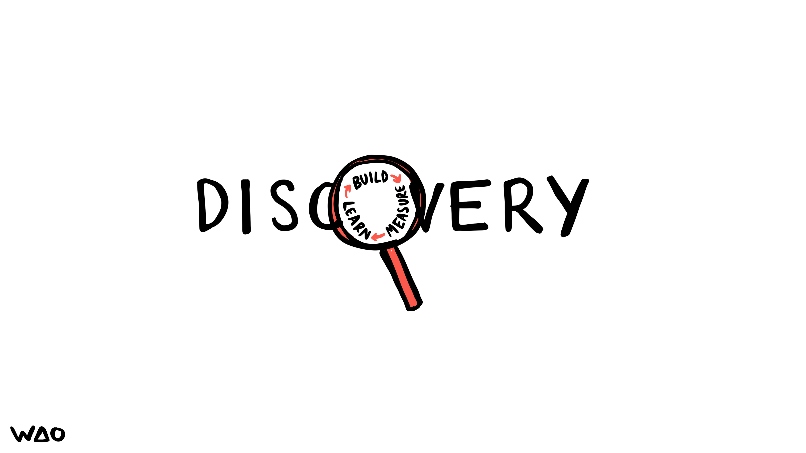

_The word "DISCOVERY" is displayed in black text with a magnifying glass replacing the "O", and within the magnifying glass lens is a circular cycle showing the words "BUILD", "MEASURE", and "LEARN" with arrows connecting them._

---

### Diversify User Research Illustration

_A four-panel illustration showing diverse user portraits (including different ages, ethnicities, and abilities) with the text "DIVERSIFY HOW YOU RESEARCH YOUR USER" emphasizing inclusive user research practices._

---

### Do My Users Care Ometer Thermometer

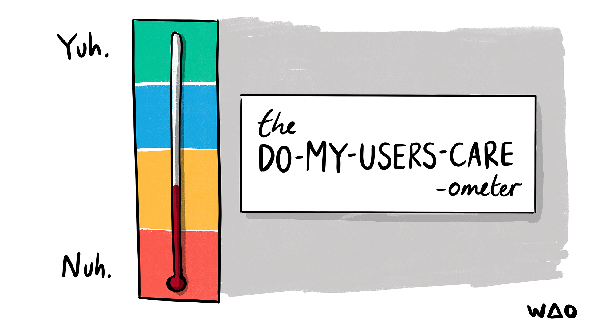

_A thermometer with colored bands from red (bottom/Nuh) to green (top/Yuh) labeled as "the DO-MY-USERS-CARE-ometer" measuring user interest levels._

---

### Dodgy Assumptions Cartoon

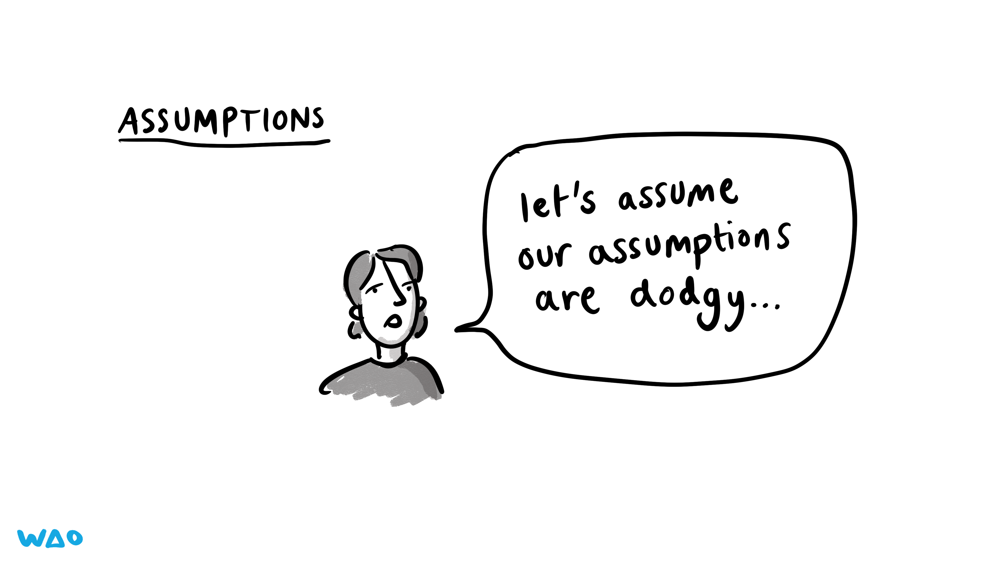

_A cartoon person with a concerned expression says "let's assume our assumptions are dodgy..." under a header reading "ASSUMPTIONS."_

---

### Extreme Users Wide Arms Stretch Concept

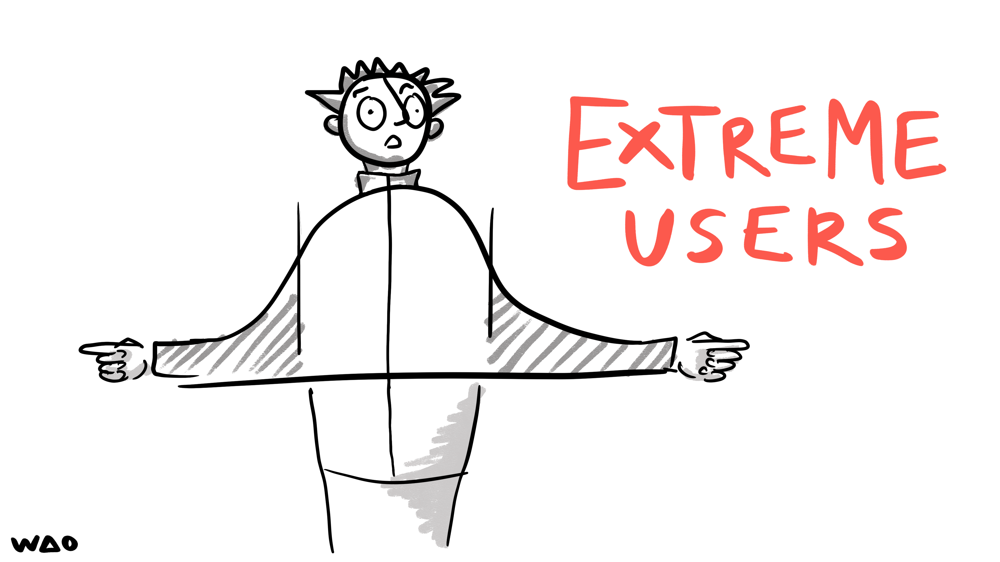

_A stick figure person with spiky hair and wide eyes stretches their arms extremely wide while wearing what appears to be a jacket, illustrating the concept of "extreme users" in red text._

---

### Magnifying Glass Examining D Which Behaviours

_A magnifying glass examining the letter "D" with the text "WHICH BEHAVIOURS?" asking what behaviors to focus on or investigate._

---

### Middle Aged White European Male Silhouette

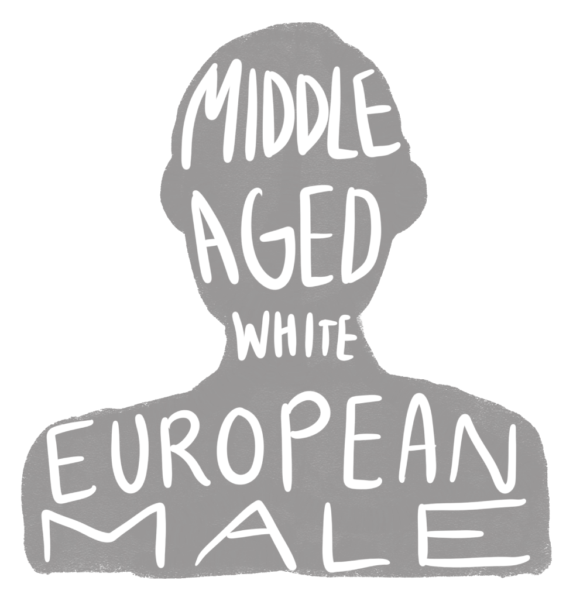

_A gray silhouette of a person's head and shoulders with white text reading "MIDDLE AGED WHITE EUROPEAN MALE" arranged within the shape._

---

### Pathfinding Job Search Algorithm Alert

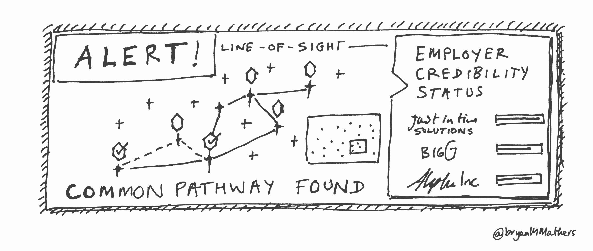

_A hand-drawn illustration showing a pathfinding algorithm that has found a route between potential employers, with an "ALERT!" notification and "EMPLOYER CREDIBILITY STATUS" panel displaying companies like "Just In Time Solutions," "BIGG," and "Apple Inc."_

---

### Person Covering Face What Not Want To Happen

_A person covers their face with their hands in distress while text asks "What do you NOT want to happen next?"_

---

### Person Framing Face Camera Viewfinder Gesture

_A person uses their hands to frame their face like a camera viewfinder, with a dotted red rectangle overlay indicating the framing gesture._

---

### Person On Couch Clicked Link Get Users Talking

_A person lies relaxed on a couch holding a device, with text explaining how clicking a link started everything and noting "get users talking" as the goal._

---

### Persona Spectrum Common Traits Diagram

_A diagram shows five diverse people in colored sections radiating from a central "Persona Spectrum" label, with the question "What do they have in common?" illustrating the concept of finding shared traits across different user personas._

---

### Police Interrogation No Comment Rights

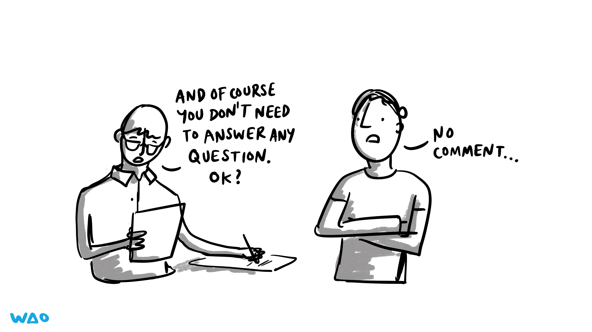

_A person with glasses and papers tells another person with crossed arms that they don't need to answer any questions, while the second person responds "No comment."_

---

### Seeing Other Peoples Ideas Visual Thinking

_A person observes floating heads with different expressions and red arrows pointing to them, representing the concept of seeing other people's ideas._

---

### Unknown Unknowns Iceberg Knowledge Gap

_An illustration showing a person's head partially submerged in blue water, with "WE DON'T KNOW" on the left side and "WHAT WE DON'T KNOW" on the right side, representing the concept that our unknown unknowns are far greater than our known unknowns._

---

### Unmoderated User Testing Tangled Paths

_A cartoon illustration shows four curved lines labeled A through D starting simply but becoming increasingly tangled in the middle, leading to a treasure chest, representing how unmoderated user testing can become chaotic before reaching valuable insights._

---

### User Research Discovery Framework

_A visual thinking diagram showing five key research areas to understand users: what a normal day looks like (weather icons), their problems and solutions (person sitting), how they use technology (tablet), services and products they use (boxes), and their needs and behaviors (triangle hierarchy), with a central figure asking "what should we find out?"_

---

### User Research Unexpected Results Cartoon

_A cartoon woman with crossed arms and concerned expression says "It's not really what we were expecting..." with text below explaining this is the whole point of user research._

---

### User Testing Exploratory Vs Validating

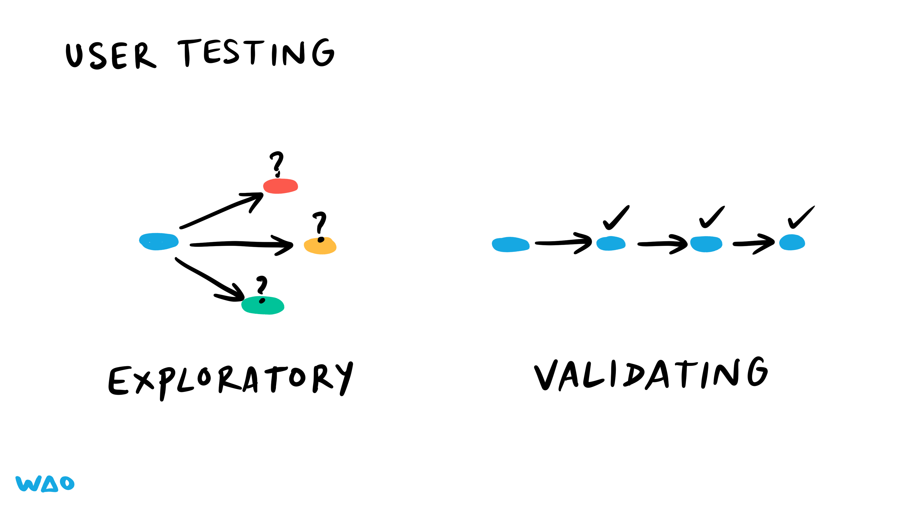

_This illustration shows two types of user testing: exploratory testing depicted as branching paths with question marks, and validating testing shown as a linear sequence with checkmarks._

---

### User Testing Five Users Eighty Percent Problems

_This illustration shows that user testing with just 5 users can identify 80% of usability problems, depicted through simple icons of diverse users with an arrow pointing to a blue pie chart showing the 80% statistic._

---

### Word Cloud Excited Descriptive Terms

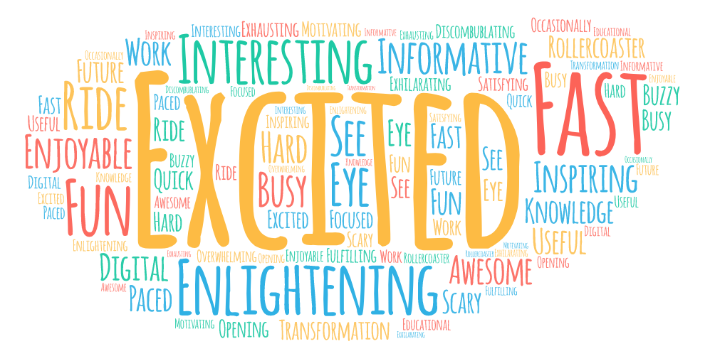

_A colorful word cloud displaying various descriptive terms with "EXCITED" prominently featured in the center, surrounded by words like "INTERESTING," "FAST," "FUN," "ENLIGHTENING," and "AWESOME" in different sizes and colors._

---

**27 images** in this collection

All images © Bryan Mathers, available under [CC BY-ND 4.0](https://creativecommons.org/licenses/by-nd/4.0/)
